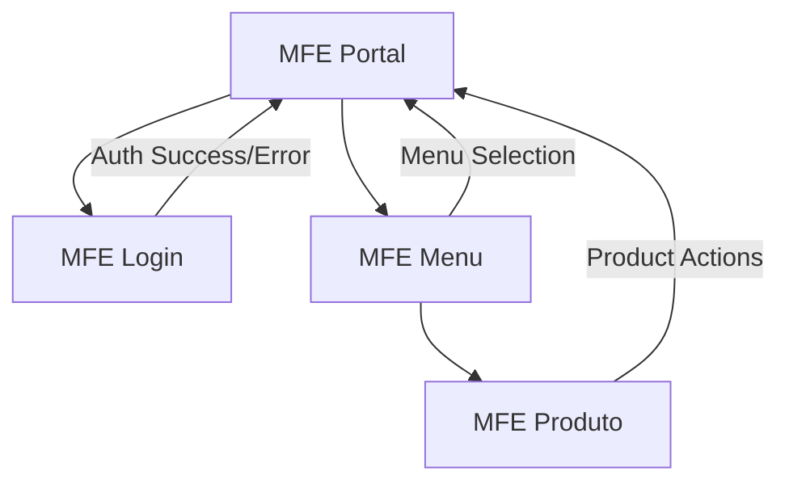

# 🏗️ Arquitetura MicroFrontEnd - Documentação Técnica

## 📋 Visão Geral

Esta documentação descreve a arquitetura de referência para MicroFrontEnds (MFEs) implementada com Angular 21, seguindo as melhores práticas de comunicação, orquestração e organização entre componentes distribuídos.

## 🎯 Objetivos

- **Padronização**: Estabelecer padrões consistentes para desenvolvimento de MFEs
- **Comunicação**: Implementar comunicação eficiente entre MFEs sem acoplamento
- **Escalabilidade**: Permitir desenvolvimento independente por diferentes times
- **Manutenibilidade**: Facilitar manutenção e evolução dos componentes

## 🏛️ Componentes da Arquitetura

### 1. MFE Portal (Shell Container) - Porta 4200
**Responsabilidade**: Orquestrador principal da aplicação

**Características**:
- Container principal que hospeda outros MFEs
- Gerencia autenticação e estado global
- Controla navegação entre MFEs
- Implementa layout base da aplicação

**Tecnologias**:
- Angular 21 (Standalone Components)
- TypeScript 5.9+
- SCSS para estilização
- RxJS para gerenciamento de estado

**Estrutura**:
```
mfe-portal/
├── src/app/
│   ├── components/
│   │   └── mfe-loader/          # Componente para carregar MFEs
│   ├── services/
│   │   └── mfe-communication.service.ts  # Comunicação entre MFEs
│   ├── models/
│   │   └── auth.model.ts        # Modelos de dados
│   └── app.component.*          # Componente principal
```

### 2. MFE Login (Autenticação) - Porta 4201
**Responsabilidade**: Gerenciamento de autenticação

**Características**:
- Interface de login com validação
- Autenticação fake para demonstração
- Retorna credenciais ou erro para o portal
- Não possui dependências de outros MFEs

**Funcionalidades**:
- Formulário reativo com validações
- Múltiplos usuários de demonstração
- Comunicação via Custom Events
- Interface responsiva

**Usuários de Demonstração**:
- **Admin**: admin/admin123 (Permissões: read, write, delete, admin)
- **Gerente**: manager/manager123 (Permissões: read, write)
- **Usuário**: user/user123 (Permissões: read)

### 3. MFE Menu (Navegação) - Porta 4202
**Responsabilidade**: Sistema de navegação e menu

**Características**:
- Menu dinâmico baseado em permissões
- Filtragem de itens por perfil do usuário
- Comunicação com MFE Produto
- Interface adaptativa

**Itens do Menu**:
- **Produto Principal**: Acesso ao MFE Produto (requer: read)
- **Dashboard**: Item fake (requer: read)
- **Relatórios**: Item fake (requer: read)
- **Configurações**: Item fake (requer: write, admin)
- **Usuários**: Item fake (requer: admin)

### 4. MFE Produto (Funcionalidade) - Porta 4203
**Responsabilidade**: Módulo de produtos

**Características**:
- Dashboard com métricas de produtos
- Listagem de produtos com filtros
- Ações baseadas em permissões
- Dados fake para demonstração

**Funcionalidades**:
- Dashboard com métricas e gráficos
- Lista de produtos com detalhes
- Ações CRUD simuladas
- Controle de permissões granular

## 🔄 Fluxo de Comunicação

### Fluxo Principal


### Sequência de Autenticação
1. **Portal** carrega **MFE Login**
2. Usuário insere credenciais no **MFE Login**
3. **MFE Login** valida e envia resultado para **Portal**
4. **Portal** armazena dados do usuário e carrega **MFE Menu**
5. **MFE Menu** recebe dados do usuário e filtra itens
6. Usuário seleciona item no **MFE Menu**
7. **MFE Menu** notifica **Portal** sobre seleção
8. **Portal** carrega **MFE Produto** com dados contextuais

## 📡 Padrões de Comunicação

### 1. Custom Events (Window Events)
**Uso**: Comunicação entre MFEs

**Padrão de Nomenclatura**:
- Input: `mfe-{nome}-input`
- Output: `mfe-{nome}-output`

**Exemplo**:
```typescript
// Enviar dados para MFE
const event = new CustomEvent('mfe-login-input', {
  detail: { title: 'Login do Portal' }
});
window.dispatchEvent(event);

// Receber dados de MFE
window.addEventListener('mfe-login-output', (event) => {
  console.log('Dados recebidos:', event.detail);
});
```

### 2. InputData Pattern
**Uso**: Envio de dados contextuais para MFEs

**Estrutura**:
```typescript
interface MfeInputData {
  user?: User;
  permissions?: string[];
  [key: string]: any;
}
```

### 3. OutputData Pattern
**Uso**: Retorno de dados e ações dos MFEs

**Estrutura**:
```typescript
interface MfeOutputData {
  type: string;    // Tipo da ação/evento
  payload: any;    // Dados da ação
}
```

## 🛡️ Segurança e Permissões

### Sistema de Permissões
- **read**: Visualização de dados
- **write**: Criação e edição
- **delete**: Exclusão de dados
- **admin**: Acesso administrativo completo

### Controle de Acesso
- Filtragem de menu baseada em permissões
- Validação de ações por perfil
- Isolamento de funcionalidades por MFE

## 🚀 Execução e Deploy

### Comandos de Desenvolvimento
```bash
# MFE Portal (Shell)
cd mfe-portal && npm start  # Porta 4200

# MFE Login
cd mfe-login && npm start   # Porta 4201

# MFE Menu
cd mfe-menu && npm start    # Porta 4202

# MFE Produto
cd mfe-produto && npm start # Porta 4203
```

### Build de Produção
```bash
# Todos os MFEs
npm run build
```

### Verificação de Vulnerabilidades
```bash
npm audit
# Resultado: 0 vulnerabilidades críticas/altas
```

## 📊 Métricas e Monitoramento

### Performance
- Bundle size otimizado
- Lazy loading de MFEs
- Compartilhamento de dependências

### Observabilidade
- Logs de comunicação entre MFEs
- Rastreamento de ações do usuário
- Métricas de carregamento

## 🔧 Manutenção e Evolução

### Versionamento
- Versionamento independente por MFE
- Compatibilidade de contratos de comunicação
- Rollback independente

### Testes
- Testes unitários por MFE
- Testes de integração de comunicação
- Testes end-to-end do fluxo completo

## 📚 Próximos Passos

1. **Implementação de Testes**: Adicionar cobertura de testes
2. **CI/CD**: Pipeline de deploy automatizado
3. **Monitoramento**: Implementar observabilidade
4. **Documentação**: Expandir documentação técnica
5. **Performance**: Otimizações de bundle e carregamento

## 🤝 Contribuição

Esta arquitetura serve como referência para desenvolvimento de novos MFEs. Siga os padrões estabelecidos para manter consistência e facilitar manutenção.

---

**Versão**: 1.0  
**Data**: Fevereiro 2024  
**Tecnologias**: Angular 21, TypeScript 5.9, Node.js 20+