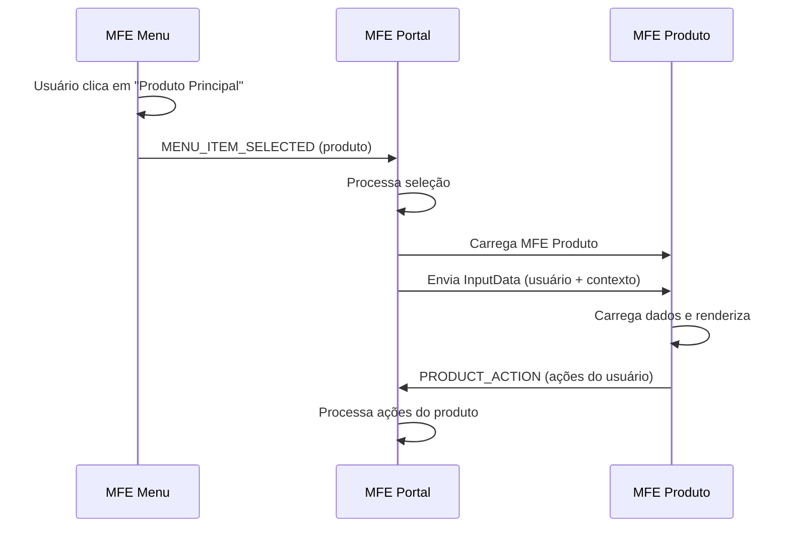

# 📋 Contrato de Comunicação: MFE Menu ↔ MFE Produto

## 🎯 Visão Geral

Este documento define o contrato de comunicação entre o **MFE Menu** (Sistema de Navegação) e o **MFE Produto** (Módulo de Produtos), mediado pelo **MFE Portal**.

## 🔄 Fluxo de Comunicação



## 🗂️ Seleção no Menu

### Item do Menu - Produto Principal
```typescript
const produtoMenuItem: MenuItem = {
  id: 'produto',
  label: 'Produto Principal',
  icon: '📦',
  description: 'Acesse o módulo principal de produtos',
  action: 'navigate',
  permissions: ['read'],
  productId: 'main-product'
};
```

### Ação de Seleção no Menu
```typescript
// mfe-menu/src/app/components/menu-list/menu-list.component.ts
onMenuItemClick(item: MenuItem): void {
  if (item.action === 'navigate' && item.id === 'produto') {
    this.mfeCommunicationService.sendDataToPortal({
      type: 'MENU_ITEM_SELECTED',
      payload: {
        id: item.id,
        label: item.label,
        productId: item.productId,
        action: item.action
      }
    });
  }
}
```

## 📤 Portal → Produto (Input via Menu)

### Event Name
`mfe-produto-input`

### Estrutura de Dados
```typescript
interface ProductInputData {
  user: {
    id: string;
    username: string;
    name: string;
    email?: string;
    permissions: string[];
  };
  productId?: string;        // ID do produto selecionado
  permissions: string[];     // Permissões do usuário
  context?: {               // Contexto adicional
    source: 'menu';         // Origem da navegação
    menuItemId: string;     // ID do item do menu
  };
  [key: string]: any;       // Extensibilidade
}
```

### Processamento no Portal
```typescript
// mfe-portal/src/app/app.component.ts
private handleMenuSelection(menuItem: any): void {
  console.log('Item do menu selecionado:', menuItem);
  
  if (menuItem.id === 'produto') {
    this.selectedProduct = 'produto';
    this.productInputData = {
      user: this.currentUser,
      productId: menuItem.productId || 'default',
      permissions: this.currentUser?.permissions || [],
      context: {
        source: 'menu',
        menuItemId: menuItem.id
      }
    };
  }
}
```

## 📥 Produto → Portal (Output)

### Event Name
`mfe-produto-output`

### Tipos de Resposta

#### 1. Mudança de View
```typescript
interface ProductViewChangeOutput {
  type: 'PRODUCT_ACTION';
  payload: {
    action: 'view_changed';
    view: 'dashboard' | 'products';
    user: string;           // Username do usuário
  };
}
```

#### 2. Ações CRUD
```typescript
interface ProductCrudOutput {
  type: 'PRODUCT_ACTION';
  payload: {
    action: 'create' | 'view' | 'edit' | 'delete';
    product?: Product;      // Dados do produto (se aplicável)
    user: string;          // Username do usuário
  };
}
```

### Implementação no Produto
```typescript
// mfe-produto/src/app/components/product-dashboard/product-dashboard.component.ts
switchView(view: 'dashboard' | 'products'): void {
  this.selectedView = view;
  
  this.mfeCommunicationService.sendDataToPortal({
    type: 'PRODUCT_ACTION',
    payload: {
      action: 'view_changed',
      view: view,
      user: this.currentUser?.username
    }
  });
}

onProductAction(action: string, product?: Product): void {
  this.mfeCommunicationService.sendDataToPortal({
    type: 'PRODUCT_ACTION',
    payload: {
      action: action,
      product: product,
      user: this.currentUser?.username
    }
  });
}
```

## 🏗️ Estrutura do MFE Produto

### Componentes Principais
```typescript
// Dashboard com duas views
interface ProductDashboard {
  selectedView: 'dashboard' | 'products';
  products: Product[];
  metrics: ProductMetrics;
  currentUser: User;
}
```

### Dados de Produto
```typescript
interface Product {
  id: string;
  name: string;
  description: string;
  category: string;
  price: number;
  stock: number;
  status: 'active' | 'inactive' | 'discontinued';
  createdAt: Date;
  updatedAt: Date;
}
```

### Métricas do Dashboard
```typescript
interface ProductMetrics {
  totalProducts: number;
  activeProducts: number;
  inactiveProducts: number;
  totalValue: number;
  lowStockProducts: number;
  categories: CategoryMetric[];
}
```

## ⚡ Implementação Técnica

### No MFE Menu

#### Verificação de Permissões
```typescript
// mfe-menu/src/app/services/menu.service.ts
getMenuItems(user?: User): Observable<MenuItem[]> {
  const userPermissions = user?.permissions || [];
  
  const filteredItems = this.allMenuItems.filter(item => {
    if (!item.permissions || item.permissions.length === 0) {
      return true;
    }
    
    return item.permissions.some(permission => 
      userPermissions.includes(permission)
    );
  });

  return of(filteredItems);
}
```

### No MFE Portal

#### Gerenciamento de Estado
```typescript
// mfe-portal/src/app/app.component.ts
export class AppComponent implements OnInit, OnDestroy {
  selectedProduct: string | null = null;
  productInputData: MfeInputData = {};

  private handleMenuSelection(menuItem: any): void {
    if (menuItem.id === 'produto') {
      this.selectedProduct = 'produto';
      this.updateProductInputData(menuItem);
    } else {
      this.selectedProduct = null;
    }
  }

  private updateProductInputData(menuItem: any): void {
    this.productInputData = {
      user: this.currentUser,
      productId: menuItem.productId || 'default',
      permissions: this.currentUser?.permissions || [],
      context: {
        source: 'menu',
        menuItemId: menuItem.id,
        timestamp: new Date().toISOString()
      }
    };
  }
}
```

### No MFE Produto

#### Recepção de Dados
```typescript
// mfe-produto/src/app/components/product-dashboard/product-dashboard.component.ts
ngOnInit(): void {
  const inputSub = this.mfeCommunicationService.inputData$.subscribe(data => {
    if (data.user) {
      this.currentUser = data.user;
      this.loadData();
    }
    
    if (data.context?.source === 'menu') {
      console.log('Acessado via menu:', data.context.menuItemId);
    }
  });
  this.subscriptions.push(inputSub);
}
```

## 🛡️ Controle de Permissões

### Permissões no Produto
```typescript
// Verificação de permissões no MFE Produto
hasPermission(permission: string): boolean {
  return this.currentUser?.permissions?.includes(permission) || false;
}

// Ações baseadas em permissões
getAvailableActions(): string[] {
  const actions = ['view'];
  
  if (this.hasPermission('write')) {
    actions.push('create', 'edit');
  }
  
  if (this.hasPermission('delete')) {
    actions.push('delete');
  }
  
  return actions;
}
```

### Filtragem de Interface
```html
<!-- mfe-produto/src/app/components/product-dashboard/product-dashboard.component.html -->
<button 
  *ngIf="hasPermission('write')"
  class="action-button primary"
  (click)="onProductAction('create')">
  ➕ Novo Produto
</button>

<div class="product-actions" *ngIf="hasPermission('read')">
  <button (click)="onProductAction('view', product)">👁️ Ver</button>
  <button 
    *ngIf="hasPermission('write')"
    (click)="onProductAction('edit', product)">✏️ Editar</button>
  <button 
    *ngIf="hasPermission('delete')"
    (click)="onProductAction('delete', product)">🗑️ Excluir</button>
</div>
```

## 📊 Dados de Demonstração

### Produtos Fake
```typescript
const fakeProducts: Product[] = [
  {
    id: '1',
    name: 'Smartphone Galaxy Pro',
    description: 'Smartphone avançado com câmera de alta resolução',
    category: 'Eletrônicos',
    price: 2499.99,
    stock: 45,
    status: 'active',
    createdAt: new Date('2024-01-15'),
    updatedAt: new Date('2024-02-10')
  },
  // ... mais produtos
];
```

### Métricas Calculadas
```typescript
getProductMetrics(): Observable<ProductMetrics> {
  const activeProducts = this.fakeProducts.filter(p => p.status === 'active');
  const lowStockProducts = this.fakeProducts.filter(p => p.stock < 10);
  const totalValue = this.fakeProducts.reduce((sum, p) => sum + (p.price * p.stock), 0);
  
  return of({
    totalProducts: this.fakeProducts.length,
    activeProducts: activeProducts.length,
    inactiveProducts: this.fakeProducts.length - activeProducts.length,
    totalValue: totalValue,
    lowStockProducts: lowStockProducts.length,
    categories: this.calculateCategoryMetrics()
  });
}
```

## 🧪 Testes

### Cenários de Teste
1. **Navegação do menu para produto**
2. **Carregamento de dados do produto**
3. **Filtragem por permissões**
4. **Ações CRUD simuladas**
5. **Comunicação de volta ao portal**

### Exemplo de Teste
```typescript
describe('Menu-Produto Integration', () => {
  it('should navigate to product when menu item is selected', () => {
    const menuItem = { id: 'produto', productId: 'main-product' };
    
    component.handleMenuSelection(menuItem);
    
    expect(component.selectedProduct).toBe('produto');
    expect(component.productInputData.productId).toBe('main-product');
  });
});
```

## 📈 Analytics e Monitoramento

### Métricas de Uso
```typescript
// Tracking de navegação
trackNavigation(from: string, to: string, userId: string): void {
  console.log(`Navigation: ${userId} went from ${from} to ${to}`);
}

// Tracking de ações no produto
trackProductAction(action: string, productId: string, userId: string): void {
  console.log(`Product Action: ${userId} performed ${action} on ${productId}`);
}
```

### Performance
- Tempo de carregamento do MFE Produto
- Tempo de resposta das ações
- Taxa de uso das funcionalidades

## 🔄 Versionamento

### Versão Atual: 1.0
- Navegação básica menu → produto
- Dashboard com métricas
- Lista de produtos
- Ações CRUD simuladas

### Próximas Versões
- Filtros avançados de produtos
- Exportação de dados
- Gráficos interativos
- Integração com API real

---

**Responsáveis**:
- **MFE Menu**: Time de UX/UI
- **MFE Produto**: Time de Produtos
- **Integração**: Time de Arquitetura

**Última Atualização**: Fevereiro 2024