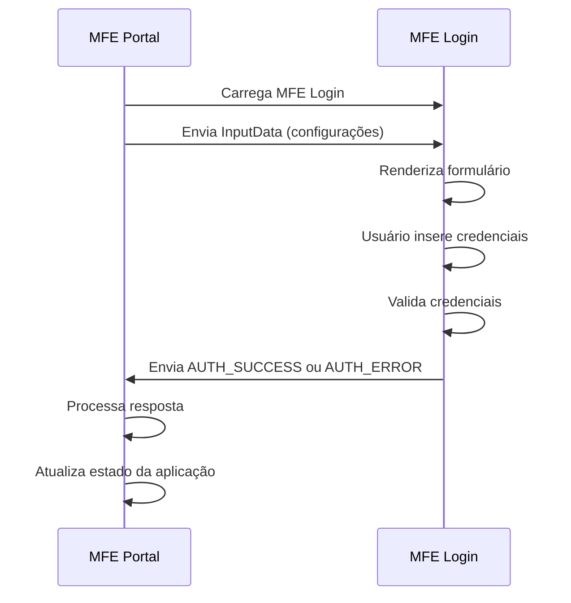

# 📋 Contrato de Comunicação: MFE Portal ↔ MFE Login

## 🎯 Visão Geral

Este documento define o contrato de comunicação entre o **MFE Portal** (Shell Container) e o **MFE Login** (Autenticação).

## 🔄 Fluxo de Comunicação



## 📤 Portal → Login (Input)

### Event Name
`mfe-login-input`

### Estrutura de Dados
```typescript
interface LoginInputData {
  title?: string;           // Título personalizado do login
  allowRememberMe?: boolean; // Permitir "Lembrar-me"
  [key: string]: any;       // Extensibilidade
}
```

### Exemplo de Uso
```typescript
// No MFE Portal
const loginInputData = {
  title: 'Login do Portal',
  allowRememberMe: true
};

this.mfeCommunicationService.sendDataToMfe('login', loginInputData);
```

### Implementação no Portal
```typescript
// mfe-portal/src/app/app.component.ts
loginInputData: MfeInputData = {
  title: 'Login do Portal',
  allowRememberMe: true
};
```

## 📥 Login → Portal (Output)

### Event Name
`mfe-login-output`

### Tipos de Resposta

#### 1. Sucesso na Autenticação
```typescript
interface AuthSuccessOutput {
  type: 'AUTH_SUCCESS';
  payload: {
    success: true;
    token: string;
    user: {
      id: string;
      username: string;
      name: string;
      email?: string;
      permissions: string[];
    };
  };
}
```

#### 2. Erro na Autenticação
```typescript
interface AuthErrorOutput {
  type: 'AUTH_ERROR';
  payload: {
    success: false;
    error: string;
  };
}
```

### Exemplo de Implementação no Login
```typescript
// mfe-login/src/app/services/mfe-communication.service.ts
sendAuthSuccess(authResponse: AuthResponse): void {
  this.sendDataToPortal({
    type: 'AUTH_SUCCESS',
    payload: authResponse
  });
}

sendAuthError(error: string): void {
  this.sendDataToPortal({
    type: 'AUTH_ERROR',
    payload: { error }
  });
}
```

### Exemplo de Recepção no Portal
```typescript
// mfe-portal/src/app/app.component.ts
private handleLoginSuccess(authResponse: AuthResponse): void {
  if (authResponse.success && authResponse.user) {
    this.mfeCommunicationService.setCurrentUser(authResponse.user);
    console.log('Login realizado com sucesso:', authResponse.user);
  }
}

private handleLoginError(error: any): void {
  console.error('Erro no login:', error);
  // Implementar notificação de erro para o usuário
}
```

## 🔐 Dados de Autenticação

### Usuários de Demonstração
```typescript
const fakeUsers = [
  {
    id: '1',
    username: 'admin',
    password: 'admin123',
    name: 'Administrador',
    email: 'admin@portal.com',
    permissions: ['read', 'write', 'delete', 'admin']
  },
  {
    id: '2',
    username: 'user',
    password: 'user123',
    name: 'Usuário Comum',
    email: 'user@portal.com',
    permissions: ['read']
  },
  {
    id: '3',
    username: 'manager',
    password: 'manager123',
    name: 'Gerente',
    email: 'manager@portal.com',
    permissions: ['read', 'write']
  }
];
```

## ⚡ Implementação Técnica

### No MFE Portal

#### Service de Comunicação
```typescript
// mfe-portal/src/app/services/mfe-communication.service.ts
receiveDataFromMfe(mfeName: string): Observable<MfeOutputData> {
  return new Observable(observer => {
    const handler = (event: any) => {
      observer.next(event.detail);
    };
    
    window.addEventListener(`mfe-${mfeName}-output`, handler);
    
    return () => {
      window.removeEventListener(`mfe-${mfeName}-output`, handler);
    };
  });
}
```

#### Componente Principal
```typescript
// mfe-portal/src/app/app.component.ts
ngOnInit(): void {
  // Escutar dados do MFE de login
  const loginSub = this.mfeCommunicationService.receiveDataFromMfe('login').subscribe(
    (data: any) => {
      if (data.type === 'AUTH_SUCCESS') {
        this.handleLoginSuccess(data.payload);
      } else if (data.type === 'AUTH_ERROR') {
        this.handleLoginError(data.payload);
      }
    }
  );
  this.subscriptions.push(loginSub);
}
```

### No MFE Login

#### Service de Comunicação
```typescript
// mfe-login/src/app/services/mfe-communication.service.ts
sendDataToPortal(data: MfeOutputData): void {
  const event = new CustomEvent('mfe-login-output', {
    detail: data
  });
  window.dispatchEvent(event);
  console.log('MFE login enviou dados:', data);
}
```

#### Componente de Login
```typescript
// mfe-login/src/app/components/login-form/login-form.component.ts
onSubmit(): void {
  if (this.loginForm.valid) {
    const credentials: LoginCredentials = this.loginForm.value;

    this.authService.login(credentials).subscribe({
      next: (response: AuthResponse) => {
        if (response.success) {
          this.mfeCommunicationService.sendDataToPortal({
            type: 'AUTH_SUCCESS',
            payload: response
          });
        } else {
          this.mfeCommunicationService.sendDataToPortal({
            type: 'AUTH_ERROR',
            payload: { error: response.error }
          });
        }
      }
    });
  }
}
```

## 🛡️ Validações e Segurança

### Validações no Login
- Username: mínimo 3 caracteres
- Password: mínimo 6 caracteres
- Sanitização de dados de entrada
- Rate limiting (simulado)

### Segurança na Comunicação
- Dados sensíveis não expostos em logs
- Token JWT fake para demonstração
- Validação de origem dos eventos

## 🧪 Testes

### Cenários de Teste
1. **Login com credenciais válidas**
2. **Login com credenciais inválidas**
3. **Validação de campos obrigatórios**
4. **Comunicação entre MFEs**
5. **Persistência de sessão**

### Exemplo de Teste
```typescript
describe('Portal-Login Communication', () => {
  it('should handle successful authentication', () => {
    const authResponse = {
      success: true,
      user: { id: '1', username: 'admin', name: 'Admin' }
    };
    
    component.handleLoginSuccess(authResponse);
    
    expect(component.isAuthenticated).toBe(true);
    expect(component.currentUser).toEqual(authResponse.user);
  });
});
```

## 📊 Monitoramento

### Métricas
- Taxa de sucesso de login
- Tempo de resposta da autenticação
- Erros de comunicação entre MFEs

### Logs
```typescript
console.log('MFE Login: Tentativa de login para:', username);
console.log('MFE Portal: Usuário autenticado:', user.name);
console.error('MFE Login: Erro na autenticação:', error);
```

## 🔄 Versionamento

### Versão Atual: 1.0
- Suporte a autenticação básica
- Comunicação via Custom Events
- Usuários fake para demonstração

### Próximas Versões
- Integração com API real
- Autenticação OAuth
- Multi-factor authentication

---

**Responsáveis**:
- **MFE Portal**: Time de Arquitetura
- **MFE Login**: Time de Segurança

**Última Atualização**: Fevereiro 2024