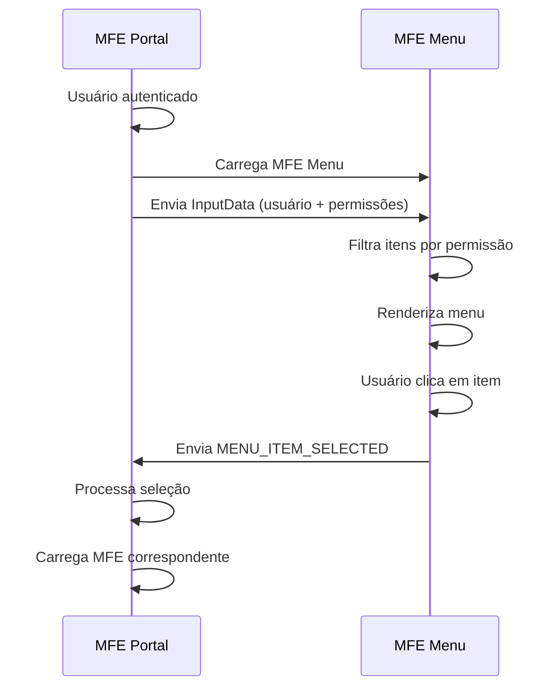

# 📋 Contrato de Comunicação: MFE Portal ↔ MFE Menu

## 🎯 Visão Geral

Este documento define o contrato de comunicação entre o **MFE Portal** (Shell Container) e o **MFE Menu** (Sistema de Navegação).

## 🔄 Fluxo de Comunicação



## 📤 Portal → Menu (Input)

### Event Name
`mfe-menu-input`

### Estrutura de Dados
```typescript
interface MenuInputData {
  user: {
    id: string;
    username: string;
    name: string;
    email?: string;
    permissions: string[];
  };
  permissions?: string[];     // Permissões adicionais
  theme?: string;            // Tema da interface
  [key: string]: any;        // Extensibilidade
}
```

### Exemplo de Uso
```typescript
// No MFE Portal
const menuInputData = {
  user: this.currentUser,
  permissions: this.currentUser.permissions || []
};

this.mfeCommunicationService.sendDataToMfe('menu', menuInputData);
```

### Implementação no Portal
```typescript
// mfe-portal/src/app/app.component.ts
private updateMenuData(): void {
  if (this.currentUser) {
    this.menuInputData = {
      user: this.currentUser,
      permissions: this.currentUser.permissions || []
    };
  }
}
```

## 📥 Menu → Portal (Output)

### Event Name
`mfe-menu-output`

### Tipos de Resposta

#### 1. Seleção de Item do Menu
```typescript
interface MenuItemSelectedOutput {
  type: 'MENU_ITEM_SELECTED';
  payload: {
    id: string;           // ID do item selecionado
    label: string;        // Label do item
    action: string;       // Tipo de ação (navigate, fake)
    productId?: string;   // ID do produto (se aplicável)
    url?: string;         // URL de destino (se aplicável)
  };
}
```

#### 2. Ação de Item Fake
```typescript
interface MenuFakeActionOutput {
  type: 'MENU_FAKE_ACTION';
  payload: {
    id: string;
    label: string;
    message: string;      // Mensagem de feedback
  };
}
```

### Exemplo de Implementação no Menu
```typescript
// mfe-menu/src/app/components/menu-list/menu-list.component.ts
onMenuItemClick(item: MenuItem): void {
  this.activeItemId = item.id;

  if (item.action === 'navigate' && item.id === 'produto') {
    this.mfeCommunicationService.sendDataToPortal({
      type: 'MENU_ITEM_SELECTED',
      payload: {
        id: item.id,
        label: item.label,
        productId: item.productId,
        action: item.action
      }
    });
  } else if (item.action === 'fake') {
    this.mfeCommunicationService.sendDataToPortal({
      type: 'MENU_FAKE_ACTION',
      payload: {
        id: item.id,
        label: item.label,
        message: `Funcionalidade "${item.label}" em desenvolvimento`
      }
    });
  }
}
```

### Exemplo de Recepção no Portal
```typescript
// mfe-portal/src/app/app.component.ts
private handleMenuSelection(menuItem: any): void {
  console.log('Item do menu selecionado:', menuItem);
  
  if (menuItem.id === 'produto') {
    this.selectedProduct = 'produto';
    this.productInputData = {
      user: this.currentUser,
      productId: menuItem.productId || 'default',
      permissions: this.currentUser?.permissions || []
    };
  } else {
    this.selectedProduct = null;
  }
}
```

## 🗂️ Estrutura dos Itens do Menu

### Definição de MenuItem
```typescript
interface MenuItem {
  id: string;              // Identificador único
  label: string;           // Texto exibido
  icon: string;            // Emoji ou classe CSS do ícone
  description?: string;    // Descrição do item
  action: 'navigate' | 'fake'; // Tipo de ação
  url?: string;            // URL de destino
  permissions?: string[];  // Permissões necessárias
  isActive?: boolean;      // Estado ativo
  productId?: string;      // ID do produto relacionado
}
```

### Itens Padrão do Menu
```typescript
const menuItems: MenuItem[] = [
  {
    id: 'produto',
    label: 'Produto Principal',
    icon: '📦',
    description: 'Acesse o módulo principal de produtos',
    action: 'navigate',
    permissions: ['read'],
    productId: 'main-product'
  },
  {
    id: 'dashboard',
    label: 'Dashboard',
    icon: '📊',
    description: 'Visualize métricas e indicadores',
    action: 'fake',
    permissions: ['read']
  },
  {
    id: 'relatorios',
    label: 'Relatórios',
    icon: '📈',
    description: 'Gere e visualize relatórios',
    action: 'fake',
    permissions: ['read']
  },
  {
    id: 'configuracoes',
    label: 'Configurações',
    icon: '⚙️',
    description: 'Configure o sistema',
    action: 'fake',
    permissions: ['write', 'admin']
  },
  {
    id: 'usuarios',
    label: 'Usuários',
    icon: '👥',
    description: 'Gerencie usuários do sistema',
    action: 'fake',
    permissions: ['admin']
  }
];
```

## ⚡ Implementação Técnica

### No MFE Portal

#### Service de Comunicação
```typescript
// mfe-portal/src/app/services/mfe-communication.service.ts
ngOnInit(): void {
  // Escutar dados do MFE de menu
  const menuSub = this.mfeCommunicationService.receiveDataFromMfe('menu').subscribe(
    (data: any) => {
      if (data.type === 'MENU_ITEM_SELECTED') {
        this.handleMenuSelection(data.payload);
      } else if (data.type === 'MENU_FAKE_ACTION') {
        this.handleFakeAction(data.payload);
      }
    }
  );
  this.subscriptions.push(menuSub);
}
```

### No MFE Menu

#### Service de Menu
```typescript
// mfe-menu/src/app/services/menu.service.ts
getMenuItems(user?: User): Observable<MenuItem[]> {
  if (!user) {
    return of([]);
  }

  const userPermissions = user.permissions || [];
  
  const filteredItems = this.allMenuItems.filter(item => {
    if (!item.permissions || item.permissions.length === 0) {
      return true;
    }
    
    return item.permissions.some(permission => 
      userPermissions.includes(permission)
    );
  });

  return of(filteredItems);
}
```

#### Service de Comunicação
```typescript
// mfe-menu/src/app/services/mfe-communication.service.ts
constructor() {
  this.setupInputListener();
}

private setupInputListener(): void {
  window.addEventListener('mfe-menu-input', (event: any) => {
    console.log('MFE menu recebeu dados:', event.detail);
    this.inputDataSubject.next(event.detail);
  });
}

sendDataToPortal(data: MfeOutputData): void {
  const event = new CustomEvent('mfe-menu-output', {
    detail: data
  });
  window.dispatchEvent(event);
  console.log('MFE menu enviou dados:', data);
}
```

## 🛡️ Sistema de Permissões

### Níveis de Permissão
- **read**: Visualização básica
- **write**: Criação e edição
- **delete**: Exclusão de dados
- **admin**: Acesso administrativo completo

### Filtragem por Permissão
```typescript
hasPermission(item: MenuItem): boolean {
  if (!item.permissions || item.permissions.length === 0) {
    return true;
  }

  const userPermissions = this.currentUser?.permissions || [];
  return item.permissions.some(permission => 
    userPermissions.includes(permission)
  );
}
```

### Mapeamento de Perfis
```typescript
getUserRole(): string {
  if (!this.currentUser || !this.currentUser.permissions) {
    return 'Usuário';
  }

  const permissions = this.currentUser.permissions;
  
  if (permissions.includes('admin')) {
    return 'Administrador';
  } else if (permissions.includes('write')) {
    return 'Gerente';
  } else if (permissions.includes('read')) {
    return 'Usuário';
  }
  
  return 'Usuário';
}
```

## 🎨 Interface e UX

### Estados Visuais
- **Ativo**: Item selecionado
- **Hover**: Feedback visual ao passar o mouse
- **Desabilitado**: Item sem permissão
- **Loading**: Carregamento de dados

### Feedback para Itens Fake
```typescript
private showFakeItemMessage(item: MenuItem): void {
  console.log(`Ação simulada para: ${item.label}`);
  
  // Indicador visual temporário
  setTimeout(() => {
    if (this.activeItemId === item.id) {
      this.activeItemId = null;
    }
  }, 2000);
}
```

## 🧪 Testes

### Cenários de Teste
1. **Filtragem por permissões**
2. **Seleção de item navegável**
3. **Ação em item fake**
4. **Comunicação com portal**
5. **Responsividade da interface**

### Exemplo de Teste
```typescript
describe('Portal-Menu Communication', () => {
  it('should filter menu items by user permissions', () => {
    const user = { permissions: ['read'] };
    const filteredItems = menuService.getMenuItems(user);
    
    expect(filteredItems.length).toBeGreaterThan(0);
    expect(filteredItems.every(item => 
      !item.permissions || item.permissions.includes('read')
    )).toBe(true);
  });
});
```

## 📊 Monitoramento

### Métricas
- Itens mais acessados
- Tempo de resposta do menu
- Taxa de uso por perfil de usuário

### Analytics
```typescript
trackMenuUsage(itemId: string, userId: string): void {
  console.log(`Menu Analytics: ${userId} acessou ${itemId}`);
  // Implementar envio para sistema de analytics
}
```

## 🔄 Versionamento

### Versão Atual: 1.0
- Menu dinâmico baseado em permissões
- Comunicação via Custom Events
- 5 itens de menu padrão

### Próximas Versões
- Menu hierárquico (submenus)
- Personalização por usuário
- Favoritos e atalhos

---

**Responsáveis**:
- **MFE Portal**: Time de Arquitetura
- **MFE Menu**: Time de UX/UI

**Última Atualização**: Fevereiro 2024