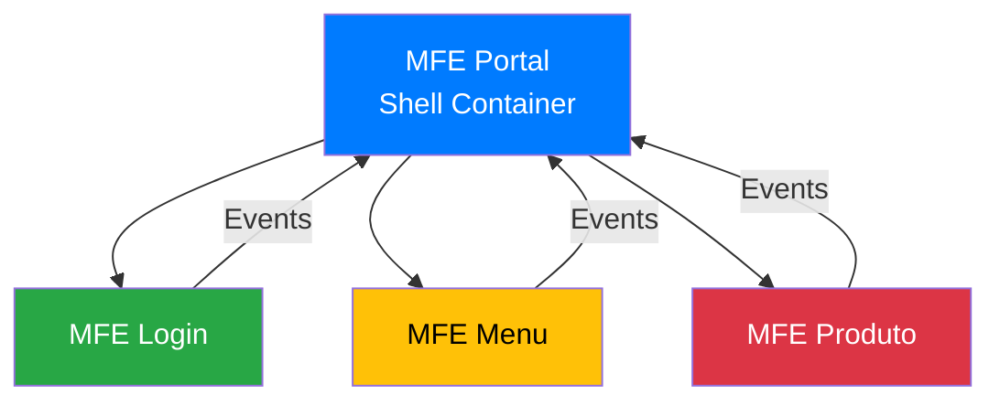

# 📡 Padrão de Comunicação entre MicroFrontEnds

## 🎯 Visão Geral

Este documento estabelece o padrão de comunicação entre MicroFrontEnds (MFEs) na arquitetura de referência, definindo convenções, estruturas de dados e melhores práticas para garantir consistência e manutenibilidade.

## 🏗️ Arquitetura de Comunicação

### Modelo Hub-and-Spoke


### Princípios Fundamentais
1. **Desacoplamento**: MFEs não se comunicam diretamente
2. **Mediação**: Portal atua como mediador central
3. **Eventos**: Comunicação baseada em Custom Events
4. **Tipagem**: Contratos bem definidos com TypeScript
5. **Unidirecionalidade**: Fluxo de dados previsível

## 🔧 Implementação Técnica

### 1. Custom Events (Window Events)

#### Convenção de Nomenclatura
```typescript
// Padrão: mfe-{nome-do-mfe}-{direção}
const INPUT_EVENT = 'mfe-login-input';   // Portal → MFE
const OUTPUT_EVENT = 'mfe-login-output'; // MFE → Portal
```

#### Estrutura Base dos Eventos
```typescript
interface MfeEvent<T = any> {
  detail: T;
}

// Evento de entrada (Portal → MFE)
interface MfeInputEvent extends MfeEvent<MfeInputData> {}

// Evento de saída (MFE → Portal)
interface MfeOutputEvent extends MfeEvent<MfeOutputData> {}
```

### 2. Estruturas de Dados Padronizadas

#### Input Data (Portal → MFE)
```typescript
interface MfeInputData {
  // Dados do usuário (sempre presente após login)
  user?: {
    id: string;
    username: string;
    name: string;
    email?: string;
    permissions: string[];
  };
  
  // Contexto da navegação
  context?: {
    source: string;        // Origem da ação
    timestamp: string;     // Timestamp da ação
    sessionId?: string;    // ID da sessão
  };
  
  // Configurações específicas do MFE
  config?: {
    theme?: string;
    locale?: string;
    features?: string[];
  };
  
  // Dados específicos do domínio
  [key: string]: any;
}
```

#### Output Data (MFE → Portal)
```typescript
interface MfeOutputData {
  // Tipo da ação/evento (obrigatório)
  type: string;
  
  // Dados da ação
  payload: {
    // Identificação da ação
    action?: string;
    
    // Dados específicos
    data?: any;
    
    // Metadados
    metadata?: {
      timestamp: string;
      source: string;
      userId?: string;
    };
    
    // Status da operação
    status?: 'success' | 'error' | 'warning' | 'info';
    
    // Mensagem de feedback
    message?: string;
  };
}
```

### 3. Service de Comunicação Padronizado

#### Interface Base
```typescript
interface IMfeCommunicationService {
  // Enviar dados para o Portal
  sendDataToPortal(data: MfeOutputData): void;
  
  // Receber dados do Portal
  inputData$: Observable<MfeInputData>;
  
  // Obter dados atuais
  getCurrentInputData(): MfeInputData;
}
```

#### Implementação no Portal
```typescript
@Injectable({
  providedIn: 'root'
})
export class MfeCommunicationService {
  private mfeDataSubject = new BehaviorSubject<MfeOutputData>({});
  public mfeData$ = this.mfeDataSubject.asObservable();

  // Enviar dados para um MFE específico
  sendDataToMfe(mfeName: string, data: MfeInputData): void {
    const event = new CustomEvent(`mfe-${mfeName}-input`, {
      detail: {
        ...data,
        context: {
          ...data.context,
          timestamp: new Date().toISOString(),
          source: 'portal'
        }
      }
    });
    window.dispatchEvent(event);
    console.log(`Portal → MFE ${mfeName}:`, data);
  }

  // Receber dados de um MFE específico
  receiveDataFromMfe(mfeName: string): Observable<MfeOutputData> {
    return new Observable(observer => {
      const handler = (event: CustomEvent) => {
        const data = {
          ...event.detail,
          payload: {
            ...event.detail.payload,
            metadata: {
              ...event.detail.payload?.metadata,
              timestamp: new Date().toISOString(),
              source: mfeName
            }
          }
        };
        observer.next(data);
      };
      
      window.addEventListener(`mfe-${mfeName}-output`, handler);
      
      return () => {
        window.removeEventListener(`mfe-${mfeName}-output`, handler);
      };
    });
  }
}
```

#### Implementação nos MFEs
```typescript
@Injectable({
  providedIn: 'root'
})
export class MfeCommunicationService implements IMfeCommunicationService {
  private mfeName: string;
  private inputDataSubject = new BehaviorSubject<MfeInputData>({});
  public inputData$ = this.inputDataSubject.asObservable();

  constructor(@Inject('MFE_NAME') mfeName: string) {
    this.mfeName = mfeName;
    this.setupInputListener();
  }

  private setupInputListener(): void {
    window.addEventListener(`mfe-${this.mfeName}-input`, (event: CustomEvent) => {
      console.log(`MFE ${this.mfeName} ← Portal:`, event.detail);
      this.inputDataSubject.next(event.detail);
    });
  }

  sendDataToPortal(data: MfeOutputData): void {
    const enrichedData = {
      ...data,
      payload: {
        ...data.payload,
        metadata: {
          ...data.payload?.metadata,
          timestamp: new Date().toISOString(),
          source: this.mfeName
        }
      }
    };

    const event = new CustomEvent(`mfe-${this.mfeName}-output`, {
      detail: enrichedData
    });
    window.dispatchEvent(event);
    console.log(`MFE ${this.mfeName} → Portal:`, enrichedData);
  }

  getCurrentInputData(): MfeInputData {
    return this.inputDataSubject.value;
  }
}
```

## 📋 Tipos de Eventos Padronizados

### 1. Eventos de Autenticação
```typescript
// Login bem-sucedido
interface AuthSuccessEvent extends MfeOutputData {
  type: 'AUTH_SUCCESS';
  payload: {
    action: 'login';
    data: {
      token: string;
      user: User;
    };
    status: 'success';
  };
}

// Erro de autenticação
interface AuthErrorEvent extends MfeOutputData {
  type: 'AUTH_ERROR';
  payload: {
    action: 'login';
    status: 'error';
    message: string;
  };
}
```

### 2. Eventos de Navegação
```typescript
// Seleção de item do menu
interface MenuSelectionEvent extends MfeOutputData {
  type: 'MENU_ITEM_SELECTED';
  payload: {
    action: 'navigate';
    data: {
      itemId: string;
      label: string;
      targetMfe?: string;
    };
    status: 'success';
  };
}
```

### 3. Eventos de Ação
```typescript
// Ação genérica em MFE
interface MfeActionEvent extends MfeOutputData {
  type: 'MFE_ACTION';
  payload: {
    action: string;
    data?: any;
    status: 'success' | 'error' | 'warning' | 'info';
    message?: string;
  };
}
```

## 🛡️ Validação e Segurança

### 1. Validação de Dados
```typescript
// Validador de entrada
function validateInputData(data: MfeInputData): boolean {
  // Validações básicas
  if (data.user && !data.user.id) {
    console.error('User ID is required');
    return false;
  }
  
  // Validações específicas
  return true;
}

// Sanitização de dados
function sanitizeInputData(data: MfeInputData): MfeInputData {
  return {
    ...data,
    // Remover propriedades sensíveis se necessário
  };
}
```

### 2. Controle de Origem
```typescript
// Verificar origem do evento
function isValidEventOrigin(event: CustomEvent): boolean {
  // Implementar verificações de segurança
  return true; // Simplificado para demonstração
}
```

## 📊 Logging e Monitoramento

### 1. Logger Padronizado
```typescript
interface MfeLogger {
  logCommunication(direction: 'in' | 'out', mfeName: string, data: any): void;
  logError(error: Error, context?: any): void;
  logPerformance(action: string, duration: number): void;
}

class MfeCommunicationLogger implements MfeLogger {
  logCommunication(direction: 'in' | 'out', mfeName: string, data: any): void {
    const arrow = direction === 'in' ? '←' : '→';
    console.log(`MFE Communication ${arrow} ${mfeName}:`, data);
  }

  logError(error: Error, context?: any): void {
    console.error('MFE Communication Error:', error, context);
  }

  logPerformance(action: string, duration: number): void {
    console.log(`MFE Performance - ${action}: ${duration}ms`);
  }
}
```

### 2. Métricas de Comunicação
```typescript
interface CommunicationMetrics {
  totalEvents: number;
  eventsByType: Record<string, number>;
  averageResponseTime: number;
  errorRate: number;
}

class MetricsCollector {
  private metrics: CommunicationMetrics = {
    totalEvents: 0,
    eventsByType: {},
    averageResponseTime: 0,
    errorRate: 0
  };

  recordEvent(type: string, responseTime?: number): void {
    this.metrics.totalEvents++;
    this.metrics.eventsByType[type] = (this.metrics.eventsByType[type] || 0) + 1;
    
    if (responseTime) {
      // Calcular média de tempo de resposta
    }
  }

  getMetrics(): CommunicationMetrics {
    return { ...this.metrics };
  }
}
```

## 🧪 Testes

### 1. Testes de Comunicação
```typescript
describe('MFE Communication', () => {
  let communicationService: MfeCommunicationService;

  beforeEach(() => {
    communicationService = new MfeCommunicationService();
  });

  it('should send data to MFE', () => {
    const spy = spyOn(window, 'dispatchEvent');
    const data = { user: { id: '1', name: 'Test' } };

    communicationService.sendDataToMfe('login', data);

    expect(spy).toHaveBeenCalledWith(
      jasmine.objectContaining({
        type: 'mfe-login-input',
        detail: jasmine.objectContaining(data)
      })
    );
  });

  it('should receive data from MFE', (done) => {
    communicationService.receiveDataFromMfe('login').subscribe(data => {
      expect(data.type).toBe('AUTH_SUCCESS');
      done();
    });

    // Simular evento
    const event = new CustomEvent('mfe-login-output', {
      detail: { type: 'AUTH_SUCCESS', payload: {} }
    });
    window.dispatchEvent(event);
  });
});
```

### 2. Testes de Integração
```typescript
describe('MFE Integration', () => {
  it('should handle complete authentication flow', async () => {
    // Simular fluxo completo de autenticação
    const portal = new PortalComponent();
    const login = new LoginComponent();

    // 1. Portal carrega login
    portal.loadMfe('login');

    // 2. Login envia credenciais
    login.authenticate({ username: 'test', password: 'test' });

    // 3. Portal recebe resposta
    expect(portal.isAuthenticated).toBe(true);
  });
});
```

## 📈 Performance

### 1. Otimizações
- **Debounce**: Evitar eventos excessivos
- **Throttle**: Limitar frequência de eventos
- **Caching**: Cache de dados frequentemente acessados
- **Lazy Loading**: Carregamento sob demanda

### 2. Monitoramento de Performance
```typescript
class PerformanceMonitor {
  private startTime: number = 0;

  startMeasure(): void {
    this.startTime = performance.now();
  }

  endMeasure(action: string): number {
    const duration = performance.now() - this.startTime;
    console.log(`${action} took ${duration.toFixed(2)}ms`);
    return duration;
  }
}
```

## 🔄 Versionamento de Contratos

### 1. Versionamento Semântico
```typescript
interface MfeContract {
  version: string;        // "1.0.0"
  mfeName: string;       // "login"
  inputSchema: object;   // JSON Schema para validação
  outputEvents: string[]; // Lista de eventos suportados
}
```

### 2. Compatibilidade
```typescript
function isCompatible(requiredVersion: string, currentVersion: string): boolean {
  // Implementar verificação de compatibilidade semântica
  return true;
}
```

## 📚 Melhores Práticas

### 1. Desenvolvimento
- ✅ Sempre definir tipos TypeScript
- ✅ Validar dados de entrada e saída
- ✅ Implementar tratamento de erros
- ✅ Usar logging consistente
- ✅ Documentar contratos de comunicação

### 2. Testes
- ✅ Testar comunicação entre MFEs
- ✅ Validar contratos de dados
- ✅ Simular cenários de erro
- ✅ Testar performance

### 3. Monitoramento
- ✅ Coletar métricas de comunicação
- ✅ Monitorar erros e exceções
- ✅ Rastrear performance
- ✅ Implementar alertas

---

**Versão do Padrão**: 1.0  
**Compatibilidade**: Angular 21+  
**Última Atualização**: Fevereiro 2024