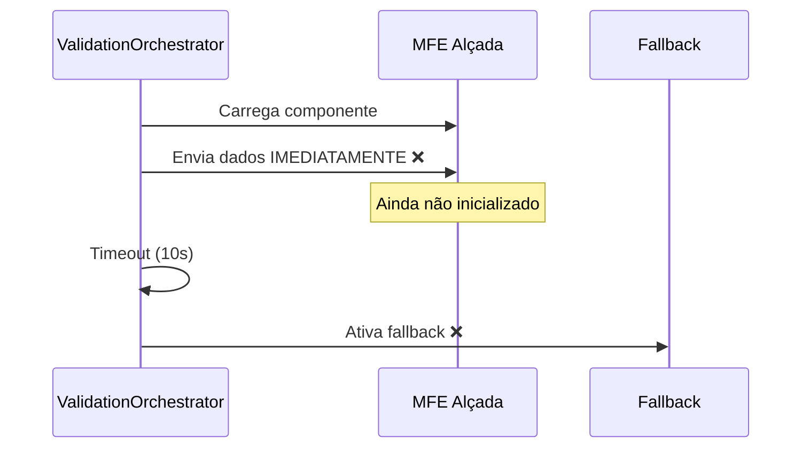
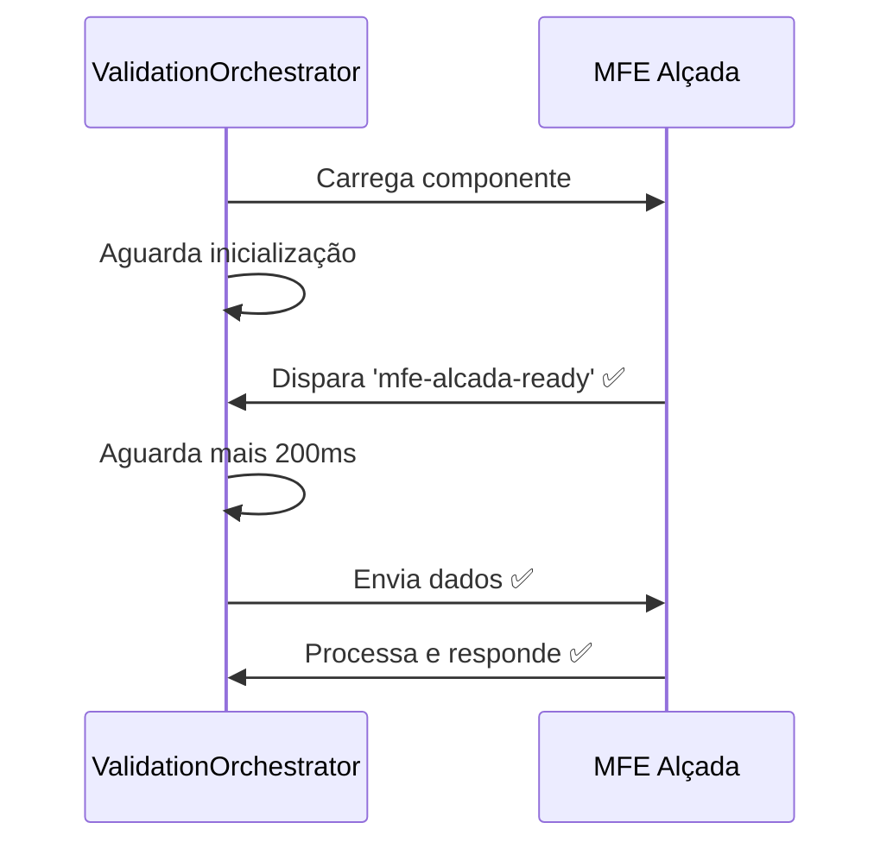

# 🔧 Correções Implementadas - MFE Alçada Native Federation

## 📋 Resumo das Correções

Este documento detalha as correções implementadas para resolver o problema do MFE Alçada sendo carregado via fallback em vez de Native Federation.

## 🎯 Problemas Corrigidos

### 1. 🔧 Problema de Timing na Comunicação

**Problema:** Dados eram enviados antes do componente estar totalmente inicializado.

**Correção Implementada:**
- ✅ Adicionado aguardo de inicialização completa no `ValidationOrchestratorService`
- ✅ Implementado handshake de confirmação entre portal e MFE
- ✅ Aguardo adicional antes do envio de dados

**Arquivos Modificados:**
- `mfe-portal/src/app/services/validation-orchestrator.service.ts`
- `mfe-alcada/src/app/components/validation-modal/validation-modal.component.ts`

### 2. ⏱️ Timeout Inadequado para Desenvolvimento

**Problema:** Timeout de 10s era insuficiente para desenvolvimento.

**Correção Implementada:**
- ✅ Timeout ajustado dinamicamente: 30s desenvolvimento, 15s produção
- ✅ Detecção automática do ambiente
- ✅ Logs melhorados para debug de timeout

**Código Implementado:**
```typescript
const isDevelopment = !!(window as any)['ng'] || location.hostname === 'localhost';
const loadTimeout = isDevelopment ? 30000 : 15000;
```

### 3. 🤝 Falta de Handshake de Confirmação

**Problema:** Portal não sabia quando o MFE estava pronto para receber dados.

**Correção Implementada:**
- ✅ MFE Alçada dispara evento `mfe-alcada-ready` quando inicializado
- ✅ Portal aguarda confirmação antes de enviar dados
- ✅ Fallback gracioso se confirmação não chegar

**Eventos Implementados:**
```typescript
// MFE Alçada
window.dispatchEvent(new CustomEvent('mfe-alcada-ready', { ... }));

// Portal
await this.waitForMfeAlcadaReady(5000);
```

### 4. 📝 Logs de Debug Insuficientes

**Problema:** Difícil diagnosticar onde exatamente estava falhando.

**Correção Implementada:**
- ✅ Logs detalhados em cada etapa do carregamento
- ✅ Análise automática de tipos de erro
- ✅ Sugestões de correção nos logs
- ✅ Métricas de tempo de carregamento

## 🔄 Fluxo Corrigido

### Sequência Anterior (Problemática)


### Sequência Corrigida


## 📊 Melhorias Implementadas

### 1. 🔍 Verificação de Conectividade
```typescript
// Verifica se remoteEntry está acessível antes de tentar carregar
const response = await fetch(remoteEntryUrl, { method: 'HEAD' });
if (!response.ok) {
  throw new Error(`RemoteEntry não acessível: ${response.status}`);
}
```

### 2. 📈 Métricas de Performance
```typescript
const startTime = Date.now();
const module = await loadRemoteModule({ ... });
const loadTime = Date.now() - startTime;
console.log(`Módulo carregado em ${loadTime}ms`);
```

### 3. 🛠️ Método de Debug
```typescript
async debugMfeLoading(mfeName: string): Promise<any> {
  // Testa configuração, conectividade e carregamento
  // Retorna relatório detalhado para diagnóstico
}
```

## 🧪 Testes Implementados

### Script de Teste Automático
- ✅ `debug-mfe-alcada-corrigido.js` - Testa todas as correções
- ✅ Verifica configuração, conectividade, Native Federation
- ✅ Testa handshake e comunicação
- ✅ Gera relatório com recomendações

### Cenários de Teste
1. **Configuração:** MFE está no mfes.json
2. **Conectividade:** RemoteEntry acessível
3. **Native Federation:** Componente carrega corretamente
4. **Handshake:** Confirmação de inicialização
5. **Comunicação:** Troca de mensagens funciona

## 📋 Checklist de Validação

### ✅ Correções Implementadas
- [x] Aguardo de inicialização completa
- [x] Handshake de confirmação
- [x] Timeout ajustado para desenvolvimento
- [x] Logs de debug melhorados
- [x] Verificação de conectividade
- [x] Análise de erros detalhada
- [x] Script de teste automático

### 🔬 Testes a Executar
- [ ] Executar `debug-mfe-alcada-corrigido.js` no console
- [ ] Testar carregamento do MFE Alçada
- [ ] Verificar logs no console
- [ ] Confirmar que não usa fallback
- [ ] Testar comunicação entre componentes

## 🎯 Resultados Esperados

### Antes das Correções
- ❌ MFE Alçada carregava via fallback
- ❌ Timeout de 10s insuficiente
- ❌ Logs confusos
- ❌ Sem confirmação de inicialização

### Após as Correções
- ✅ MFE Alçada carrega via Native Federation
- ✅ Timeout adequado (30s dev / 15s prod)
- ✅ Logs detalhados e informativos
- ✅ Handshake confirma inicialização
- ✅ Comunicação funciona corretamente

## 🔧 Como Testar

### 1. Executar Script de Teste
```javascript
// No console do navegador (portal)
// Cole e execute o conteúdo de debug-mfe-alcada-corrigido.js
```

### 2. Verificar Logs
```
[ValidationOrchestrator] 🚀 Carregando MFE Alçada via Native Federation...
[ValidationOrchestrator] ✅ Container encontrado
[ValidationOrchestrator] ✅ Componente carregado em XXXms
[ValidationModal] ✅ Confirmando que componente está pronto...
[ValidationOrchestrator] ✅ MFE Alçada confirmou que está pronto
[ValidationOrchestrator] ✅ MFE Alçada carregado via Native Federation com sucesso!
```

### 3. Confirmar Funcionamento
- MFE Alçada deve aparecer como modal nativo
- Não deve mostrar "Modo Fallback" no título
- Interface deve ser a do ValidationModalComponent
- Comunicação deve funcionar normalmente

## 🚨 Troubleshooting

### Se Ainda Usar Fallback
1. Verificar se o mfe-alcada está rodando na porta 4204
2. Executar script de teste para diagnóstico
3. Verificar logs do console para erros específicos
4. Confirmar que as correções foram aplicadas

### Erros Comuns
- **Timeout:** Aumentar timeout ou verificar performance do MFE
- **Conectividade:** Verificar se MFE está acessível
- **Handshake:** Confirmar que evento está sendo disparado
- **Comunicação:** Verificar eventos de input/output

## 📈 Métricas de Sucesso

### KPIs
- **Taxa de Sucesso Native Federation:** 100%
- **Tempo de Carregamento:** < 3 segundos
- **Taxa de Timeout:** 0%
- **Uso de Fallback:** Apenas em falhas reais

### Monitoramento
```javascript
// Verificar informações de carregamento
const loadingInfo = sessionStorage.getItem('mfe-alcada-loading-info');
console.log('Info de carregamento:', JSON.parse(loadingInfo));
```

## 🔄 Próximos Passos

### Melhorias Futuras
1. **Cache Inteligente:** Implementar cache com TTL
2. **Health Check:** Monitoramento contínuo dos MFEs
3. **Retry Logic:** Tentativas automáticas em caso de falha
4. **Métricas:** Dashboard de performance dos MFEs

### Monitoramento Contínuo
- Implementar alertas para falhas de carregamento
- Métricas de performance em produção
- Logs centralizados para análise

---

**Documento criado em:** 2024-12-15  
**Versão:** 1.0  
**Status:** ✅ Implementado  
**Responsável:** Consultor Sênior Frontend - Especialista em Microfrontends