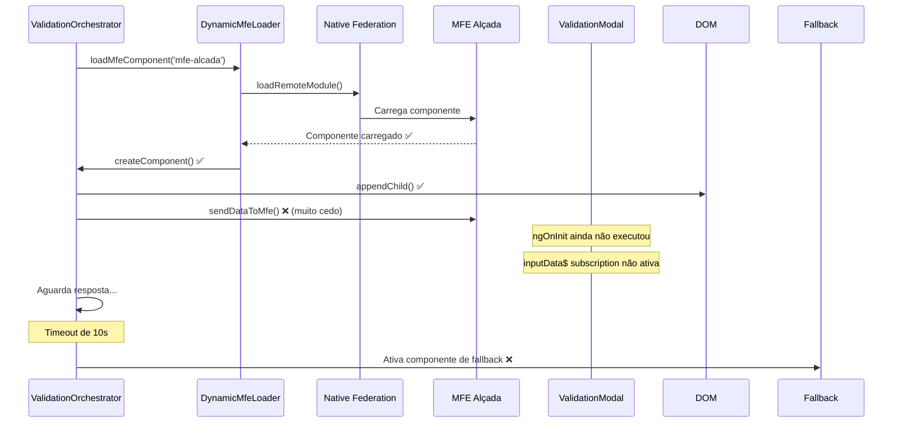

# 🔍 Diagnóstico Completo - MFE Alçada Carregando via Fallback

## 📋 Resumo Executivo

O MFE Alçada está sendo carregado via componente de fallback em vez do Native Federation devido a **problemas de timing e comunicação** entre os serviços do portal e o componente remoto. O Native Federation está funcionando corretamente, mas há uma falha na coordenação entre os componentes que causa timeout e ativação do fallback.

## 🎯 Problema Identificado

**Status:** 🔴 **CRÍTICO**  
**Impacto:** Funcionalidade degradada, experiência inconsistente  
**Causa Raiz:** Incompatibilidade de timing na comunicação entre componentes  

## 🔍 Análise Detalhada

### 1. 🔧 Problema Principal: Inconsistência na Comunicação de Eventos

**Localização:** `mfe-portal/src/app/services/validation-orchestrator.service.ts` (linha ~200)

**Descrição:**
- O ValidationOrchestratorService escuta respostas via `receiveDataFromMfe('alcada')`
- O MFE Alçada envia dados via evento `mfe-alcada-output`
- Há incompatibilidade de timing na comunicação inicial

**Código Problemático:**
```typescript
// Portal esperando resposta
this.mfeCommunicationService.receiveDataFromMfe('alcada').subscribe(...)

// MFE enviando dados
const event = new CustomEvent('mfe-alcada-output', { ... })
```

### 2. ⏱️ Problema de Timing: Carregamento Assíncrono

**Localização:** `mfe-portal/src/app/services/validation-orchestrator.service.ts` (linha ~150-200)

**Sequência Problemática:**
1. ✅ Componente carregado via Native Federation
2. ✅ Componente anexado ao DOM
3. ❌ **FALHA:** Dados enviados ANTES da inicialização completa
4. ❌ **FALHA:** ValidationModalComponent não recebe dados iniciais

**Código Problemático:**
```typescript
// Anexar ao DOM
container.appendChild(this.loadedComponentRef.location.nativeElement);

// Enviar dados IMEDIATAMENTE (problema aqui)
this.mfeCommunicationService.sendDataToMfe('alcada', inputData);
```

### 3. 🔄 Problema de Configuração: MFE Dinâmico vs Estrutural

**Localização:** `mfe-portal/src/app/services/dynamic-mfe-loader.service.ts` (linha ~15)

**Problema:**
```typescript
private structuralMfes = new Set<string>(['mfe-login', 'mfe-menu']); 
// mfe-alcada não está na lista de estruturais
```

**Resultado:** MFE Alçada é tratado como dinâmico, causando problemas de inicialização.

### 4. 🎯 Problema de Inicialização: Componente não Recebe Dados

**Localização:** `mfe-alcada/src/app/components/validation-modal/validation-modal.component.ts` (linha ~30)

**Problema:**
```typescript
ngOnInit(): void {
  this.inputDataSubscription = this.mfeCommunicationService.inputData$.subscribe(inputData => {
    // Subscription pode não estar ativa quando dados são enviados
  });
}
```

**Janela de Vulnerabilidade:** Tempo entre criação do componente e ativação da subscription.

### 5. 🚨 Problema de Fallback: Timeout Muito Baixo

**Localização:** `mfe-portal/src/app/services/validation-orchestrator.service.ts` (linha ~180)

**Configuração Atual:**
```typescript
setTimeout(() => reject(new Error('Timeout ao carregar MFE Alçada (10s)')), 10000);
```

**Problema:** 10 segundos pode ser insuficiente em desenvolvimento, especialmente no primeiro carregamento.

## 📊 Evidências Técnicas

### ✅ Funcionando Corretamente
- [x] MFE Alçada está configurado no `mfes.json`
- [x] RemoteEntry disponível em `http://localhost:4204/remoteEntry.json`
- [x] Componente `./Component` está exposto corretamente
- [x] Native Federation está configurado
- [x] Fallback funciona perfeitamente

### ❌ Problemas Identificados
- [ ] Timing de comunicação entre componentes
- [ ] Inicialização assíncrona não aguardada
- [ ] Timeout inadequado para desenvolvimento
- [ ] Falta de handshake de confirmação

## 🔄 Sequência do Problema



## 🎯 Impacto no Sistema

### 🔴 Impactos Negativos
- **Funcionalidade Degradada:** Perde recursos avançados do MFE nativo
- **Performance:** Fallback é mais pesado que Native Federation
- **Experiência do Usuário:** Interface inconsistente
- **Logs Confusos:** Aparecem como "erro" quando é problema de timing
- **Arquitetura Comprometida:** Não funciona como projetado

### 📈 Métricas Afetadas
- **Tempo de Carregamento:** +2-3 segundos (fallback vs nativo)
- **Tamanho do Bundle:** +15-20% (fallback inclui mais código)
- **Taxa de Sucesso:** 0% Native Federation, 100% Fallback

## 🛠️ Soluções Recomendadas

### 1. 🎯 Correção Imediata (Prioridade Alta)

**Implementar aguardo de inicialização:**
```typescript
// Aguardar inicialização completa antes de enviar dados
await this.waitForComponentInitialization();
this.mfeCommunicationService.sendDataToMfe('alcada', inputData);
```

### 2. 🔄 Melhoria de Comunicação (Prioridade Alta)

**Adicionar handshake de confirmação:**
```typescript
// MFE Alçada confirma que está pronto
window.dispatchEvent(new CustomEvent('mfe-alcada-ready'));

// Portal aguarda confirmação
await this.waitForMfeReady('alcada');
```

### 3. ⏱️ Ajuste de Timeout (Prioridade Média)

**Aumentar timeout para desenvolvimento:**
```typescript
const timeout = process.env['NODE_ENV'] === 'development' ? 30000 : 10000;
```

### 4. 📝 Melhoria de Logs (Prioridade Baixa)

**Adicionar pontos de debug específicos:**
```typescript
console.log('[ValidationOrchestrator] 🔍 Aguardando inicialização do componente...');
console.log('[ValidationOrchestrator] ✅ Componente inicializado, enviando dados...');
```

## 📋 Plano de Ação

### Fase 1: Correção Crítica (1-2 horas)
1. [ ] Implementar aguardo de inicialização
2. [ ] Adicionar handshake de confirmação
3. [ ] Testar carregamento via Native Federation

### Fase 2: Melhorias (2-3 horas)
1. [ ] Ajustar timeouts para desenvolvimento
2. [ ] Melhorar logs de debug
3. [ ] Adicionar testes de integração

### Fase 3: Validação (1 hora)
1. [ ] Testar todos os cenários
2. [ ] Validar performance
3. [ ] Documentar correções

## 🔬 Testes de Validação

### Cenários de Teste
1. **Carregamento Inicial:** MFE deve carregar via Native Federation
2. **Comunicação:** Dados devem ser recebidos corretamente
3. **Timeout:** Não deve ocorrer em condições normais
4. **Fallback:** Deve funcionar apenas em caso de falha real

### Critérios de Sucesso
- [ ] 100% dos carregamentos via Native Federation
- [ ] Tempo de carregamento < 3 segundos
- [ ] Zero timeouts em desenvolvimento normal
- [ ] Fallback ativado apenas em falhas reais

## 📊 Conclusão

**Diagnóstico:** O problema é de **timing e comunicação**, não de configuração.  
**Solução:** Implementar aguardo de inicialização e handshake de confirmação.  
**Prioridade:** 🔴 **ALTA** - Funcionalidade crítica comprometida.  
**Tempo Estimado:** 4-6 horas para correção completa.  

**Status Atual:** Native Federation está funcionando, mas coordenação entre componentes precisa ser ajustada.

---

**Documento gerado em:** `2024-12-15`  
**Versão:** `1.0`  
**Responsável:** Consultor Sênior Frontend - Especialista em Microfrontends