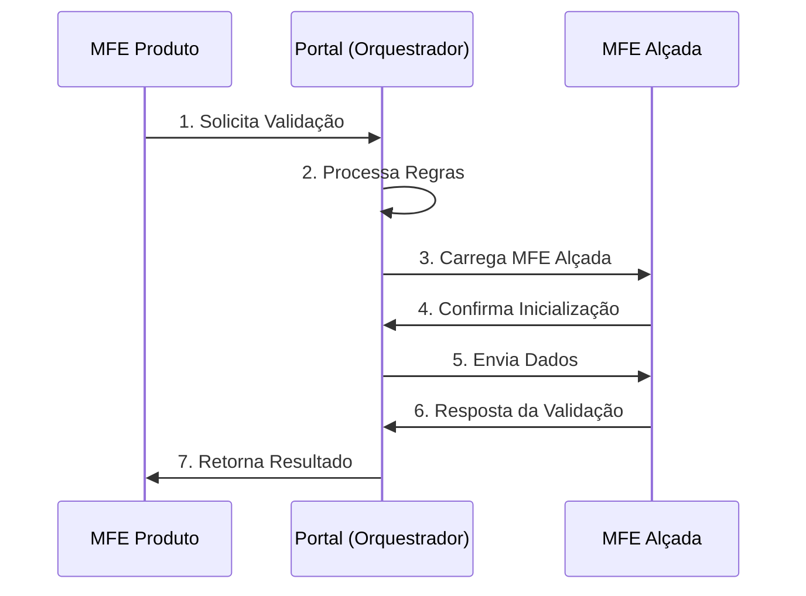
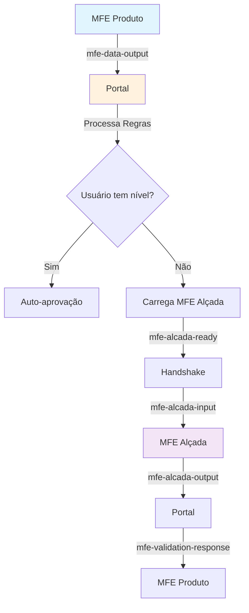

# 📡 Guia de Comunicação entre MFEs: Produto ↔ Alçada

## 🎯 Objetivo

Este guia explica o **padrão de comunicação** implementado entre o **MFE Produto** e o **MFE Alçada** através do **Portal**, usando eventos customizados e orquestração centralizada.

---

## 🏗️ Arquitetura de Comunicação

### Visão Geral do Fluxo



### Componentes Principais

| Componente | Responsabilidade |
|------------|------------------|
| **MFE Produto** | Solicita validação de operações críticas |
| **Portal** | Orquestra comunicação e aplica regras de negócio |
| **ValidationOrchestrator** | Gerencia ciclo de vida das validações |
| **MFE Alçada** | Processa validação com usuário autorizado |

---

## 🔄 Padrão de Comunicação

### 1. 📤 Solicitação de Validação (MFE Produto → Portal)

O MFE Produto dispara um evento quando precisa de validação:

```typescript
// MFE Produto - Solicitando validação
const validationRequest = {
  type: 'VALIDATION_REQUEST',
  payload: {
    action: 'request_validation',
    data: {
      operation: {
        type: 'delete',           // Tipo da operação
        resource: 'product',      // Recurso afetado
        resourceId: 'PROD-001',   // ID específico
        description: 'Exclusão de produto'
      },
      context: {
        resourceName: 'Smartphone XYZ',
        requestedBy: {
          name: 'João Silva',
          id: 'user-123',
          role: 'operator'
        },
        resourceDetails: {
          name: 'Smartphone XYZ',
          price: 1299.99,
          category: 'Eletrônicos'
        }
      },
      urgency: 'high'
    }
  }
};

// Disparar evento global
const event = new CustomEvent('mfe-data-output', {
  detail: validationRequest,
  bubbles: true
});
window.dispatchEvent(event);
```

### 2. 🎯 Processamento no Portal (ValidationOrchestrator)

O Portal recebe e processa a solicitação:

```typescript
// Portal - ValidationOrchestratorService
window.addEventListener('mfe-data-output', (event) => {
  const outputData = event.detail;
  
  if (outputData.type === 'VALIDATION_REQUEST') {
    this.handleGenericValidationRequest(outputData);
  }
});

private async handleGenericValidationRequest(request: any) {
  const validationData = request.payload.data;
  
  // 1. Verificar regras de negócio
  const rule = this.getValidationRule(validationData.operation);
  
  // 2. Verificar nível do usuário atual
  if (this.userHasSufficientLevel(rule.requiredLevel)) {
    this.sendAutoApproval(validationData);
    return;
  }
  
  // 3. Criar solicitação de validação
  const validationRequest = {
    id: this.generateValidationId(),
    operation: validationData.operation,
    requiredLevel: rule.requiredLevel,
    context: validationData.context,
    metadata: {
      timestamp: new Date().toISOString(),
      urgency: validationData.urgency,
      expiresAt: this.calculateExpiration(rule.timeoutMinutes)
    }
  };
  
  // 4. Carregar MFE Alçada
  await this.loadValidationMfe(validationRequest);
}
```

### 3. 🚀 Carregamento Dinâmico do MFE Alçada

O Portal carrega o MFE Alçada via Native Federation:

```typescript
// Portal - Carregamento dinâmico
private async loadValidationMfe(request: ValidationRequest) {
  try {
    // 1. Carregar componente via Native Federation
    const AlcadaComponent = await this.dynamicMfeLoader
      .loadMfeComponent('mfe-alcada');
    
    // 2. Criar instância do componente
    this.loadedComponentRef = createComponent(AlcadaComponent, {
      environmentInjector: this.environmentInjector
    });
    
    // 3. Anexar ao DOM
    container.appendChild(this.loadedComponentRef.location.nativeElement);
    
    // 4. Aguardar inicialização
    await this.waitForMfeAlcadaReady();
    
    // 5. Enviar dados para o MFE
    const inputData = {
      config: { validation: request },
      user: this.getCurrentUser(),
      token: this.tokenManager.getCurrentToken()
    };
    
    this.mfeCommunicationService.sendDataToMfe('alcada', inputData);
    
  } catch (error) {
    // Fallback em caso de erro
    this.showFallbackValidation(request);
  }
}
```

### 4. 🤝 Handshake de Inicialização

O MFE Alçada confirma que está pronto:

```typescript
// MFE Alçada - Confirmação de inicialização
ngAfterViewInit(): void {
  setTimeout(() => {
    // Disparar evento confirmando que está pronto
    const readyEvent = new CustomEvent('mfe-alcada-ready', {
      detail: {
        componentName: 'ValidationModalComponent',
        timestamp: new Date().toISOString(),
        ready: true
      },
      bubbles: true
    });
    
    window.dispatchEvent(readyEvent);
  }, 100);
}
```

### 5. 📥 Recebimento de Dados (Portal → MFE Alçada)

O MFE Alçada recebe os dados via evento customizado:

```typescript
// MFE Alçada - Recebendo dados
ngOnInit(): void {
  this.mfeCommunicationService.inputData$.subscribe(inputData => {
    if (inputData.config?.validation) {
      this.validation = inputData.config.validation;
      this.startExpirationTimer();
    }
  });
}

// MfeCommunicationService - Setup de listeners
private setupEventListeners(): void {
  window.addEventListener('mfe-alcada-input', (event: any) => {
    this.inputDataSubject.next(event.detail);
  });
}
```

### 6. ✅ Resposta da Validação (MFE Alçada → Portal)

Após validação, o MFE Alçada envia resposta:

```typescript
// MFE Alçada - Enviando resposta
private sendValidationResponse(validated: boolean, data: any): void {
  const response = {
    type: 'VALIDATION_RESPONSE',
    payload: {
      action: 'validation_complete',
      data: {
        validationId: this.validation.id,
        validated: validated,
        validatedBy: data.validatedBy,
        justification: data.justification,
        timestamp: new Date().toISOString()
      },
      status: validated ? 'success' : 'error'
    }
  };
  
  // Enviar via evento customizado
  const event = new CustomEvent('mfe-alcada-output', {
    detail: response,
    bubbles: true
  });
  window.dispatchEvent(event);
}
```

### 7. 🔄 Retorno ao MFE Produto (Portal → MFE Produto)

O Portal processa a resposta e notifica o MFE Produto:

```typescript
// Portal - Processando resposta e notificando MFE Produto
private sendValidationResponse(validationId: string, validated: boolean, data: any) {
  const validation = this.pendingValidations.get(validationId);
  
  // Criar evento de resposta padronizado
  const responseEvent = new CustomEvent('mfe-validation-response', {
    detail: {
      context: {
        action: 'validation_response',
        validationId: validationId,
        resourceId: validation.operation.resourceId,
        validated: validated,
        validatedBy: data.validatedBy,
        reason: data.reason,
        timestamp: new Date().toISOString()
      }
    },
    bubbles: true
  });
  
  window.dispatchEvent(responseEvent);
  
  // Limpar recursos
  this.pendingValidations.delete(validationId);
  this.unloadValidationMfe();
}
```

---

## 🎨 Diagrama de Eventos



---

## 🔧 Padrões de Nomenclatura

### Eventos Globais

| Evento | Direção | Propósito |
|--------|---------|-----------|
| `mfe-data-output` | MFE → Portal | Solicitações gerais |
| `mfe-alcada-ready` | MFE Alçada → Portal | Confirmação de inicialização |
| `mfe-alcada-input` | Portal → MFE Alçada | Envio de dados |
| `mfe-alcada-output` | MFE Alçada → Portal | Resposta de validação |
| `mfe-validation-response` | Portal → MFE Produto | Resultado final |

### Estrutura de Dados

```typescript
// Padrão de Mensagem
interface MfeMessage {
  type: string;           // Tipo da mensagem
  payload: {
    action: string;       // Ação específica
    data: any;           // Dados da operação
    status?: string;     // Status da operação
  };
}

// Contexto de Validação
interface ValidationContext {
  resourceName: string;
  requestedBy: {
    id: string;
    name: string;
    role: string;
  };
  resourceDetails: Record<string, any>;
  impact?: 'low' | 'medium' | 'high';
  reversible: boolean;
}
```

---

## ⚡ Vantagens do Padrão

### 🎯 **Desacoplamento**
- MFEs não se conhecem diretamente
- Portal atua como mediador
- Facilita manutenção e evolução

### 🔄 **Flexibilidade**
- Novos MFEs podem usar o mesmo padrão
- Regras centralizadas no Portal
- Fallback automático em caso de falha

### 🛡️ **Robustez**
- Timeout configurável
- Handshake de confirmação
- Tratamento de erros robusto

### 📊 **Observabilidade**
- Logs detalhados em cada etapa
- Rastreamento de validações
- Métricas de performance

---

## 🚀 Exemplo Prático Completo

### Cenário: Exclusão de Produto

```typescript
// 1. MFE Produto solicita validação
const deleteProduct = (productId: string) => {
  const event = new CustomEvent('mfe-data-output', {
    detail: {
      type: 'VALIDATION_REQUEST',
      payload: {
        action: 'request_validation',
        data: {
          operation: {
            type: 'delete',
            resource: 'product',
            resourceId: productId,
            description: 'Exclusão de produto'
          },
          context: {
            resourceName: 'Smartphone XYZ',
            requestedBy: getCurrentUser(),
            resourceDetails: getProductDetails(productId)
          }
        }
      }
    }
  });
  window.dispatchEvent(event);
};

// 2. MFE Produto escuta resposta
window.addEventListener('mfe-validation-response', (event) => {
  const response = event.detail.context;
  
  if (response.validated) {
    // Prosseguir com exclusão
    this.executeDelete(response.resourceId);
    this.showSuccess('Produto excluído com sucesso!');
  } else {
    // Cancelar operação
    this.showError(`Operação cancelada: ${response.reason}`);
  }
});
```

---

## 📝 Resumo para Desenvolvedores

### ✅ **O que Fazer**
1. **Usar eventos customizados** para comunicação
2. **Seguir padrão de nomenclatura** estabelecido
3. **Implementar tratamento de erros** robusto
4. **Adicionar logs detalhados** para debug

### ❌ **O que Evitar**
1. **Comunicação direta** entre MFEs
2. **Dependências hard-coded** entre componentes
3. **Timeouts muito baixos** em desenvolvimento
4. **Ignorar handshake** de inicialização

### 🎯 **Pontos-Chave**
- **Portal é o orquestrador** central
- **Eventos são assíncronos** e desacoplados
- **Fallback sempre disponível** para robustez
- **Validações seguem regras** centralizadas

---

## 🔍 Troubleshooting

### Problemas Comuns

| Problema | Causa Provável | Solução |
|----------|----------------|---------|
| MFE não carrega | Timeout muito baixo | Aumentar timeout para desenvolvimento |
| Dados não chegam | Handshake não funcionando | Verificar evento `mfe-alcada-ready` |
| Fallback sempre ativo | Native Federation falhando | Verificar logs do console |
| Validação não responde | Evento não disparado | Verificar `mfe-alcada-output` |

### Debug Útil

```typescript
// Verificar eventos sendo disparados
window.addEventListener('mfe-data-output', console.log);
window.addEventListener('mfe-alcada-ready', console.log);
window.addEventListener('mfe-validation-response', console.log);

// Verificar estado do ValidationOrchestrator
console.log(window.mfeLoadingInfo);
```

---

## 📚 Referências

- **Documentação Completa:** Pasta `roteiro/` do projeto
- **Diagnóstico de Problemas:** `docs/diagnostico-mfe-alcada-fallback.md`
- **Correções Implementadas:** `docs/correcoes-mfe-alcada-implementadas.md`

---

*Este padrão garante comunicação robusta, desacoplada e escalável entre microfrontends, facilitando manutenção e evolução do sistema.*

---

**Documento criado em:** 2024-12-15  
**Versão:** 1.0  
**Responsável:** Equipe de Arquitetura Frontend