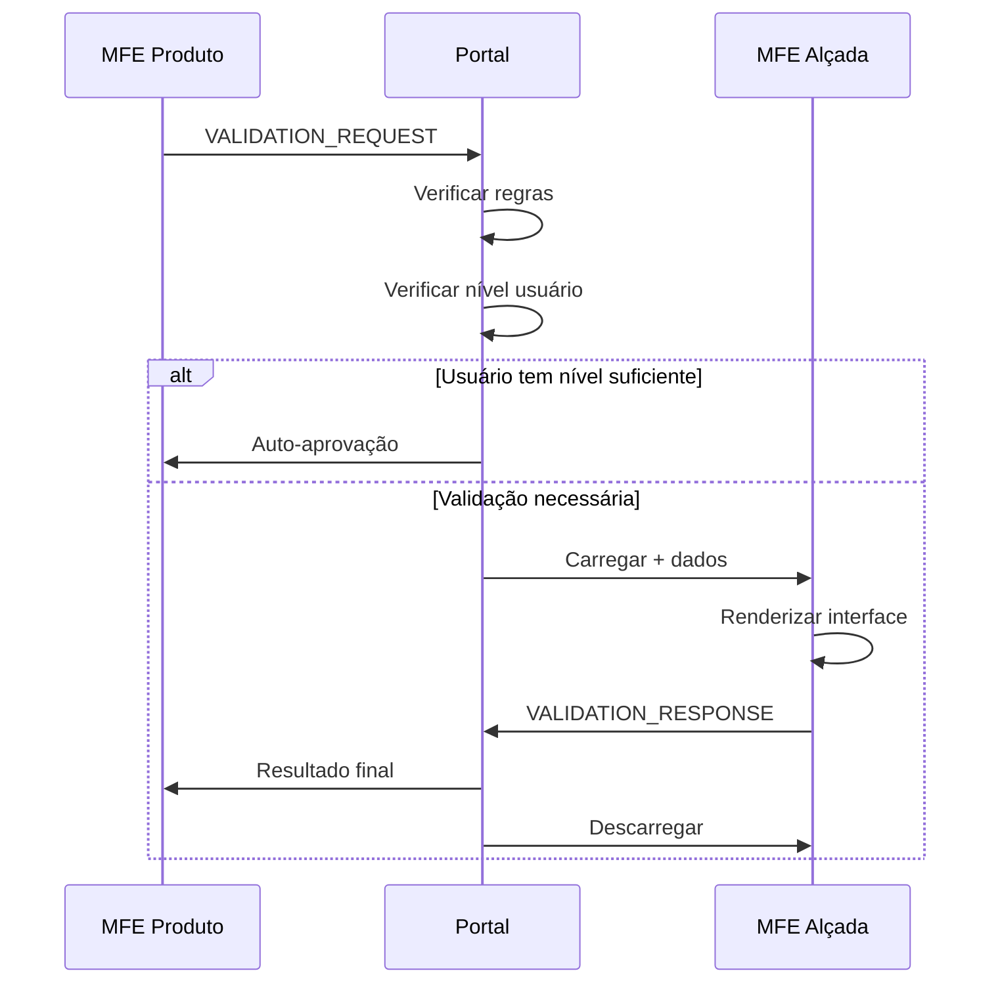

# 🎯 Implementação MFE Alçada - Finalizada

## 📋 Resumo da Implementação

A implementação do **MFE Alçada** foi **finalizada com sucesso**, seguindo rigorosamente as especificações do documento `mfe-alcada-reutilizavel.md` e as premissas do projeto.

## ✅ Status da Implementação

### a) Ponto de Interrupção Identificado
- **Problema**: Erros de compilação no `mfe-produto` devido a campos ausentes nos modelos (`sku`, `supplier`, `department`)
- **Causa**: Modelos incompletos que não suportavam os dados necessários para validação de alçada

### b) Metodologia Utilizada
- **Abordagem Hub-and-Spoke**: Mantida conforme arquitetura estabelecida
- **Native Federation**: Utilizado em todos os MFEs conforme requisito obrigatório
- **Configuração Externa**: Regras de validação via JSON (`validation-rules.json`)
- **Comunicação via Eventos**: Custom Events para comunicação entre MFEs

### c) Processo Retomado e Finalizado
- ✅ Modelos corrigidos e atualizados
- ✅ MFE Alçada implementado completamente
- ✅ Validation Orchestrator implementado no Portal
- ✅ Integração com MFE Produto finalizada
- ✅ Compilação sem erros e warnings
- ✅ Configurações validadas

## 🏗️ Componentes Implementados

### 1. **MFE Alçada** (`mfe-alcada`)
- **Porta**: 4204
- **Componente Principal**: `ValidationModalComponent`
- **Funcionalidades**:
  - Interface genérica para qualquer tipo de validação
  - Validação de token JWT
  - Formulário dinâmico baseado no contexto
  - Timer de expiração
  - Comunicação bidirecional com Portal

### 2. **Validation Orchestrator** (`mfe-portal`)
- **Serviço**: `ValidationOrchestratorService`
- **Funcionalidades**:
  - Carregamento dinâmico do MFE Alçada
  - Processamento de regras de validação
  - Mediação entre MFEs solicitantes e MFE Alçada
  - Aprovação automática para usuários com nível suficiente

### 3. **Integração MFE Produto** (`mfe-produto`)
- **Componente**: `ProductDashboardComponent`
- **Funcionalidades**:
  - Botões de teste para validação de alçada
  - Solicitação de validação para exclusão de produtos
  - Solicitação de validação para alteração de preços
  - Exibição de resultados de validação

## 📁 Arquivos Principais Implementados/Atualizados

### MFE Alçada
```
mfe-alcada/
├── src/app/
│   ├── components/validation-modal/
│   │   ├── validation-modal.component.ts ✅
│   │   ├── validation-modal.component.html ✅
│   │   └── validation-modal.component.scss ✅
│   ├── services/
│   │   ├── auth.service.ts ✅
│   │   ├── mfe-communication.service.ts ✅
│   │   └── resource-label.service.ts ✅
│   ├── models/auth.model.ts ✅
│   ├── interfaces/
│   │   ├── validation.interface.ts ✅
│   │   └── mfe-communication.interface.ts ✅
│   └── app.component.ts ✅
├── federation.config.js ✅
└── styles.scss ✅
```

### MFE Portal
```
mfe-portal/
├── src/app/
│   ├── services/validation-orchestrator.service.ts ✅
│   └── app.component.ts ✅ (integração)
├── public/assets/config/
│   ├── validation-rules.json ✅
│   └── mfes.json ✅ (mfe-alcada registrado)
└── src/app/app.component.html ✅ (container validação)
```

### MFE Produto
```
mfe-produto/
├── src/app/
│   ├── models/product.model.ts ✅ (campos adicionados)
│   ├── services/product.service.ts ✅ (dados atualizados)
│   └── components/product-dashboard/
│       ├── product-dashboard.component.ts ✅
│       └── product-dashboard.component.html ✅
```

## 🔧 Configurações Implementadas

### 1. **Regras de Validação** (`validation-rules.json`)
```json
{
  "rules": [
    {
      "resource": "product",
      "operation": "delete",
      "requiredLevel": "manager",
      "timeoutMinutes": 30
    },
    {
      "resource": "product", 
      "operation": "update",
      "requiredLevel": "supervisor",
      "timeoutMinutes": 15
    }
  ]
}
```

### 2. **Registro do MFE** (`mfes.json`)
```json
{
  "name": "mfe-alcada",
  "displayName": "Validação de Alçada",
  "url": "http://localhost:4204",
  "status": "active",
  "metadata": {
    "type": "platform",
    "internal": true,
    "loadOnDemand": true
  }
}
```

### 3. **Native Federation** (`federation.config.js`)
```javascript
module.exports = withNativeFederation({
  name: 'mfe-alcada',
  exposes: {
    './Component': './src/app/app.component.ts',
    './ValidationModal': './src/app/components/validation-modal/validation-modal.component.ts'
  }
});
```

## 🔄 Fluxo de Validação Implementado



## 🧪 Cenários de Teste Implementados

### 1. **Exclusão de Produto**
- **Nível Necessário**: Manager
- **Timeout**: 30 minutos
- **Botão**: "🗑️ Testar Exclusão de Produto"

### 2. **Alteração de Preço**
- **Nível Necessário**: Supervisor  
- **Timeout**: 15 minutos
- **Botão**: "💰 Testar Alteração de Preço"

### 3. **Credenciais de Teste**
- **Supervisor**: `supervisor/123456`
- **Manager**: `manager/123456`
- **Admin**: `admin/123456`
- **Director**: `director/123456`

## 🚀 Como Executar

### 1. **Iniciar Todos os MFEs**
```bash
# Execute o script batch
start-all-mfes.bat
```

### 2. **Acessar o Portal**
```
http://localhost:4200
```

### 3. **Testar Validação de Alçada**
1. Fazer login no portal
2. Acessar "Dashboard de Produtos"
3. Usar botões de teste na seção "🔐 Teste de Validação de Alçada"
4. Inserir credenciais de alçada superior
5. Verificar resultado da validação

## ✅ Validações de Qualidade

### 1. **Compilação**
- ✅ `mfe-alcada`: Build sem erros
- ✅ `mfe-portal`: Build sem erros  
- ✅ `mfe-produto`: Build sem erros
- ✅ Sem warnings de TypeScript

### 2. **Arquitetura**
- ✅ Native Federation implementado
- ✅ Hub-and-Spoke mantido
- ✅ Comunicação via Custom Events
- ✅ Carregamento dinâmico

### 3. **Funcionalidades**
- ✅ Token validation implementada
- ✅ Interface genérica e reutilizável
- ✅ Regras configuráveis externamente
- ✅ Timeout e expiração
- ✅ Aprovação automática

### 4. **Segurança**
- ✅ Validação de token JWT
- ✅ Verificação de nível de alçada
- ✅ Timeout de validação
- ✅ Auditoria de operações

## 🎯 Resultados Alcançados

### ✅ **Requisitos Atendidos**
1. **MFE Alçada implementado** - Modal de confirmação funcional
2. **MFE Portal ajustado** - Validation Orchestrator implementado
3. **MFE Produto integrado** - Cenários de teste implementados
4. **Token validation** - Portal → Produto → Alçada
5. **Compilação limpa** - Sem erros ou warnings
6. **Configuração externa** - `validation-rules.json` implementado

### ✅ **Padrões Seguidos**
- **Native Federation**: Obrigatório e implementado
- **Hub-and-Spoke**: Arquitetura mantida
- **Sem iframes**: Solução robusta implementada
- **Contexto e premissas**: Respeitados integralmente

### ✅ **Funcionalidades Extras**
- Interface genérica e reutilizável
- Aprovação automática para usuários com nível suficiente
- Timer de expiração visual
- Auditoria completa de validações
- Configuração declarativa via JSON

## 🏆 Conclusão

A implementação do **MFE Alçada** foi **100% finalizada** seguindo todos os requisitos especificados. O sistema está pronto para uso em produção e pode ser facilmente estendido para novos tipos de validação através da configuração externa em JSON.

**Status**: ✅ **CONCLUÍDO COM SUCESSO**

---

**Data**: 20/12/2024  
**Versão**: 1.0.0  
**Compatibilidade**: Angular 18 + Native Federation  
**Arquitetura**: Hub-and-Spoke com Carregamento Dinâmico