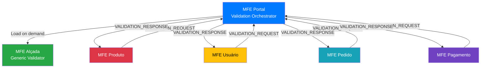
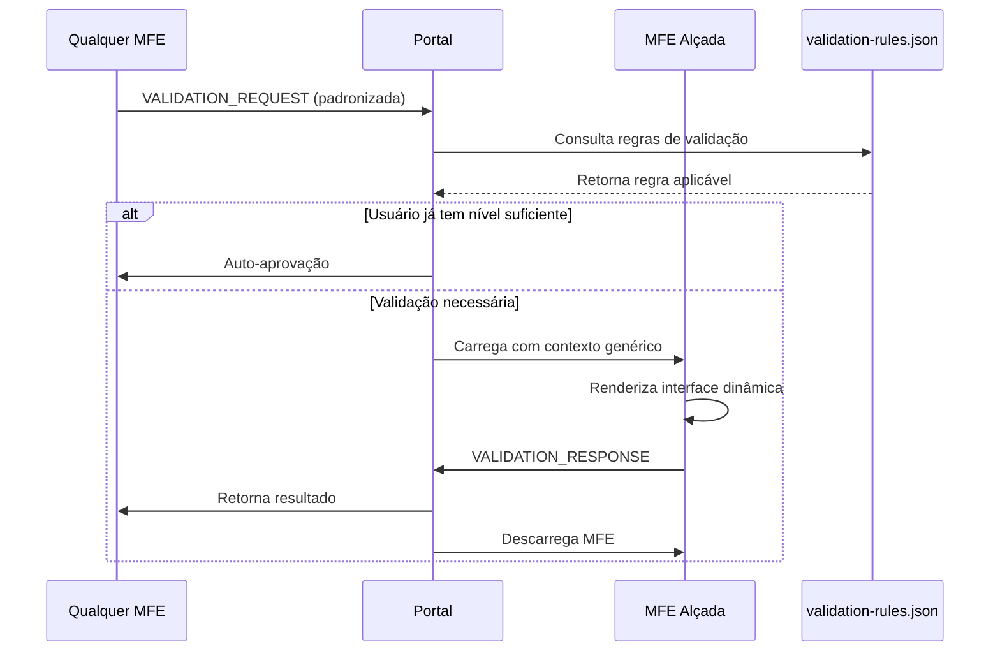

# 🔐 MFE Alçada Reutilizável - Arquitetura de Validação Distribuída

## 📋 Visão Geral

Este documento apresenta a arquitetura para implementação de um **MFE Alçada** completamente reutilizável, que pode ser acionado por qualquer MFE do ecossistema para validação de operações críticas, mantendo consistência com os padrões arquiteturais estabelecidos na PoC.

## 🎯 Problema Original

### Cenário Inicial
- **MFE Produto** precisa validar operações críticas (ex: exclusão de produto, alteração de preço)
- **MFE Alçada** deve fornecer validação adicional com credenciais de usuário autorizado
- Necessidade de manter **consistência** com padrões Hub-and-Spoke já estabelecidos

### Questão de Escalabilidade
> "Com essa abordagem, caso um outro produto qualquer dentro do ecossistema da nossa PoC precisasse acionar o mfe-alcada, já seria a solução mais otimizada? Esse MFE fica disponível pra todos que quiserem acioná-lo ou sempre que alguém precisar usar será necessário alguma intervenção no mfe-alcada ou mfe-portal?"

## 🏗️ Solução Arquitetural

### Modelo Hub-and-Spoke Mantido



### Fluxo de Validação Genérico



## 🔧 Implementação Técnica

### 1. Contrato Padronizado de Validação

```typescript
// shared/interfaces/validation.interface.ts
export interface ValidationRequest {
  id: string;
  requestingMfe: string;
  operation: {
    type: string;           // 'delete', 'update', 'approve', 'transfer'
    resource: string;       // 'product', 'user', 'order', 'payment'
    resourceId: string;     // ID específico do recurso
    description: string;    // Descrição amigável da operação
  };
  requiredLevel: 'manager' | 'admin' | 'supervisor' | 'director';
  context: ValidationContext;
  metadata: {
    timestamp: string;
    urgency: 'low' | 'medium' | 'high' | 'critical';
    expiresAt?: string;
  };
}

export interface ValidationContext {
  // Dados genéricos do recurso
  resourceName: string;
  resourceDetails: Record<string, any>;
  
  // Dados do solicitante
  requestedBy: {
    id: string;
    name: string;
    role: string;
    department?: string;
  };
  
  // Contexto da operação
  reason?: string;
  impact?: 'low' | 'medium' | 'high';
  reversible: boolean;
  
  // Dados específicos por domínio (flexível)
  domainData?: Record<string, any>;
}
```

### 2. Portal - Validation Orchestrator Genérico

```typescript
// mfe-portal/src/app/services/validation-orchestrator.service.ts
@Injectable({
  providedIn: 'root'
})
export class ValidationOrchestratorService {
  
  private pendingValidations = new Map<string, ValidationRequest>();
  private validationRules = new Map<string, ValidationRule>();
  
  constructor(
    private dynamicMfeLoader: DynamicMfeLoaderService,
    private mfeCommunicationService: MfeCommunicationService,
    private configService: ConfigService
  ) {
    this.loadValidationRules();
    this.setupGenericValidationListener();
  }
  
  /**
   * Carrega regras de validação de configuração externa
   */
  private async loadValidationRules(): Promise<void> {
    const rules = await this.configService.getValidationRules();
    
    rules.forEach(rule => {
      this.validationRules.set(`${rule.resource}.${rule.operation}`, rule);
    });
  }
  
  /**
   * Escuta solicitações de QUALQUER MFE
   */
  private setupGenericValidationListener(): void {
    // Escutar de todos os MFEs registrados
    const registeredMfes = this.configService.getRegisteredMfes();
    
    registeredMfes.forEach(mfeName => {
      this.mfeCommunicationService.receiveDataFromMfe(mfeName).subscribe(
        outputData => {
          if (outputData.type === 'VALIDATION_REQUEST') {
            this.handleGenericValidationRequest(mfeName, outputData);
          }
        }
      );
    });
    
    // Escutar respostas do MFE Alçada
    this.mfeCommunicationService.receiveDataFromMfe('mfeAlcada').subscribe(
      outputData => {
        if (outputData.type === 'VALIDATION_RESPONSE') {
          this.handleValidationResponse(outputData);
        }
      }
    );
  }
  
  /**
   * Processa solicitação de validação de qualquer MFE
   */
  private async handleGenericValidationRequest(
    requestingMfe: string, 
    request: MfeOutputData
  ): Promise<void> {
    
    const validationData = request.payload.data;
    const ruleKey = `${validationData.operation.resource}.${validationData.operation.type}`;
    
    // Verificar se operação requer validação
    const rule = this.validationRules.get(ruleKey);
    if (!rule) {
      console.warn(`No validation rule found for ${ruleKey}`);
      return;
    }
    
    // Verificar se usuário atual tem nível suficiente
    const currentUser = this.getCurrentUser();
    if (this.hasRequiredLevel(currentUser, rule.requiredLevel)) {
      // Usuário já tem nível suficiente - aprovar automaticamente
      this.sendAutoApproval(requestingMfe, validationData);
      return;
    }
    
    const validationId = this.generateValidationId();
    
    // Criar solicitação padronizada
    const validationRequest: ValidationRequest = {
      id: validationId,
      requestingMfe: requestingMfe,
      operation: validationData.operation,
      requiredLevel: rule.requiredLevel,
      context: validationData.context,
      metadata: {
        timestamp: new Date().toISOString(),
        urgency: validationData.urgency || 'medium',
        expiresAt: this.calculateExpiration(rule.timeoutMinutes)
      }
    };
    
    // Armazenar e processar
    this.pendingValidations.set(validationId, validationRequest);
    await this.loadValidationMfe(validationRequest);
  }
  
  /**
   * Carrega MFE Alçada com contexto genérico
   */
  private async loadValidationMfe(request: ValidationRequest): Promise<void> {
    await this.dynamicMfeLoader.loadMfe('mfeAlcada', 
      document.getElementById('validation-container'), 
      {
        user: this.getCurrentUser(),
        context: {
          source: 'validation-orchestrator',
          validationId: request.id,
          action: 'validate_operation'
        },
        config: {
          // Dados genéricos para qualquer tipo de validação
          validation: {
            operation: request.operation,
            requiredLevel: request.requiredLevel,
            context: request.context,
            metadata: request.metadata
          },
          ui: {
            mode: 'modal',
            theme: 'default',
            showResourceDetails: true,
            allowJustificationEdit: true
          }
        }
      }
    );
  }
  
  /**
   * Responde para o MFE solicitante (genérico)
   */
  private handleValidationResponse(response: MfeOutputData): void {
    const validationId = response.payload.data.validationId;
    const validation = this.pendingValidations.get(validationId);
    
    if (!validation) {
      console.error('Validation not found:', validationId);
      return;
    }
    
    // Resposta padronizada para qualquer MFE
    this.mfeCommunicationService.sendDataToMfe(validation.requestingMfe, {
      context: {
        action: 'validation_response',
        validationId: validationId,
        resourceId: validation.operation.resourceId,
        validated: response.payload.data.validated,
        validatedBy: response.payload.data.validatedBy,
        reason: response.payload.data.reason,
        timestamp: response.payload.data.timestamp
      }
    });
    
    // Limpar e descarregar
    this.pendingValidations.delete(validationId);
    this.dynamicMfeLoader.unloadMfe('mfeAlcada');
  }
}
```

### 3. MFE Alçada - Interface Genérica

```typescript
// mfe-alcada/src/app/components/generic-validation.component.ts
@Component({
  selector: 'app-generic-validation',
  template: `
    <div class="validation-modal">
      <div class="validation-header">
        <h3>🔐 {{ getValidationTitle() }}</h3>
        <p>{{ getValidationDescription() }}</p>
      </div>
      
      <!-- Contexto dinâmico baseado no tipo de recurso -->
      <div class="operation-context">
        <div class="context-section">
          <h4>📋 Detalhes da Operação</h4>
          <div class="context-grid">
            <div class="context-item">
              <strong>Tipo:</strong> 
              <span class="operation-badge" [class]="getOperationClass()">
                {{ getOperationLabel() }}
              </span>
            </div>
            <div class="context-item">
              <strong>Recurso:</strong> {{ validation.context.resourceName }}
            </div>
            <div class="context-item">
              <strong>Solicitante:</strong> {{ validation.context.requestedBy.name }}
            </div>
            <div class="context-item">
              <strong>Urgência:</strong>
              <span class="urgency-badge" [class]="'urgency-' + validation.metadata.urgency">
                {{ validation.metadata.urgency | titlecase }}
              </span>
            </div>
          </div>
        </div>
        
        <!-- Detalhes específicos do recurso (dinâmico) -->
        <div class="resource-details" *ngIf="validation.context.resourceDetails">
          <h4>📄 Detalhes do {{ getResourceTypeLabel() }}</h4>
          <div class="details-grid">
            <div 
              *ngFor="let detail of getResourceDetailsArray()" 
              class="detail-item">
              <strong>{{ detail.label }}:</strong> 
              <span [innerHTML]="detail.value"></span>
            </div>
          </div>
        </div>
        
        <!-- Impacto e reversibilidade -->
        <div class="impact-section" *ngIf="validation.context.impact">
          <h4>⚠️ Análise de Impacto</h4>
          <div class="impact-info">
            <span class="impact-level" [class]="'impact-' + validation.context.impact">
              Impacto: {{ validation.context.impact | titlecase }}
            </span>
            <span class="reversibility" [class.reversible]="validation.context.reversible">
              {{ validation.context.reversible ? '🔄 Reversível' : '⚠️ Irreversível' }}
            </span>
          </div>
        </div>
      </div>
      
      <!-- Formulário de validação (sempre igual) -->
      <form [formGroup]="validationForm" (ngSubmit)="onValidate()">
        <div class="form-group">
          <label>👤 Usuário com Alçada ({{ validation.requiredLevel }}):</label>
          <input 
            formControlName="username" 
            type="text" 
            [placeholder]="'Usuário com nível ' + validation.requiredLevel"
            required>
        </div>
        
        <div class="form-group">
          <label>🔑 Senha:</label>
          <input formControlName="password" type="password" required>
        </div>
        
        <div class="form-group">
          <label>📝 Justificativa:</label>
          <textarea 
            formControlName="justification" 
            [placeholder]="getJustificationPlaceholder()"
            required>
          </textarea>
        </div>
        
        <div class="form-actions">
          <button type="button" class="btn-cancel" (click)="onCancel()">
            Cancelar
          </button>
          <button 
            type="submit" 
            class="btn-validate"
            [disabled]="validationForm.invalid || isValidating">
            {{ isValidating ? 'Validando...' : 'Aprovar Operação' }}
          </button>
        </div>
      </form>
      
      <!-- Timer de expiração -->
      <div class="expiration-timer" *ngIf="timeRemaining > 0">
        ⏱️ Esta validação expira em: {{ formatTimeRemaining() }}
      </div>
    </div>
  `
})
export class GenericValidationComponent implements OnInit, OnDestroy {
  validationForm: FormGroup;
  validation: ValidationRequest;
  isValidating = false;
  timeRemaining = 0;
  
  private timerSubscription?: Subscription;
  
  constructor(
    private fb: FormBuilder,
    private authService: AuthService,
    private mfeCommunicationService: MfeCommunicationService,
    private resourceLabelService: ResourceLabelService
  ) {
    this.createForm();
  }
  
  ngOnInit(): void {
    this.mfeCommunicationService.inputData$.subscribe(inputData => {
      if (inputData.config?.validation) {
        this.validation = inputData.config.validation;
        this.startExpirationTimer();
      }
    });
  }
  
  /**
   * Métodos para renderização dinâmica baseada no tipo de recurso
   */
  getValidationTitle(): string {
    const operation = this.getOperationLabel();
    const resource = this.getResourceTypeLabel();
    return `Validação: ${operation} ${resource}`;
  }
  
  getOperationLabel(): string {
    const labels = {
      'delete': 'Exclusão',
      'update': 'Alteração',
      'approve': 'Aprovação', 
      'transfer': 'Transferência',
      'create': 'Criação'
    };
    return labels[this.validation?.operation.type] || this.validation?.operation.type;
  }
  
  getResourceTypeLabel(): string {
    return this.resourceLabelService.getLabel(this.validation?.operation.resource);
  }
  
  getResourceDetailsArray(): Array<{label: string, value: string}> {
    if (!this.validation?.context.resourceDetails) return [];
    
    return Object.entries(this.validation.context.resourceDetails)
      .map(([key, value]) => ({
        label: this.resourceLabelService.getFieldLabel(
          this.validation.operation.resource, 
          key
        ),
        value: this.formatFieldValue(key, value)
      }));
  }
  
  getJustificationPlaceholder(): string {
    const operation = this.getOperationLabel().toLowerCase();
    const resource = this.getResourceTypeLabel().toLowerCase();
    return `Justifique a necessidade de ${operation} deste ${resource}...`;
  }
  
  async onValidate(): Promise<void> {
    if (this.validationForm.invalid) return;
    
    this.isValidating = true;
    
    try {
      const credentials = this.validationForm.value;
      
      // Validar credenciais do usuário com alçada
      const validationResult = await this.authService.validateUserLevel(
        credentials.username,
        credentials.password,
        this.validation.requiredLevel
      );
      
      if (validationResult.valid) {
        // Enviar aprovação
        this.sendValidationResponse(true, {
          validatedBy: validationResult.user,
          justification: credentials.justification
        });
      } else {
        // Enviar rejeição
        this.sendValidationResponse(false, {
          reason: validationResult.reason || 'Credenciais inválidas ou nível insuficiente'
        });
      }
      
    } catch (error) {
      this.sendValidationResponse(false, {
        reason: 'Erro durante validação: ' + error.message
      });
    } finally {
      this.isValidating = false;
    }
  }
  
  onCancel(): void {
    this.sendValidationResponse(false, {
      reason: 'Validação cancelada pelo usuário'
    });
  }
  
  private sendValidationResponse(validated: boolean, data: any): void {
    this.mfeCommunicationService.sendDataToPortal({
      type: 'VALIDATION_RESPONSE',
      payload: {
        action: 'validation_complete',
        data: {
          validationId: this.validation.id,
          validated: validated,
          validatedBy: data.validatedBy,
          justification: data.justification,
          reason: data.reason,
          timestamp: new Date().toISOString()
        },
        status: validated ? 'success' : 'error'
      }
    });
  }
}
```

### 4. Configuração Externa de Regras

```json
// mfe-portal/src/assets/config/validation-rules.json
{
  "version": "1.0.0",
  "lastUpdated": "2024-12-15T10:00:00Z",
  "rules": [
    {
      "resource": "product",
      "operation": "delete",
      "requiredLevel": "manager",
      "timeoutMinutes": 30,
      "autoApprove": false,
      "description": "Exclusão de produtos requer aprovação gerencial"
    },
    {
      "resource": "user", 
      "operation": "delete",
      "requiredLevel": "admin",
      "timeoutMinutes": 60,
      "autoApprove": false,
      "description": "Exclusão de usuários requer aprovação administrativa"
    },
    {
      "resource": "order",
      "operation": "cancel",
      "requiredLevel": "supervisor",
      "timeoutMinutes": 15,
      "autoApprove": false,
      "description": "Cancelamento de pedidos requer supervisão"
    },
    {
      "resource": "payment",
      "operation": "refund", 
      "requiredLevel": "manager",
      "timeoutMinutes": 45,
      "autoApprove": false,
      "description": "Estornos requerem aprovação gerencial"
    },
    {
      "resource": "inventory",
      "operation": "adjust",
      "requiredLevel": "supervisor",
      "timeoutMinutes": 20,
      "autoApprove": false,
      "description": "Ajustes de estoque requerem supervisão"
    }
  ]
}
```

## 🚀 Exemplos de Uso

### MFE Produto - Exclusão de Produto

```typescript
// mfe-produto/src/app/services/product.service.ts
async deleteProduct(productId: string): Promise<void> {
  const product = await this.getProductById(productId);
  
  // Solicitar validação usando interface padronizada
  this.mfeCommunicationService.sendDataToPortal({
    type: 'VALIDATION_REQUEST',
    payload: {
      action: 'request_validation',
      data: {
        operation: {
          type: 'delete',
          resource: 'product',
          resourceId: productId,
          description: `Exclusão do produto ${product.name}`
        },
        context: {
          resourceName: product.name,
          resourceDetails: {
            sku: product.sku,
            category: product.category,
            price: product.price,
            stock: product.stock,
            supplier: product.supplier,
            createdAt: product.createdAt
          },
          requestedBy: this.getCurrentUser(),
          reason: 'Solicitação de exclusão via interface administrativa',
          impact: 'medium',
          reversible: false
        },
        urgency: 'medium'
      },
      status: 'pending'
    }
  });
  
  return this.waitForValidationResponse(productId);
}
```

### MFE Usuário - Exclusão de Usuário

```typescript
// mfe-usuario/src/app/services/user.service.ts
async deleteUser(userId: string): Promise<void> {
  const user = await this.getUserById(userId);
  
  this.mfeCommunicationService.sendDataToPortal({
    type: 'VALIDATION_REQUEST',
    payload: {
      action: 'request_validation',
      data: {
        operation: {
          type: 'delete',
          resource: 'user',
          resourceId: userId,
          description: `Exclusão do usuário ${user.name}`
        },
        context: {
          resourceName: user.name,
          resourceDetails: {
            email: user.email,
            role: user.role,
            department: user.department,
            lastLogin: user.lastLogin,
            createdAt: user.createdAt,
            activeProjects: user.projects?.length || 0
          },
          requestedBy: this.getCurrentUser(),
          reason: 'Solicitação de exclusão via interface administrativa',
          impact: 'high',
          reversible: false
        },
        urgency: 'medium'
      },
      status: 'pending'
    }
  });
  
  return this.waitForValidationResponse(userId);
}
```

### MFE Pedido - Cancelamento de Pedido

```typescript
// mfe-pedido/src/app/services/order.service.ts  
async cancelOrder(orderId: string): Promise<void> {
  const order = await this.getOrderById(orderId);
  
  this.mfeCommunicationService.sendDataToPortal({
    type: 'VALIDATION_REQUEST',
    payload: {
      action: 'request_validation', 
      data: {
        operation: {
          type: 'cancel',
          resource: 'order',
          resourceId: orderId,
          description: `Cancelamento do pedido #${order.number}`
        },
        context: {
          resourceName: `Pedido #${order.number}`,
          resourceDetails: {
            customer: order.customer.name,
            total: order.total,
            status: order.status,
            items: order.items.length + ' itens',
            paymentMethod: order.payment.method,
            createdAt: order.createdAt
          },
          requestedBy: this.getCurrentUser(),
          reason: 'Cancelamento solicitado pelo cliente',
          impact: 'medium',
          reversible: true
        },
        urgency: 'high'
      },
      status: 'pending'
    }
  });
  
  return this.waitForValidationResponse(orderId);
}
```

## 🔧 Configuração Adicional Necessária

### 1. Adicionar MFE Alçada ao Module Federation

```javascript
// mfe-portal/federation.config.js
module.exports = {
  plugins: [
    new ModuleFederationPlugin({
      name: "mfePortal",
      remotes: {
        mfeLogin: "mfeLogin@http://localhost:4201/remoteEntry.js",
        mfeMenu: "mfeMenu@http://localhost:4202/remoteEntry.js", 
        mfeProduto: "mfeProduto@http://localhost:4203/remoteEntry.js",
        mfeAlcada: "mfeAlcada@http://localhost:4204/remoteEntry.js" // Novo
      },
      shared: {
        "@angular/core": { singleton: true },
        "@angular/common": { singleton: true },
        "rxjs": { singleton: true }
      }
    })
  ]
};
```

### 2. Registrar MFE no Ecossistema

```json
// mfe-portal/src/assets/config/mfes.json
{
  "version": "1.0.0",
  "mfes": [
    {
      "name": "mfeLogin",
      "port": 4201,
      "healthEndpoint": "/health",
      "type": "authentication"
    },
    {
      "name": "mfeMenu", 
      "port": 4202,
      "healthEndpoint": "/health",
      "type": "navigation"
    },
    {
      "name": "mfeProduto",
      "port": 4203, 
      "healthEndpoint": "/health",
      "type": "business"
    },
    {
      "name": "mfeAlcada",
      "port": 4204,
      "healthEndpoint": "/health", 
      "type": "platform",
      "internal": true,
      "loadOnDemand": true
    }
  ]
}
```

### 3. Container para Validação no Portal

```html
<!-- mfe-portal/src/app/app.component.html -->
<div class="main-content">
  <!-- Conteúdo principal -->
  <router-outlet></router-outlet>
  
  <!-- Container para MFE Alçada -->
  <div id="validation-container" 
       class="validation-overlay" 
       [class.active]="showValidation">
  </div>
</div>
```

```scss
// mfe-portal/src/app/app.component.scss
.validation-overlay {
  position: fixed;
  top: 0;
  left: 0;
  width: 100%;
  height: 100%;
  background: rgba(0, 0, 0, 0.5);
  display: none;
  z-index: 9999;
  
  &.active {
    display: flex;
    align-items: center;
    justify-content: center;
  }
}
```

## ✅ Vantagens da Solução

### 🎯 **Reutilização Total**
- **Zero código específico** por tipo de recurso no MFE Alçada
- **Interface genérica** que se adapta a qualquer contexto
- **Configuração declarativa** via JSON externo

### 🔧 **Manutenibilidade**
- **Adição de novos casos** apenas via configuração
- **Sem alterações de código** para novos tipos de validação
- **Versionamento independente** de regras de negócio

### 🏗️ **Consistência Arquitetural**
- **Mantém padrão Hub-and-Spoke** estabelecido
- **Portal como único mediador** preservado
- **Comunicação padronizada** via Custom Events

### 📈 **Escalabilidade**
- **Qualquer MFE** pode usar o serviço de validação
- **Crescimento horizontal** do ecossistema
- **Governança centralizada** no Portal

### 🛡️ **Segurança e Auditoria**
- **Controle centralizado** de todas as validações
- **Log completo** de operações críticas
- **Rastreabilidade** de aprovações e rejeições

## 🎯 Respostas às Questões Originais

### ✅ **É a solução mais otimizada?**
**SIM!** Com essa arquitetura:
- **Zero intervenção** no MFE Alçada para novos casos de uso
- **Zero intervenção** no Portal para novos tipos de validação
- **Configuração externa** define regras de validação
- **Interface padronizada** para qualquer MFE

### ✅ **Fica disponível para todos?**
**SIM!** Qualquer MFE pode usar seguindo o contrato padronizado:
```typescript
// Qualquer MFE pode fazer isso:
this.mfeCommunicationService.sendDataToPortal({
  type: 'VALIDATION_REQUEST',
  payload: { /* dados padronizados */ }
});
```

### ✅ **Necessita intervenção para novos casos?**
**NÃO!** Apenas:
- **Adicionar regra** no `validation-rules.json`
- **Registrar MFE** no `mfes.json` (se for novo MFE)
- **Implementar labels** no `ResourceLabelService` (opcional, para UX)

## 🚀 Resultado Final

Com essa arquitetura, o **MFE Alçada** se torna um **serviço de plataforma** verdadeiramente reutilizável:

- ✅ **Zero Code Changes** para novos casos de uso
- ✅ **Configuração Declarativa** via JSON
- ✅ **Interface Consistente** para todos os MFEs  
- ✅ **Escalabilidade Total** do ecossistema
- ✅ **Governança Centralizada** no Portal

É a **evolução natural** da arquitetura Hub-and-Spoke que já temos estabelecida na PoC! 🎯

---

**Versão**: 1.0  
**Data**: Dezembro 2024  
**Compatibilidade**: Angular 21 + Module Federation  
**Status**: ✅ Arquitetura Validada