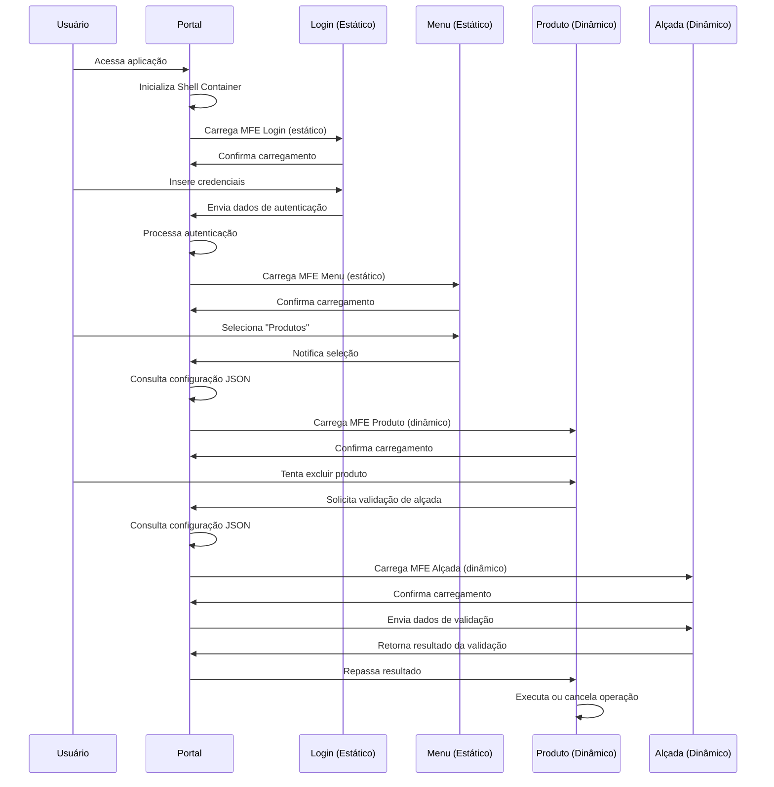

# 🏗️ Roteiro Documental - Parte 2: Arquitetura da PoC (v2.0)

## 🎯 Objetivo da Sessão

Compreender a arquitetura específica implementada nesta PoC, analisando as decisões técnicas, a estrutura híbrida de componentes e os padrões arquiteturais avançados adotados, incluindo o novo MFE Alçada e a comunicação inter-MFE.

## 🏛️ Visão Geral da Arquitetura

### Modelo Hub-and-Spoke Evoluído

Nossa PoC adota o padrão **Hub-and-Spoke** evoluído, onde o **MFE Portal** atua como o hub central que orquestra todos os outros MFEs (spokes), agora com **carregamento híbrido** e **comunicação inter-MFE**.

```
                    ┌─────────────────┐
                    │   MFE Portal    │
                    │ (Shell Container│
                    │   Port 4200)    │
                    │                 │
                    │ 🔄 Orquestrador │
                    │ 📡 Mediador     │
                    └─────────┬───────┘
                              │
            ┌─────────────────┼─────────────────┬─────────────────┐
            │                 │                 │                 │
    ┌───────▼──────┐ ┌────────▼────────┐ ┌─────▼──────┐ ┌────────▼────────┐
    │  MFE Login   │ │   MFE Menu      │ │ MFE Produto│ │   MFE Alçada    │
    │ (Port 4201)  │ │  (Port 4202)    │ │(Port 4203) │ │  (Port 4204)    │
    │              │ │                 │ │            │ │                 │
    │ 🏗️ ESTÁTICO  │ │ 🏗️ ESTÁTICO     │ │🔄 DINÂMICO │ │ 🔄 DINÂMICO     │
    │ Hardcoded    │ │ Hardcoded       │ │JSON Config │ │ JSON Config     │
    └──────────────┘ └─────────────────┘ └────────────┘ └─────────────────┘
                                                │                 ▲
                                                │ 📞 Comunicação  │
                                                │    Direta       │
                                                └─────────────────┘
                                                  (via Portal)
```

### 🆕 Principais Evoluções da v2.0

#### 1. **Carregamento Híbrido**
- **MFEs Estáticos**: Login e Menu carregados estaticamente no `main.ts`
- **MFEs Dinâmicos**: Produto e Alçada carregados sob demanda via JSON
- **Sem Fallbacks**: MFEs dinâmicos devem estar disponíveis (não há componentes de fallback)

#### 2. **Comunicação Inter-MFE**
- **Produto → Alçada**: Solicitação de validação para operações críticas
- **Alçada → Produto**: Resposta de validação (aprovada/rejeitada)
- **Portal como Mediador**: Todas as comunicações passam pelo Portal

#### 3. **Validação Obrigatória**
- **Operações Críticas**: Exclusão de produtos requer validação de alçada
- **Instâncias Reais**: Não há fallbacks para MFEs dinâmicos
- **Disponibilidade Garantida**: MFEs dinâmicos devem estar rodando

## 🔧 Decisões Tecnológicas

### Angular 21 + Standalone Components

#### Por que Angular 21?
- **Standalone Components**: Eliminam necessidade de NgModules
- **Signals**: Gerenciamento de estado reativo moderno
- **Performance**: Otimizações de bundle e runtime
- **TypeScript nativo**: Tipagem forte em toda aplicação
- **🆕 Improved DI**: Injeção de dependência aprimorada
- **🆕 Better Tree-shaking**: Otimização de bundle mais eficiente

#### Vantagens dos Standalone Components
```typescript
// Componente tradicional (com NgModule)
@NgModule({
  declarations: [ValidationModalComponent],
  imports: [CommonModule, ReactiveFormsModule],
  exports: [ValidationModalComponent]
})
export class ValidationModule { }

// Standalone Component (Angular 21)
@Component({
  selector: 'app-validation-modal',
  standalone: true,
  imports: [CommonModule, ReactiveFormsModule],
  template: `...`
})
export class ValidationModalComponent { }
```

**Benefícios**:
- **Menos boilerplate**: Sem necessidade de módulos
- **Tree-shaking melhorado**: Importações mais granulares
- **Lazy loading simplificado**: Carregamento direto de componentes
- **🆕 Melhor isolamento**: Cada MFE é completamente independente

### Module Federation (Webpack 5)

#### Por que Module Federation?
- **Runtime Integration**: Carregamento dinâmico de MFEs
- **Shared Dependencies**: Evita duplicação de bibliotecas
- **Independent Deployment**: Deploy isolado por MFE
- **Version Management**: Controle de versões automático
- **🆕 Dynamic Loading**: Carregamento sob demanda baseado em configuração

#### Configuração Base Evoluída
```javascript
// federation.config.js (MFE Alçada - exemplo)
const ModuleFederationPlugin = require("@module-federation/webpack");

module.exports = {
  plugins: [
    new ModuleFederationPlugin({
      name: "mfeAlcada",
      filename: "remoteEntry.js",
      exposes: {
        "./Component": "./src/app/app.component.ts",
      },
      shared: {
        "@angular/core": { singleton: true, strictVersion: true },
        "@angular/common": { singleton: true, strictVersion: true },
        "rxjs": { singleton: true, strictVersion: true }
      }
    })
  ]
};
```

## 🏢 Estrutura de Componentes

### 1. MFE Portal (Shell Container) - Porta 4200

#### Responsabilidades Principais
- **Orquestração**: Gerencia ciclo de vida dos MFEs
- **Autenticação**: Controla login/logout e tokens
- **Layout**: Fornece estrutura visual base
- **🆕 Mediação de Comunicação**: Facilita comunicação inter-MFE
- **🆕 Carregamento Dinâmico**: Gerencia MFEs sob demanda

#### Componentes Chave
```
mfe-portal/
├── components/
│   ├── mfe-loader/          # Carregador dinâmico de MFEs
│   └── fallback/            # ⚠️ Apenas para MFEs estáticos
├── services/
│   ├── mfe-communication.service.ts    # Comunicação
│   ├── token-manager.service.ts        # Gerenciamento de tokens
│   ├── dynamic-mfe-loader.service.ts   # 🆕 Carregamento dinâmico
│   └── validation-orchestrator.service.ts # 🆕 Orquestração de validação
└── models/
    ├── auth.model.ts        # Modelos de autenticação
    └── config.model.ts      # Modelos de configuração
```

#### 🆕 Configuração de MFEs (mfes.json)
```json
{
  "mfes": [
    {
      "name": "mfe-login",
      "status": "active",
      "loadType": "static",
      "fallbackComponent": "DefaultLoginComponent"
    },
    {
      "name": "mfe-menu", 
      "status": "active",
      "loadType": "static"
    },
    {
      "name": "mfe-produto",
      "status": "active", 
      "loadType": "dynamic",
      "fallbackComponent": null
    },
    {
      "name": "mfe-alcada",
      "status": "active",
      "loadType": "dynamic", 
      "fallbackComponent": null,
      "metadata": {
        "type": "platform",
        "internal": true,
        "loadOnDemand": true
      }
    }
  ]
}
```

### 2. MFE Login (Autenticação) - Porta 4201 [ESTÁTICO]

#### Responsabilidades Específicas
- **Interface de Login**: Formulário reativo com validações
- **Autenticação Mock**: Simulação de autenticação para demo
- **Gestão de Credenciais**: Validação e retorno de dados do usuário

#### Características Técnicas
- **🏗️ Carregamento Estático**: Registrado no `main.ts` do Portal
- **Isolamento completo**: Não depende de outros MFEs
- **Comunicação unidirecional**: Apenas envia dados para Portal
- **Validação client-side**: Formulários reativos com Angular

### 3. MFE Menu (Navegação) - Porta 4202 [ESTÁTICO]

#### Responsabilidades Específicas
- **Menu Dinâmico**: Carregamento baseado em configuração JSON
- **Controle de Permissões**: Filtragem por perfil do usuário
- **Navegação**: Comunicação de seleções para Portal

#### Características Técnicas
- **🏗️ Carregamento Estático**: Registrado no `main.ts` do Portal
- **Configuração externa**: Menu definido em `menu-items.json`
- **Filtragem reativa**: Baseada em permissões do usuário
- **Interface adaptativa**: Responsiva e acessível

### 4. MFE Produto (Funcionalidade) - Porta 4203 [DINÂMICO]

#### Responsabilidades Específicas
- **Dashboard de Produtos**: Métricas e visualizações
- **Gestão de Produtos**: CRUD simulado com dados mock
- **🆕 Solicitação de Validação**: Comunica com MFE Alçada para operações críticas
- **Controle de Acesso**: Ações baseadas em permissões

#### Características Técnicas
- **🔄 Carregamento Dinâmico**: Carregado sob demanda via JSON
- **Dados simulados**: Mock service para demonstração
- **Interface rica**: Dashboard com métricas e gráficos
- **🆕 Comunicação Inter-MFE**: Integração com MFE Alçada
- **Permissões granulares**: Controle por ação (read/write/delete)

### 5. 🆕 MFE Alçada (Validação) - Porta 4204 [DINÂMICO]

#### Responsabilidades Específicas
- **Validação de Operações Críticas**: Modal de aprovação para ações sensíveis
- **Autenticação de Alçada**: Validação de credenciais com nível adequado
- **🆕 Comunicação Bidirecional**: Recebe solicitações e envia respostas
- **Controle de Tempo**: Timer para expiração de validações

#### Características Técnicas
- **🔄 Carregamento Dinâmico**: Carregado apenas quando necessário
- **Interface Modal**: Componente de validação interativo
- **🆕 Comunicação Complexa**: Recebe dados estruturados do MFE Produto
- **Validação de Alçada**: Sistema de níveis hierárquicos
- **Timer de Expiração**: Controle temporal de validações

#### Estrutura do MFE Alçada
```
mfe-alcada/
├── components/
│   ├── validation-modal/    # Modal principal de validação
│   └── health/             # Health check
├── services/
│   ├── auth.service.ts     # Validação de alçada
│   ├── mfe-communication.service.ts # Comunicação
│   └── resource-label.service.ts   # Labels dinâmicos
├── interfaces/
│   ├── validation.interface.ts     # Contratos de validação
│   └── mfe-communication.interface.ts
└── models/
    └── auth.model.ts       # Modelos de autenticação
```

## 🔄 Fluxo de Inicialização

### Sequência de Startup Evoluída


### Estados da Aplicação
1. **Inicial**: Apenas Portal carregado
2. **Autenticação**: Login MFE ativo (estático)
3. **Navegação**: Menu MFE carregado (estático)
4. **Funcional**: MFE Produto em execução (dinâmico)
5. **🆕 Validação**: MFE Alçada ativo para operação crítica (dinâmico)

## 🎨 Padrões de Design Implementados

### 1. **Mediator Pattern**
- **Portal** atua como mediador entre MFEs
- **🆕 Comunicação Inter-MFE** mediada pelo Portal
- **Controle centralizado** de fluxo de dados

### 2. **Observer Pattern**
- **Custom Events** para notificações
- **Reactive Streams** com RxJS
- **Estado reativo** com BehaviorSubjects

### 3. **Strategy Pattern**
- **🆕 Carregamento Híbrido**: Estático vs Dinâmico
- **Fallback strategies** apenas para MFEs estáticos
- **Configuração externa** de comportamentos

### 4. **🆕 Command Pattern**
- **Validação de Alçada**: Comandos de operações críticas
- **Encapsulamento** de operações complexas
- **Undo/Redo** para operações reversíveis

## 📊 Benefícios da Arquitetura Evoluída

### 1. **Desenvolvimento**
- **Times independentes** por MFE
- **🆕 Carregamento Otimizado**: Estático para essenciais, dinâmico para específicos
- **Tecnologias homogêneas** (Angular 21)
- **Padrões consistentes** de desenvolvimento

### 2. **Manutenção**
- **Isolamento de responsabilidades**
- **🆕 Comunicação Estruturada**: Contratos bem definidos inter-MFE
- **Versionamento independente**
- **🆕 Validação Distribuída**: Lógica de alçada isolada

### 3. **Performance**
- **🆕 Lazy loading Inteligente**: Apenas MFEs necessários
- **Shared dependencies** otimizadas
- **Bundle splitting** automático
- **🆕 Carregamento Sob Demanda**: MFE Alçada apenas quando necessário

### 4. **Escalabilidade**
- **Adição fácil** de novos MFEs
- **🆕 Comunicação Escalável**: Padrão para novos MFEs
- **Crescimento horizontal** de funcionalidades
- **Distribuição de carga** de desenvolvimento

## ⚖️ Trade-offs Considerados

### Vantagens Obtidas
- ✅ **Desenvolvimento paralelo** de funcionalidades
- ✅ **Deploy independente** por MFE
- ✅ **Isolamento de falhas** por componente
- ✅ **Flexibilidade** para evolução
- ✅ **🆕 Carregamento Otimizado** por contexto
- ✅ **🆕 Comunicação Inter-MFE** estruturada
- ✅ **🆕 Validação Distribuída** para operações críticas

### Complexidades Introduzidas
- ⚠️ **Comunicação entre MFEs** requer padronização
- ⚠️ **Gerenciamento de estado** distribuído
- ⚠️ **Debugging** mais complexo
- ⚠️ **Overhead** de múltiplos bundles
- ⚠️ **🆕 Orquestração Complexa**: Portal como mediador
- ⚠️ **🆕 Dependência de Disponibilidade**: MFEs dinâmicos devem estar ativos
- ⚠️ **🆕 Sincronização**: Comunicação inter-MFE requer coordenação

## 🆕 Novidades Arquiteturais da v2.0

### **Carregamento Híbrido**
```typescript
// Configuração no Portal
const MFE_LOADING_STRATEGY = {
  'mfe-login': 'static',    // Sempre disponível
  'mfe-menu': 'static',     // Sempre disponível  
  'mfe-produto': 'dynamic', // Sob demanda
  'mfe-alcada': 'dynamic'   // Sob demanda
};
```

### **Comunicação Inter-MFE**
```typescript
// Produto solicita validação
this.mfeCommunicationService.sendDataToPortal({
  type: 'REQUEST_VALIDATION',
  targetMfe: 'mfe-alcada',
  payload: {
    operation: 'delete',
    resource: 'product',
    resourceId: 'PROD-001'
  }
});

// Alçada responde validação
this.mfeCommunicationService.sendDataToPortal({
  type: 'VALIDATION_RESPONSE',
  targetMfe: 'mfe-produto',
  payload: {
    validated: true,
    validatedBy: 'manager@empresa.com'
  }
});
```

### **Validação Obrigatória**
```typescript
// Sem fallbacks para MFEs dinâmicos
const config = await this.configService.getMfeByName('mfe-alcada');
if (!config.fallbackComponent) {
  // MFE deve estar disponível - sem fallback
  const component = await this.loadMfeComponent('mfe-alcada');
}
```

## 🎯 Próximos Passos

Na **próxima sessão**, exploraremos o **Module Federation** em detalhes, analisando como ele viabiliza o carregamento dinâmico e a integração runtime dos MFEs, incluindo as novas estratégias de carregamento híbrido.

### Tópicos da Próxima Sessão
- Fundamentos do Module Federation
- Configuração de exposição e consumo
- Shared dependencies e versionamento
- **🆕 Estratégias de carregamento híbrido**
- **🆕 Carregamento dinâmico sob demanda**
- Estratégias de fallback e error handling

---

**Duração Estimada**: 25-30 minutos  
**Nível**: Arquitetural  
**Próxima Parte**: [03 - Module Federation](./03-module-federation.md)  
**🆕 Novidades v2.0**: MFE Alçada, Carregamento Híbrido, Comunicação Inter-MFE