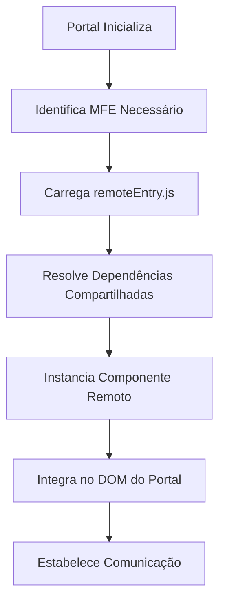

# 🔗 Roteiro Documental - Parte 3: Module Federation

## 🎯 Objetivo da Sessão

Compreender os fundamentos do Module Federation, sua implementação na PoC e como ele viabiliza o carregamento dinâmico e integração runtime dos MicroFrontEnds.

## 🧩 Fundamentos do Module Federation

### O que é Module Federation?

**Module Federation** é uma funcionalidade do **Webpack 5** que permite que aplicações JavaScript **compartilhem código dinamicamente** em tempo de execução, sem necessidade de rebuild ou redeploy das aplicações consumidoras.

### Conceitos Fundamentais

#### 1. **Host (Container)**
- Aplicação que **consome** módulos remotos
- Em nossa PoC: **MFE Portal**
- Responsável por **orquestrar** o carregamento

#### 2. **Remote (Remoto)**
- Aplicação que **expõe** módulos para consumo
- Em nossa PoC: **MFE Login, Menu, Produto**
- Cada um roda em **porta independente**

#### 3. **Exposed Modules (Módulos Expostos)**
- Componentes/serviços **disponibilizados** para consumo externo
- Definidos na configuração do webpack

#### 4. **Shared Dependencies (Dependências Compartilhadas)**
- Bibliotecas **compartilhadas** entre Host e Remotes
- Evita **duplicação** de código (Angular, RxJS, etc.)

## ⚙️ Configuração Técnica

### Estrutura de Configuração

#### Remote (MFE Login - Porta 4201)
```javascript
// mfe-login/federation.config.js
const ModuleFederationPlugin = require("@module-federation/webpack");

module.exports = {
  plugins: [
    new ModuleFederationPlugin({
      name: "mfeLogin",                    // Nome único do remote
      filename: "remoteEntry.js",          // Arquivo de entrada
      exposes: {
        "./Component": "./src/app/app.component.ts"  // Módulo exposto
      },
      shared: {
        "@angular/core": { 
          singleton: true,                 // Uma única instância
          strictVersion: true,             // Versão exata
          requiredVersion: "^21.0.0"       // Versão mínima
        },
        "@angular/common": { singleton: true },
        "rxjs": { singleton: true }
      }
    })
  ]
};
```

#### Host (MFE Portal - Porta 4200)
```javascript
// mfe-portal/federation.config.js
const ModuleFederationPlugin = require("@module-federation/webpack");

module.exports = {
  plugins: [
    new ModuleFederationPlugin({
      name: "mfePortal",
      remotes: {
        mfeLogin: "mfeLogin@http://localhost:4201/remoteEntry.js",
        mfeMenu: "mfeMenu@http://localhost:4202/remoteEntry.js",
        mfeProduto: "mfeProduto@http://localhost:4203/remoteEntry.js"
      },
      shared: {
        "@angular/core": { singleton: true },
        "@angular/common": { singleton: true },
        "rxjs": { singleton: true }
      }
    })
  ]
};
```

## 🔄 Processo de Carregamento Dinâmico

### Fluxo de Carregamento



### Implementação no Portal

```typescript
// dynamic-mfe-loader.service.ts (simplificado)
@Injectable({
  providedIn: 'root'
})
export class DynamicMfeLoaderService {
  
  async loadMfe(mfeName: string): Promise<ComponentRef<any>> {
    try {
      // 1. Carrega o módulo remoto
      const module = await loadRemoteModule({
        type: 'module',
        remoteEntry: `http://localhost:${this.getPortByMfe(mfeName)}/remoteEntry.js`,
        remoteName: mfeName,
        exposedModule: './Component'
      });

      // 2. Cria instância do componente
      const componentRef = this.createComponent(module.default);
      
      // 3. Estabelece comunicação
      this.setupCommunication(componentRef, mfeName);
      
      return componentRef;
      
    } catch (error) {
      console.error(`Erro ao carregar MFE ${mfeName}:`, error);
      return this.loadFallbackComponent(mfeName);
    }
  }
}
```

## 🔧 Gerenciamento de Dependências

### Estratégia de Shared Dependencies

#### 1. **Singleton Pattern**
```javascript
shared: {
  "@angular/core": { 
    singleton: true,        // Apenas uma instância na aplicação
    eager: true            // Carrega imediatamente
  }
}
```

**Benefícios**:
- **Evita conflitos** de versão
- **Reduz tamanho** do bundle
- **Melhora performance** de carregamento

#### 2. **Version Management**
```javascript
shared: {
  "rxjs": { 
    singleton: true,
    requiredVersion: "^7.0.0",    // Versão mínima aceita
    strictVersion: false          // Permite versões compatíveis
  }
}
```

### Resolução de Conflitos

#### Cenário: Versões Diferentes
```
Portal: Angular 21.0.1
MFE A:  Angular 21.0.0
MFE B:  Angular 21.1.0
```

**Resolução**: Module Federation usa a **versão mais alta compatível** (21.1.0)

#### Estratégias de Fallback
```javascript
shared: {
  "lodash": {
    singleton: false,           // Permite múltiplas versões
    fallback: "./src/fallback-lodash.js"  // Fallback local
  }
}
```

## 🚀 Otimizações de Performance

### 1. **Preloading Strategy**
```typescript
// Pré-carregamento de MFEs críticos
@Injectable()
export class MfePreloadService {
  
  preloadCriticalMfes(): void {
    // Carrega MFEs essenciais em background
    this.preloadMfe('mfeMenu');
    this.preloadMfe('mfeLogin');
  }
  
  private async preloadMfe(mfeName: string): Promise<void> {
    const link = document.createElement('link');
    link.rel = 'prefetch';
    link.href = `http://localhost:${this.getPort(mfeName)}/remoteEntry.js`;
    document.head.appendChild(link);
  }
}
```

### 2. **Bundle Splitting**
```javascript
// Configuração de chunks otimizada
optimization: {
  splitChunks: {
    chunks: 'all',
    cacheGroups: {
      vendor: {
        test: /[\\/]node_modules[\\/]/,
        name: 'vendors',
        chunks: 'all',
      },
      angular: {
        test: /[\\/]node_modules[\\/]@angular[\\/]/,
        name: 'angular',
        chunks: 'all',
      }
    }
  }
}
```

### 3. **Lazy Loading Inteligente**
```typescript
// Carregamento sob demanda
async loadMfeOnDemand(mfeName: string): Promise<void> {
  if (!this.isMfeLoaded(mfeName)) {
    const startTime = performance.now();
    
    await this.loadMfe(mfeName);
    
    const loadTime = performance.now() - startTime;
    console.log(`MFE ${mfeName} carregado em ${loadTime.toFixed(2)}ms`);
  }
}
```

## 🛡️ Tratamento de Erros e Fallbacks

### Estratégias de Resilência

#### 1. **Network Failures**
```typescript
async loadMfeWithRetry(mfeName: string, maxRetries = 3): Promise<ComponentRef<any>> {
  for (let attempt = 1; attempt <= maxRetries; attempt++) {
    try {
      return await this.loadMfe(mfeName);
    } catch (error) {
      console.warn(`Tentativa ${attempt} falhou para MFE ${mfeName}`);
      
      if (attempt === maxRetries) {
        return this.loadFallbackComponent(mfeName);
      }
      
      // Backoff exponencial
      await this.delay(Math.pow(2, attempt) * 1000);
    }
  }
}
```

#### 2. **Fallback Components**
```typescript
// Componentes de fallback para cada MFE
@Component({
  template: `
    <div class="fallback-container">
      <h3>⚠️ Serviço Temporariamente Indisponível</h3>
      <p>O módulo de {{mfeName}} não pôde ser carregado.</p>
      <button (click)="retry()">Tentar Novamente</button>
    </div>
  `
})
export class FallbackComponent {
  @Input() mfeName: string;
  
  retry(): void {
    this.mfeLoader.loadMfe(this.mfeName);
  }
}
```

#### 3. **Health Checks**
```typescript
// Verificação de saúde dos MFEs
@Injectable()
export class MfeHealthService {
  
  async checkMfeHealth(mfeName: string): Promise<boolean> {
    try {
      const response = await fetch(`http://localhost:${this.getPort(mfeName)}/health`);
      return response.ok;
    } catch {
      return false;
    }
  }
  
  async getHealthyMfes(): Promise<string[]> {
    const mfeNames = ['mfeLogin', 'mfeMenu', 'mfeProduto'];
    const healthChecks = await Promise.all(
      mfeNames.map(name => this.checkMfeHealth(name))
    );
    
    return mfeNames.filter((_, index) => healthChecks[index]);
  }
}
```

## 📊 Monitoramento e Debugging

### 1. **Performance Metrics**
```typescript
interface MfeLoadMetrics {
  mfeName: string;
  loadTime: number;
  bundleSize: number;
  cacheHit: boolean;
  errorCount: number;
}

@Injectable()
export class MfeMetricsService {
  private metrics: MfeLoadMetrics[] = [];
  
  recordLoadTime(mfeName: string, loadTime: number): void {
    this.metrics.push({
      mfeName,
      loadTime,
      bundleSize: this.getBundleSize(mfeName),
      cacheHit: this.wasCacheHit(mfeName),
      errorCount: this.getErrorCount(mfeName)
    });
  }
  
  getAverageLoadTime(mfeName: string): number {
    const mfeMetrics = this.metrics.filter(m => m.mfeName === mfeName);
    return mfeMetrics.reduce((sum, m) => sum + m.loadTime, 0) / mfeMetrics.length;
  }
}
```

### 2. **Debug Tools**
```typescript
// Ferramentas de debug para desenvolvimento
declare global {
  interface Window {
    __MFE_DEBUG__: {
      loadedMfes: string[];
      sharedDependencies: Record<string, string>;
      loadMfe: (name: string) => Promise<void>;
      unloadMfe: (name: string) => void;
    };
  }
}

// Exposição de ferramentas de debug
if (environment.development) {
  window.__MFE_DEBUG__ = {
    loadedMfes: this.getLoadedMfes(),
    sharedDependencies: this.getSharedDependencies(),
    loadMfe: (name) => this.dynamicLoader.loadMfe(name),
    unloadMfe: (name) => this.dynamicLoader.unloadMfe(name)
  };
}
```

## 🔄 Versionamento e Compatibilidade

### Estratégias de Versionamento

#### 1. **Semantic Versioning**
```javascript
// Configuração de versões compatíveis
shared: {
  "@angular/core": {
    requiredVersion: "^21.0.0",    // Aceita 21.x.x
    singleton: true
  },
  "rxjs": {
    requiredVersion: "~7.8.0",     // Aceita 7.8.x
    singleton: true
  }
}
```

#### 2. **Contract Versioning**
```typescript
// Versionamento de contratos de comunicação
interface MfeContract {
  version: string;
  mfeName: string;
  supportedEvents: string[];
  requiredInputs: string[];
}

const MFE_LOGIN_CONTRACT: MfeContract = {
  version: "1.2.0",
  mfeName: "mfeLogin",
  supportedEvents: ["AUTH_SUCCESS", "AUTH_ERROR"],
  requiredInputs: ["title", "theme"]
};
```

## 🎯 Próximos Passos

Na **próxima sessão**, exploraremos o **sistema de comunicação** entre MFEs, analisando os Custom Events e o padrão InputData implementado na PoC.

### Tópicos da Próxima Sessão
- Custom Events como meio de comunicação
- Padrão InputData/OutputData
- Serviços de comunicação padronizados
- Contratos de interface entre MFEs

---

**Duração Estimada**: 25-30 minutos  
**Nível**: Técnico Avançado  
**Próxima Parte**: [04 - Sistema de Comunicação](./04-sistema-comunicacao.md)