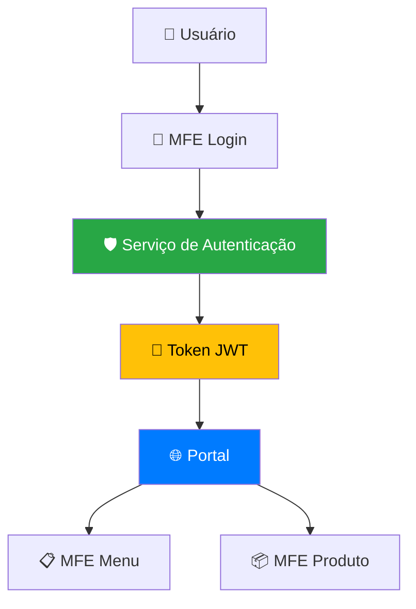
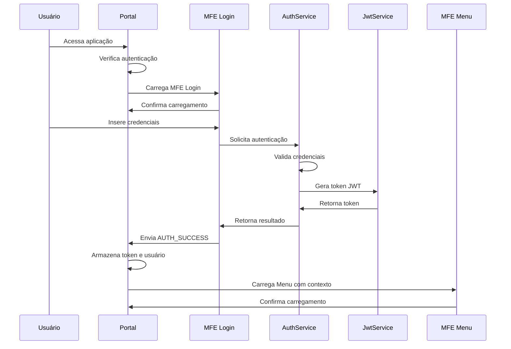

# 🔐 Roteiro Documental - Parte 5: Sistema de Autenticação

## 🎯 Objetivo da Sessão

Compreender o sistema de autenticação centralizada implementado na PoC, analisando a estrutura de tokens JWT, o fluxo de login/logout e as estratégias de segurança adotadas.

## 🏗️ Arquitetura de Autenticação

### Modelo Centralizado

Nossa PoC implementa um **modelo de autenticação centralizada** onde:

- **Portal** gerencia o estado de autenticação global
- **MFE Login** fornece a interface de autenticação
- **Tokens JWT** carregam informações do usuário e permissões
- **Todos os MFEs** recebem contexto de autenticação via comunicação



### Princípios de Design

#### 1. **Single Sign-On (SSO)**
- **Uma única autenticação** para toda a aplicação
- **Propagação automática** do contexto de usuário
- **Logout centralizado** com limpeza global

#### 2. **Stateless Authentication**
- **Tokens JWT** contêm todas as informações necessárias
- **Sem dependência de sessão** no servidor
- **Escalabilidade horizontal** facilitada

#### 3. **Least Privilege Principle**
- **Permissões granulares** por funcionalidade
- **Controle de acesso** baseado em roles e scopes
- **Validação** em cada MFE

## 🎫 Estrutura do Token JWT

### Payload do Token

```typescript
interface JwtPayload {
  // Claims padrão JWT
  sub: string;                    // Subject (User ID)
  iat: number;                    // Issued At (timestamp)
  exp: number;                    // Expiration (timestamp)
  iss?: string;                   // Issuer
  aud?: string;                   // Audience
  
  // Claims customizados da aplicação
  username: string;               // Nome de usuário
  name: string;                   // Nome completo
  email?: string;                 // Email do usuário
  
  // Sistema de permissões
  permissions: string[];          // ['read', 'write', 'delete', 'admin']
  scopes?: string[];             // ['sc_produto', 'sc_usuario', 'sc_relatorio']
  
  // Metadados adicionais
  preferred_username?: string;    // Username preferido
  roles?: string[];              // Roles do usuário
  department?: string;           // Departamento
  
  // Controle de sessão
  sessionId?: string;            // ID da sessão
  deviceId?: string;             // ID do dispositivo
}
```

### Exemplo de Token Decodificado

```json
{
  "sub": "user123",
  "iat": 1703001600,
  "exp": 1703005200,
  "iss": "mfe-portal",
  "username": "admin",
  "name": "Administrador do Sistema",
  "email": "admin@empresa.com",
  "permissions": ["read", "write", "delete", "admin"],
  "scopes": ["sc_produto", "sc_usuario", "sc_relatorio"],
  "preferred_username": "admin",
  "roles": ["ADMIN", "MANAGER"],
  "department": "TI",
  "sessionId": "sess_abc123",
  "deviceId": "dev_xyz789"
}
```

## 🔧 Implementação do Sistema

### JWT Mock Service (Simulação)

```typescript
@Injectable({
  providedIn: 'root'
})
export class JwtMockService {
  private readonly SECRET_KEY = 'mfe-demo-secret-key';
  private readonly TOKEN_DURATION = 60 * 60; // 1 hora em segundos

  /**
   * Gera um token JWT mock para demonstração
   */
  generateToken(payload: Partial<JwtPayload>): string {
    const now = Math.floor(Date.now() / 1000);
    
    const fullPayload: JwtPayload = {
      sub: payload.sub || 'unknown',
      iat: now,
      exp: now + this.TOKEN_DURATION,
      iss: 'mfe-portal',
      username: payload.username || 'user',
      name: payload.name || 'Usuário',
      email: payload.email,
      permissions: payload.permissions || ['read'],
      scopes: payload.scopes || [],
      preferred_username: payload.username,
      sessionId: this.generateSessionId()
    };

    // Em produção, usar biblioteca JWT real
    return this.createMockJwt(fullPayload);
  }

  /**
   * Valida um token JWT
   */
  validateToken(token: string): boolean {
    try {
      const payload = this.decodeToken(token);
      if (!payload) return false;

      const now = Math.floor(Date.now() / 1000);
      return payload.exp > now;
    } catch {
      return false;
    }
  }

  /**
   * Decodifica um token JWT
   */
  decodeToken(token: string): JwtPayload | null {
    try {
      // Em produção, usar biblioteca JWT real com validação de assinatura
      const parts = token.split('.');
      if (parts.length !== 3) return null;

      const payload = JSON.parse(atob(parts[1]));
      return payload;
    } catch {
      return null;
    }
  }

  /**
   * Cria um JWT mock (apenas para demonstração)
   */
  private createMockJwt(payload: JwtPayload): string {
    const header = { alg: 'HS256', typ: 'JWT' };
    
    const encodedHeader = btoa(JSON.stringify(header));
    const encodedPayload = btoa(JSON.stringify(payload));
    const signature = this.createMockSignature(encodedHeader + '.' + encodedPayload);
    
    return `${encodedHeader}.${encodedPayload}.${signature}`;
  }

  private createMockSignature(data: string): string {
    // Mock signature - em produção usar HMAC real
    return btoa(data + this.SECRET_KEY).substring(0, 32);
  }

  private generateSessionId(): string {
    return 'sess_' + Math.random().toString(36).substring(2, 15);
  }
}
```

### Serviço de Autenticação

```typescript
@Injectable({
  providedIn: 'root'
})
export class AuthService {
  private currentUserSubject = new BehaviorSubject<User | null>(null);
  public currentUser$ = this.currentUserSubject.asObservable();
  
  private tokenSubject = new BehaviorSubject<string | null>(null);
  public token$ = this.tokenSubject.asObservable();

  constructor(
    private jwtService: JwtMockService,
    private communicationService: MfeCommunicationService
  ) {
    this.initializeFromStorage();
  }

  /**
   * Realiza login com credenciais
   */
  async login(credentials: LoginCredentials): Promise<AuthResult> {
    try {
      // Simular validação de credenciais
      const user = await this.validateCredentials(credentials);
      
      if (!user) {
        return {
          success: false,
          error: 'Credenciais inválidas',
          errorCode: 'INVALID_CREDENTIALS'
        };
      }

      // Gerar token JWT
      const token = this.jwtService.generateToken({
        sub: user.id,
        username: user.username,
        name: user.name,
        email: user.email,
        permissions: user.permissions,
        scopes: user.scopes
      });

      // Armazenar token e usuário
      this.setAuthenticationData(token, user);

      // Notificar sucesso
      this.notifyAuthenticationSuccess(user, token);

      return {
        success: true,
        user,
        token,
        expiresIn: 3600
      };

    } catch (error) {
      console.error('Erro durante login:', error);
      return {
        success: false,
        error: 'Erro interno do servidor',
        errorCode: 'SERVER_ERROR'
      };
    }
  }

  /**
   * Realiza logout
   */
  logout(): void {
    // Limpar dados locais
    this.clearAuthenticationData();
    
    // Notificar logout para todos os MFEs
    this.notifyLogout();
    
    console.log('Logout realizado com sucesso');
  }

  /**
   * Verifica se usuário está autenticado
   */
  isAuthenticated(): boolean {
    const token = this.tokenSubject.value;
    return token ? this.jwtService.validateToken(token) : false;
  }

  /**
   * Obtém usuário atual
   */
  getCurrentUser(): User | null {
    return this.currentUserSubject.value;
  }

  /**
   * Obtém token atual
   */
  getCurrentToken(): string | null {
    return this.tokenSubject.value;
  }

  /**
   * Valida credenciais (mock)
   */
  private async validateCredentials(credentials: LoginCredentials): Promise<User | null> {
    // Simular delay de rede
    await new Promise(resolve => setTimeout(resolve, 1000));

    // Usuários mock para demonstração
    const mockUsers: Record<string, User> = {
      'admin': {
        id: 'user_001',
        username: 'admin',
        name: 'Administrador do Sistema',
        email: 'admin@empresa.com',
        permissions: ['read', 'write', 'delete', 'admin'],
        scopes: ['sc_produto', 'sc_usuario', 'sc_relatorio']
      },
      'manager': {
        id: 'user_002',
        username: 'manager',
        name: 'Gerente de Produtos',
        email: 'manager@empresa.com',
        permissions: ['read', 'write'],
        scopes: ['sc_produto']
      },
      'user': {
        id: 'user_003',
        username: 'user',
        name: 'Usuário Padrão',
        email: 'user@empresa.com',
        permissions: ['read'],
        scopes: []
      }
    };

    const user = mockUsers[credentials.username];
    
    // Validar senha (mock)
    const validPasswords: Record<string, string> = {
      'admin': '123456',
      'manager': 'manager123',
      'user': 'password'
    };

    if (user && validPasswords[credentials.username] === credentials.password) {
      return user;
    }

    return null;
  }

  /**
   * Define dados de autenticação
   */
  private setAuthenticationData(token: string, user: User): void {
    // Armazenar em localStorage (em produção, considerar sessionStorage ou cookies seguros)
    localStorage.setItem('auth_token', token);
    localStorage.setItem('auth_user', JSON.stringify(user));

    // Atualizar subjects
    this.tokenSubject.next(token);
    this.currentUserSubject.next(user);
  }

  /**
   * Limpa dados de autenticação
   */
  private clearAuthenticationData(): void {
    localStorage.removeItem('auth_token');
    localStorage.removeItem('auth_user');
    
    this.tokenSubject.next(null);
    this.currentUserSubject.next(null);
  }

  /**
   * Inicializa dados do localStorage
   */
  private initializeFromStorage(): void {
    const token = localStorage.getItem('auth_token');
    const userJson = localStorage.getItem('auth_user');

    if (token && userJson && this.jwtService.validateToken(token)) {
      try {
        const user = JSON.parse(userJson);
        this.tokenSubject.next(token);
        this.currentUserSubject.next(user);
      } catch (error) {
        console.error('Erro ao recuperar dados de autenticação:', error);
        this.clearAuthenticationData();
      }
    }
  }

  /**
   * Notifica sucesso de autenticação
   */
  private notifyAuthenticationSuccess(user: User, token: string): void {
    const authEvent = new CustomEvent('auth-success', {
      detail: {
        user,
        token,
        timestamp: new Date().toISOString()
      }
    });
    
    window.dispatchEvent(authEvent);
  }

  /**
   * Notifica logout
   */
  private notifyLogout(): void {
    const logoutEvent = new CustomEvent('auth-logout', {
      detail: {
        timestamp: new Date().toISOString()
      }
    });
    
    window.dispatchEvent(logoutEvent);
  }
}
```

## 🔄 Fluxo de Autenticação

### Sequência Completa de Login



### Estados de Autenticação

```typescript
enum AuthState {
  INITIAL = 'initial',           // Estado inicial
  LOADING = 'loading',           // Carregando autenticação
  AUTHENTICATED = 'authenticated', // Usuário autenticado
  UNAUTHENTICATED = 'unauthenticated', // Não autenticado
  ERROR = 'error'                // Erro de autenticação
}

interface AuthStateManager {
  currentState: AuthState;
  user: User | null;
  token: string | null;
  error: string | null;
  
  // Transições de estado
  startLogin(): void;
  loginSuccess(user: User, token: string): void;
  loginError(error: string): void;
  logout(): void;
}
```

## 🛡️ Segurança e Validação

### Validação de Permissões

```typescript
@Injectable({
  providedIn: 'root'
})
export class PermissionService {
  
  /**
   * Verifica se usuário tem permissão específica
   */
  hasPermission(user: User | null, permission: string): boolean {
    if (!user || !user.permissions) {
      return false;
    }
    
    return user.permissions.includes(permission) || user.permissions.includes('admin');
  }

  /**
   * Verifica se usuário tem scope específico
   */
  hasScope(user: User | null, scope: string): boolean {
    if (!user || !user.scopes) {
      return false;
    }
    
    return user.scopes.includes(scope);
  }

  /**
   * Verifica múltiplas permissões (AND)
   */
  hasAllPermissions(user: User | null, permissions: string[]): boolean {
    return permissions.every(permission => this.hasPermission(user, permission));
  }

  /**
   * Verifica múltiplas permissões (OR)
   */
  hasAnyPermission(user: User | null, permissions: string[]): boolean {
    return permissions.some(permission => this.hasPermission(user, permission));
  }

  /**
   * Filtra itens baseado em permissões
   */
  filterByPermissions<T extends { permissions?: string[] }>(
    items: T[], 
    user: User | null
  ): T[] {
    return items.filter(item => {
      if (!item.permissions || item.permissions.length === 0) {
        return true; // Item sem restrições
      }
      
      return this.hasAnyPermission(user, item.permissions);
    });
  }
}
```

### Guards de Rota

```typescript
@Injectable({
  providedIn: 'root'
})
export class AuthGuard implements CanActivate {
  
  constructor(
    private authService: AuthService,
    private router: Router
  ) {}

  canActivate(
    route: ActivatedRouteSnapshot,
    state: RouterStateSnapshot
  ): boolean | Observable<boolean> {
    
    if (this.authService.isAuthenticated()) {
      // Verificar permissões específicas da rota
      const requiredPermissions = route.data['permissions'] as string[];
      
      if (requiredPermissions) {
        const user = this.authService.getCurrentUser();
        const permissionService = new PermissionService();
        
        if (!permissionService.hasAnyPermission(user, requiredPermissions)) {
          console.warn('Acesso negado: permissões insuficientes');
          return false;
        }
      }
      
      return true;
    }

    // Redirecionar para login
    this.router.navigate(['/login']);
    return false;
  }
}
```

## 📊 Monitoramento de Autenticação

### Auditoria de Login

```typescript
interface LoginAuditLog {
  timestamp: string;
  userId: string;
  username: string;
  success: boolean;
  ipAddress?: string;
  userAgent?: string;
  errorCode?: string;
  sessionId?: string;
}

@Injectable({
  providedIn: 'root'
})
export class AuthAuditService {
  private auditLogs: LoginAuditLog[] = [];

  logLoginAttempt(
    username: string, 
    success: boolean, 
    errorCode?: string
  ): void {
    const log: LoginAuditLog = {
      timestamp: new Date().toISOString(),
      userId: success ? this.getUserId(username) : '',
      username,
      success,
      ipAddress: this.getClientIP(),
      userAgent: navigator.userAgent,
      errorCode,
      sessionId: this.generateSessionId()
    };

    this.auditLogs.push(log);
    console.log('Login Audit:', log);

    // Em produção, enviar para serviço de auditoria
    this.sendToAuditService(log);
  }

  getAuditLogs(): LoginAuditLog[] {
    return [...this.auditLogs];
  }

  getFailedAttempts(username: string, timeWindow: number = 300000): number {
    const cutoff = Date.now() - timeWindow;
    
    return this.auditLogs.filter(log => 
      log.username === username && 
      !log.success && 
      new Date(log.timestamp).getTime() > cutoff
    ).length;
  }
}
```

## 🎯 Próximos Passos

Na **próxima sessão**, exploraremos o **sistema de refresh de tokens**, analisando como manter a autenticação ativa e gerenciar a renovação automática de tokens.

### Tópicos da Próxima Sessão
- Gerenciamento de ciclo de vida de tokens
- Refresh automático de tokens
- Estratégias de renovação
- Tratamento de expiração

---

**Duração Estimada**: 25-30 minutos  
**Nível**: Técnico Avançado  
**Próxima Parte**: [06 - Refresh de Tokens](./06-refresh-tokens.md)