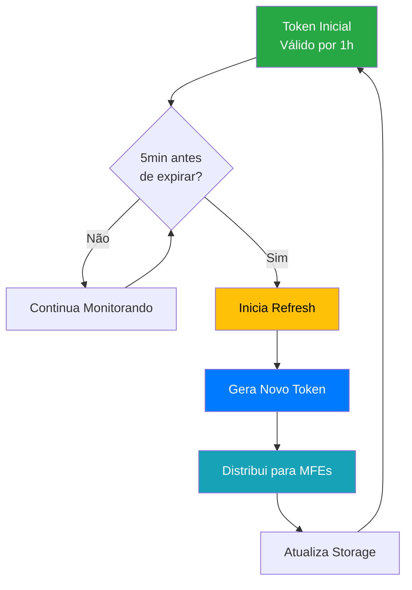

# 🔄 Roteiro Documental - Parte 6: Sistema de Refresh de Tokens

## 🎯 Objetivo da Sessão

Compreender o sistema de refresh automático de tokens implementado na PoC, analisando o gerenciamento do ciclo de vida dos tokens, estratégias de renovação e tratamento de expiração.

## 🕐 Fundamentos do Refresh de Tokens

### Por que Refresh de Tokens?

O **refresh de tokens** é uma estratégia fundamental para manter a **segurança** e **usabilidade** em aplicações modernas:

#### Problemas dos Tokens de Longa Duração
- ⚠️ **Risco de segurança**: Tokens comprometidos permanecem válidos por muito tempo
- ⚠️ **Dificuldade de revogação**: Impossível invalidar tokens distribuídos
- ⚠️ **Exposição prolongada**: Maior janela de oportunidade para ataques

#### Benefícios do Refresh Automático
- ✅ **Segurança aprimorada**: Tokens de curta duração limitam exposição
- ✅ **Experiência contínua**: Usuário não precisa fazer login repetidamente
- ✅ **Controle granular**: Possibilidade de revogar acesso instantaneamente
- ✅ **Auditoria detalhada**: Rastreamento preciso de atividade

### Estratégia Implementada



## 🏗️ Arquitetura do Token Manager

### Componentes Principais

#### 1. **TokenManagerService** (Portal)
- **Monitoramento contínuo** do status do token
- **Refresh automático** baseado em threshold
- **Distribuição** de tokens atualizados para MFEs
- **Tratamento de falhas** e fallbacks

#### 2. **Token Status Monitoring**
- **Verificação periódica** (a cada 1 minuto)
- **Cálculo de tempo restante** até expiração
- **Detecção de necessidade** de refresh
- **Métricas de performance**

#### 3. **Distribution System**
- **Eventos globais** para notificar MFEs
- **Atualização sincronizada** em todos os componentes
- **Validação** de recebimento

## 🔧 Implementação Técnica

### Token Manager Service

```typescript
@Injectable({
  providedIn: 'root'
})
export class TokenManagerService implements OnDestroy {
  // Configurações
  private readonly REFRESH_THRESHOLD = 5 * 60; // 5 minutos em segundos
  private readonly CHECK_INTERVAL = 60 * 1000; // Verificar a cada 1 minuto
  private readonly MAX_RETRY_ATTEMPTS = 3;
  
  // Estado interno
  private currentToken: string | null = null;
  private currentUser: any = null;
  private monitoringSubscription: Subscription | null = null;
  private retryCount = 0;
  
  // Observables
  private tokenStatusSubject = new BehaviorSubject<TokenStatus | null>(null);
  public tokenStatus$ = this.tokenStatusSubject.asObservable();

  constructor(
    private jwtMockService: JwtMockService,
    private mfeCommunicationService: MfeCommunicationService
  ) {
    console.log('TokenManagerService inicializado');
  }

  /**
   * Inicia o gerenciamento de um token
   */
  startManaging(token: string, user: any): void {
    console.log('=== INICIANDO GERENCIAMENTO DE TOKEN ===');
    
    this.currentToken = token;
    this.currentUser = user;
    this.retryCount = 0;
    
    // Validar token inicial
    if (!this.jwtMockService.validateToken(token)) {
      console.error('Token inválido fornecido para gerenciamento');
      this.handleInvalidToken();
      return;
    }

    // Iniciar monitoramento
    this.startMonitoring();
    
    // Emitir status inicial
    this.updateTokenStatus();
    
    console.log('Gerenciamento de token iniciado com sucesso');
  }

  /**
   * Para o gerenciamento do token
   */
  stopManaging(): void {
    console.log('=== PARANDO GERENCIAMENTO DE TOKEN ===');
    
    this.stopMonitoring();
    this.currentToken = null;
    this.currentUser = null;
    this.retryCount = 0;
    this.tokenStatusSubject.next(null);
    
    console.log('Gerenciamento de token parado');
  }

  /**
   * Inicia o monitoramento automático do token
   */
  private startMonitoring(): void {
    console.log('Iniciando monitoramento automático do token');
    
    this.stopMonitoring(); // Garantir que não há monitoramento duplicado
    
    this.monitoringSubscription = interval(this.CHECK_INTERVAL).subscribe(() => {
      this.checkTokenStatus();
    });
  }

  /**
   * Para o monitoramento automático
   */
  private stopMonitoring(): void {
    if (this.monitoringSubscription) {
      this.monitoringSubscription.unsubscribe();
      this.monitoringSubscription = null;
      console.log('Monitoramento automático parado');
    }
  }

  /**
   * Verifica o status do token e executa refresh se necessário
   */
  private checkTokenStatus(): void {
    if (!this.currentToken) {
      return;
    }

    const status = this.calculateTokenStatus(this.currentToken);
    
    console.log('Verificação de token:', {
      expiresIn: Math.floor(status.expiresIn / 60) + ' minutos',
      needsRefresh: status.needsRefresh,
      isValid: status.isValid
    });

    // Atualizar status
    this.tokenStatusSubject.next(status);

    // Executar refresh se necessário
    if (status.needsRefresh && status.isValid) {
      console.log('Token precisa ser renovado. Executando refresh...');
      this.performRefresh();
    } else if (!status.isValid) {
      console.error('Token expirado detectado');
      this.handleExpiredToken();
    }
  }

  /**
   * Calcula o status atual do token
   */
  private calculateTokenStatus(token: string): TokenStatus {
    const payload = this.jwtMockService.decodeToken(token);
    
    if (!payload) {
      return {
        isValid: false,
        expiresAt: 0,
        expiresIn: 0,
        needsRefresh: false,
        user: null
      };
    }

    const now = Math.floor(Date.now() / 1000);
    const expiresAt = payload.exp;
    const expiresIn = expiresAt - now;
    const needsRefresh = expiresIn <= this.REFRESH_THRESHOLD && expiresIn > 0;

    return {
      isValid: expiresIn > 0,
      expiresAt: expiresAt,
      expiresIn: expiresIn,
      needsRefresh: needsRefresh,
      user: {
        id: payload.sub,
        username: payload.username,
        name: payload.name,
        email: payload.email,
        permissions: payload.permissions || [],
        scopes: payload.scopes || []
      }
    };
  }

  /**
   * Executa o refresh do token
   */
  private async performRefresh(): Promise<boolean> {
    console.log('=== EXECUTANDO REFRESH DO TOKEN ===');
    
    try {
      // Simular chamada de refresh
      const newToken = await this.simulateTokenRefresh();
      
      if (newToken) {
        console.log('Token renovado com sucesso');
        
        // Atualizar token atual
        this.currentToken = newToken;
        this.retryCount = 0; // Reset contador de tentativas
        
        // Atualizar armazenamento
        this.updateTokenStorage(newToken);
        
        // Distribuir para todos os MFEs
        this.distributeTokenToMfes(newToken);
        
        // Atualizar status
        this.updateTokenStatus();
        
        return true;
      } else {
        console.error('Falha ao renovar token');
        this.handleRefreshFailure();
        return false;
      }
    } catch (error) {
      console.error('Erro durante refresh do token:', error);
      this.handleRefreshFailure();
      return false;
    }
  }

  /**
   * Simula o refresh do token (mock para desenvolvimento)
   */
  private async simulateTokenRefresh(): Promise<string | null> {
    console.log('Simulando refresh do token...');
    
    // Simular delay de rede
    await new Promise(resolve => setTimeout(resolve, 1000));
    
    // Simular falha ocasional (5% de chance)
    if (Math.random() < 0.05) {
      throw new Error('Falha simulada de rede');
    }
    
    if (!this.currentUser) {
      return null;
    }

    // Gerar novo token com mesmos dados do usuário
    const tokenPayload = {
      sub: this.currentUser.id,
      username: this.currentUser.username,
      name: this.currentUser.name,
      email: this.currentUser.email,
      permissions: this.currentUser.permissions,
      scopes: this.currentUser.scopes,
      preferred_username: this.currentUser.username
    };

    return this.jwtMockService.generateToken(tokenPayload);
  }

  /**
   * Atualiza o armazenamento do token
   */
  private updateTokenStorage(newToken: string): void {
    localStorage.setItem('auth_token', newToken);
    this.mfeCommunicationService.setCurrentToken(newToken);
  }

  /**
   * Distribui o token atualizado para todos os MFEs
   */
  private distributeTokenToMfes(newToken: string): void {
    console.log('=== DISTRIBUINDO TOKEN ATUALIZADO PARA MFEs ===');
    
    // Enviar evento global de token atualizado
    const tokenUpdateEvent = new CustomEvent('token-updated', {
      detail: {
        token: newToken,
        timestamp: new Date().toISOString(),
        user: this.currentUser,
        reason: 'refresh'
      }
    });
    
    window.dispatchEvent(tokenUpdateEvent);
    
    // Notificar MFEs específicos via comunicação padrão
    const mfeNames = ['mfeLogin', 'mfeMenu', 'mfeProduto'];
    
    mfeNames.forEach(mfeName => {
      this.mfeCommunicationService.sendDataToMfe(mfeName, {
        user: this.currentUser,
        context: {
          source: 'token-manager',
          timestamp: new Date().toISOString(),
          action: 'token-refresh'
        },
        config: {
          token: newToken
        }
      });
    });
    
    console.log('Token distribuído para todos os MFEs');
  }

  /**
   * Trata falha no refresh com retry
   */
  private handleRefreshFailure(): void {
    this.retryCount++;
    
    console.error(`=== FALHA NO REFRESH DO TOKEN (Tentativa ${this.retryCount}/${this.MAX_RETRY_ATTEMPTS}) ===`);
    
    if (this.retryCount < this.MAX_RETRY_ATTEMPTS) {
      // Tentar novamente após delay exponencial
      const delay = Math.pow(2, this.retryCount) * 1000; // 2s, 4s, 8s
      
      console.log(`Tentando novamente em ${delay}ms...`);
      
      setTimeout(() => {
        this.performRefresh();
      }, delay);
    } else {
      console.error('Máximo de tentativas de refresh atingido. Forçando logout.');
      this.forceLogout('Falha ao renovar token após múltiplas tentativas');
    }
  }

  /**
   * Trata token expirado
   */
  private handleExpiredToken(): void {
    console.error('=== TOKEN EXPIRADO DETECTADO ===');
    this.forceLogout('Token expirado');
  }

  /**
   * Trata token inválido
   */
  private handleInvalidToken(): void {
    console.error('=== TOKEN INVÁLIDO DETECTADO ===');
    this.forceLogout('Token inválido');
  }

  /**
   * Força logout por erro de token
   */
  private forceLogout(reason: string): void {
    this.stopManaging();
    
    const errorEvent = new CustomEvent('token-error', {
      detail: {
        error: reason,
        timestamp: new Date().toISOString(),
        action: 'force-logout'
      }
    });
    
    window.dispatchEvent(errorEvent);
    
    console.log('Logout forçado devido a:', reason);
  }

  /**
   * Atualiza o status do token atual
   */
  private updateTokenStatus(): void {
    if (this.currentToken) {
      const status = this.calculateTokenStatus(this.currentToken);
      this.tokenStatusSubject.next(status);
    }
  }
}
```

### Interface de Status do Token

```typescript
export interface TokenStatus {
  isValid: boolean;           // Token ainda é válido
  expiresAt: number;         // Timestamp de expiração
  expiresIn: number;         // Segundos até expirar
  needsRefresh: boolean;     // Precisa ser renovado
  user: any;                 // Dados do usuário
  lastRefresh?: string;      // Timestamp do último refresh
  refreshCount?: number;     // Número de refreshes realizados
}
```

## 📊 Monitoramento e Métricas

### Collector de Métricas de Refresh

```typescript
interface RefreshMetrics {
  totalRefreshes: number;
  successfulRefreshes: number;
  failedRefreshes: number;
  averageRefreshTime: number;
  lastRefreshTime: string;
  refreshHistory: RefreshEvent[];
}

interface RefreshEvent {
  timestamp: string;
  success: boolean;
  duration: number;
  error?: string;
  retryCount: number;
}

@Injectable({
  providedIn: 'root'
})
export class RefreshMetricsService {
  private metrics: RefreshMetrics = {
    totalRefreshes: 0,
    successfulRefreshes: 0,
    failedRefreshes: 0,
    averageRefreshTime: 0,
    lastRefreshTime: '',
    refreshHistory: []
  };

  recordRefreshAttempt(
    success: boolean, 
    duration: number, 
    error?: string, 
    retryCount: number = 0
  ): void {
    const event: RefreshEvent = {
      timestamp: new Date().toISOString(),
      success,
      duration,
      error,
      retryCount
    };

    this.metrics.totalRefreshes++;
    this.metrics.lastRefreshTime = event.timestamp;
    this.metrics.refreshHistory.push(event);

    if (success) {
      this.metrics.successfulRefreshes++;
    } else {
      this.metrics.failedRefreshes++;
    }

    // Manter apenas os últimos 100 eventos
    if (this.metrics.refreshHistory.length > 100) {
      this.metrics.refreshHistory = this.metrics.refreshHistory.slice(-100);
    }

    // Calcular tempo médio de refresh
    const successfulEvents = this.metrics.refreshHistory.filter(e => e.success);
    if (successfulEvents.length > 0) {
      this.metrics.averageRefreshTime = 
        successfulEvents.reduce((sum, e) => sum + e.duration, 0) / successfulEvents.length;
    }

    console.log('Refresh Metrics Updated:', this.metrics);
  }

  getMetrics(): RefreshMetrics {
    return { ...this.metrics };
  }

  getSuccessRate(): number {
    if (this.metrics.totalRefreshes === 0) return 0;
    return (this.metrics.successfulRefreshes / this.metrics.totalRefreshes) * 100;
  }
}
```

### Dashboard de Status do Token

```typescript
@Component({
  selector: 'app-token-status',
  template: `
    <div class="token-status-dashboard" *ngIf="tokenStatus">
      <div class="status-card" [class.warning]="tokenStatus.needsRefresh">
        <h4>🎫 Status do Token</h4>
        
        <div class="status-info">
          <div class="info-item">
            <label>Válido:</label>
            <span [class.valid]="tokenStatus.isValid" 
                  [class.invalid]="!tokenStatus.isValid">
              {{ tokenStatus.isValid ? '✅ Sim' : '❌ Não' }}
            </span>
          </div>
          
          <div class="info-item">
            <label>Expira em:</label>
            <span>{{ formatTimeRemaining(tokenStatus.expiresIn) }}</span>
          </div>
          
          <div class="info-item">
            <label>Precisa Refresh:</label>
            <span [class.needs-refresh]="tokenStatus.needsRefresh">
              {{ tokenStatus.needsRefresh ? '⚠️ Sim' : '✅ Não' }}
            </span>
          </div>
        </div>
        
        <div class="actions" *ngIf="tokenStatus.isValid">
          <button (click)="forceRefresh()" 
                  [disabled]="refreshing"
                  class="btn-refresh">
            {{ refreshing ? 'Renovando...' : '🔄 Forçar Refresh' }}
          </button>
        </div>
      </div>
      
      <div class="metrics-card">
        <h4>📊 Métricas de Refresh</h4>
        <div class="metrics-grid">
          <div class="metric">
            <label>Total:</label>
            <span>{{ refreshMetrics.totalRefreshes }}</span>
          </div>
          <div class="metric">
            <label>Sucessos:</label>
            <span>{{ refreshMetrics.successfulRefreshes }}</span>
          </div>
          <div class="metric">
            <label>Taxa de Sucesso:</label>
            <span>{{ getSuccessRate() }}%</span>
          </div>
          <div class="metric">
            <label>Tempo Médio:</label>
            <span>{{ refreshMetrics.averageRefreshTime.toFixed(0) }}ms</span>
          </div>
        </div>
      </div>
    </div>
  `
})
export class TokenStatusComponent implements OnInit, OnDestroy {
  tokenStatus: TokenStatus | null = null;
  refreshMetrics: RefreshMetrics = {} as RefreshMetrics;
  refreshing = false;
  
  private subscription = new Subscription();

  constructor(
    private tokenManager: TokenManagerService,
    private metricsService: RefreshMetricsService
  ) {}

  ngOnInit(): void {
    this.subscription.add(
      this.tokenManager.tokenStatus$.subscribe(status => {
        this.tokenStatus = status;
      })
    );

    // Atualizar métricas periodicamente
    this.subscription.add(
      interval(5000).subscribe(() => {
        this.refreshMetrics = this.metricsService.getMetrics();
      })
    );
  }

  ngOnDestroy(): void {
    this.subscription.unsubscribe();
  }

  async forceRefresh(): Promise<void> {
    this.refreshing = true;
    const startTime = performance.now();
    
    try {
      const success = await this.tokenManager.forceRefresh();
      const duration = performance.now() - startTime;
      
      this.metricsService.recordRefreshAttempt(success, duration);
      
      if (success) {
        console.log('Refresh manual realizado com sucesso');
      } else {
        console.error('Falha no refresh manual');
      }
    } catch (error) {
      const duration = performance.now() - startTime;
      this.metricsService.recordRefreshAttempt(false, duration, error.message);
      console.error('Erro no refresh manual:', error);
    } finally {
      this.refreshing = false;
    }
  }

  formatTimeRemaining(seconds: number): string {
    if (seconds <= 0) return 'Expirado';
    
    const minutes = Math.floor(seconds / 60);
    const remainingSeconds = seconds % 60;
    
    if (minutes > 0) {
      return `${minutes}m ${remainingSeconds}s`;
    } else {
      return `${remainingSeconds}s`;
    }
  }

  getSuccessRate(): number {
    return this.metricsService.getSuccessRate();
  }
}
```

## 🛡️ Estratégias de Resilência

### Tratamento de Falhas de Rede

```typescript
class NetworkAwareRefreshService {
  private isOnline = navigator.onLine;
  private retryQueue: RefreshRequest[] = [];

  constructor() {
    // Monitorar status da rede
    window.addEventListener('online', () => {
      this.isOnline = true;
      this.processRetryQueue();
    });

    window.addEventListener('offline', () => {
      this.isOnline = false;
    });
  }

  async performRefresh(): Promise<string | null> {
    if (!this.isOnline) {
      console.warn('Sem conexão. Adicionando refresh à fila.');
      this.addToRetryQueue();
      return null;
    }

    try {
      return await this.executeRefresh();
    } catch (error) {
      if (this.isNetworkError(error)) {
        this.addToRetryQueue();
      }
      throw error;
    }
  }

  private addToRetryQueue(): void {
    this.retryQueue.push({
      timestamp: Date.now(),
      attempts: 0
    });
  }

  private async processRetryQueue(): Promise<void> {
    while (this.retryQueue.length > 0 && this.isOnline) {
      const request = this.retryQueue.shift()!;
      
      try {
        await this.executeRefresh();
        console.log('Refresh da fila executado com sucesso');
      } catch (error) {
        console.error('Falha no refresh da fila:', error);
        
        // Recolocar na fila se não excedeu tentativas
        if (request.attempts < 3) {
          request.attempts++;
          this.retryQueue.push(request);
        }
      }
    }
  }
}
```

## 🎯 Próximos Passos

Na **próxima sessão**, exploraremos o **sistema de menu dinâmico**, analisando como os itens de menu são carregados dinamicamente baseados em configuração JSON e permissões do usuário.

### Tópicos da Próxima Sessão
- Configuração dinâmica de menu via JSON
- Filtragem baseada em permissões
- Carregamento assíncrono de itens
- Estrutura de dados do menu

---

**Duração Estimada**: 30-35 minutos  
**Nível**: Técnico Avançado  
**Próxima Parte**: [07 - Menu Dinâmico](./07-menu-dinamico.md)