# 📋 Roteiro Documental - Parte 7: Sistema de Menu Dinâmico

## 🎯 Objetivo da Sessão

Compreender o sistema de menu dinâmico implementado na PoC, analisando como os itens são carregados via configuração JSON, filtrados por permissões e integrados com a navegação da aplicação.

## 🏗️ Arquitetura do Menu Dinâmico

### Conceito de Menu Configurável

O **menu dinâmico** é uma abordagem que permite **configurar a navegação** da aplicação através de **arquivos de configuração externos**, sem necessidade de alteração de código.

#### Vantagens da Abordagem
- ✅ **Flexibilidade**: Alterações sem rebuild da aplicação
- ✅ **Personalização**: Menus diferentes por perfil/tenant
- ✅ **Manutenibilidade**: Configuração centralizada
- ✅ **Escalabilidade**: Adição de itens sem impacto no código
- ✅ **Controle granular**: Permissões por item de menu

### Fluxo de Funcionamento

```mermaid
graph TD
    A[Usuário Autentica] --> B[Portal Carrega MFE Menu]
    B --> C[Menu Service Inicializa]
    C --> D[Carrega menu-items.json]
    D --> E[Aplica Filtros de Permissão]
    E --> F[Renderiza Menu Filtrado]
    F --> G[Usuário Seleciona Item]
    G --> H[Notifica Portal via Evento]
    H --> I[Portal Carrega MFE Correspondente]
    
    style D fill:#ffc107,color:#000
    style E fill:#28a745,color:#fff
    style H fill:#007bff,color:#fff
```



## 📄 Estrutura de Configuração JSON

### Arquivo menu-items.json

```json
{
  "version": "1.0.0",
  "lastUpdated": "2024-01-15T10:30:00Z",
  "menuItems": [
    {
      "id": "produto",
      "label": "Produtos",
      "icon": "📦",
      "description": "Gestão de produtos",
      "mfeName": "mfe-produto",
      "route": "/produto",
      "order": 1,
      "permissions": ["read"],
      "scopes": ["sc_produto"],
      "active": true,
      "category": "business",
      "params": {
        "defaultView": "dashboard",
        "theme": "default"
      }
    },
    {
      "id": "dashboard",
      "label": "Dashboard",
      "icon": "📊",
      "description": "Painel de controle",
      "mfeName": null,
      "route": "/dashboard",
      "order": 0,
      "permissions": ["read"],
      "scopes": [],
      "active": true,
      "category": "analytics",
      "action": "fake"
    },
    {
      "id": "usuarios",
      "label": "Usuários",
      "icon": "👥",
      "description": "Gerencie usuários do sistema",
      "mfeName": null,
      "route": "/usuarios",
      "order": 4,
      "permissions": ["admin"],
      "scopes": ["sc_usuario"],
      "active": true,
      "category": "system",
      "action": "fake"
    }
  ]
}
```

### Modelo de Dados TypeScript

```typescript
export interface MenuConfig {
  version: string;
  lastUpdated: string;
  menuItems: MenuItem[];
}

export interface MenuItem {
  // Identificação
  id: string;                    // ID único do item
  label: string;                 // Texto exibido no menu
  icon?: string;                 // Ícone (emoji ou classe CSS)
  description?: string;          // Descrição para tooltip
  
  // Navegação
  mfeName?: string;             // Nome do MFE a carregar (null = ação fake)
  route: string;                // Rota da aplicação
  order: number;                // Ordem de exibição
  
  // Controle de Acesso
  permissions: string[];        // Permissões necessárias ['read', 'write', 'admin']
  scopes?: string[];           // Scopes necessários ['sc_produto', 'sc_usuario']
  
  // Estado e Configuração
  active: boolean;              // Item ativo/inativo
  category?: string;            // Categoria para agrupamento
  action?: string;              // Tipo de ação ('fake', 'mfe', 'external')
  
  // Parâmetros Adicionais
  params?: Record<string, any>; // Parâmetros específicos do item
  
  // Hierarquia (para submenus futuros)
  parentId?: string;            // ID do item pai
  children?: MenuItem[];        // Itens filhos
  
  // Metadados
  tags?: string[];              // Tags para busca/filtragem
  helpUrl?: string;             // URL de ajuda
  badge?: {                     // Badge de notificação
    text: string;
    color: string;
    type: 'info' | 'warning' | 'error' | 'success';
  };
}
```

## 🔧 Implementação do Menu Service

### Service Principal

```typescript
@Injectable({
  providedIn: 'root'
})
export class MenuService {
  private menuItemsSubject = new BehaviorSubject<MenuItem[]>([]);
  public menuItems$ = this.menuItemsSubject.asObservable();
  
  private filteredMenuItemsSubject = new BehaviorSubject<MenuItem[]>([]);
  public filteredMenuItems$ = this.filteredMenuItemsSubject.asObservable();
  
  private currentUser: User | null = null;
  private menuConfig: MenuConfig | null = null;

  constructor(
    private http: HttpClient,
    private permissionService: PermissionService,
    private mfeCommunicationService: MfeCommunicationService
  ) {
    this.setupUserContextListener();
  }

  /**
   * Carrega configuração do menu
   */
  async loadMenuConfig(): Promise<void> {
    try {
      console.log('Carregando configuração do menu...');
      
      // Carregar do arquivo JSON
      this.menuConfig = await this.http.get<MenuConfig>('/assets/config/menu-items.json').toPromise();
      
      if (!this.menuConfig) {
        throw new Error('Configuração de menu não encontrada');
      }

      console.log('Configuração do menu carregada:', this.menuConfig);
      
      // Processar itens do menu
      const processedItems = this.processMenuItems(this.menuConfig.menuItems);
      this.menuItemsSubject.next(processedItems);
      
      // Aplicar filtros se usuário já estiver disponível
      if (this.currentUser) {
        this.applyUserFilters(this.currentUser);
      }
      
    } catch (error) {
      console.error('Erro ao carregar configuração do menu:', error);
      
      // Fallback para menu básico
      this.loadFallbackMenu();
    }
  }

  /**
   * Processa itens do menu (ordenação, validação, etc.)
   */
  private processMenuItems(items: MenuItem[]): MenuItem[] {
    return items
      .filter(item => item.active) // Apenas itens ativos
      .sort((a, b) => a.order - b.order) // Ordenar por order
      .map(item => ({
        ...item,
        // Normalizar dados
        permissions: item.permissions || [],
        scopes: item.scopes || [],
        params: item.params || {}
      }));
  }

  /**
   * Configura listener para contexto do usuário
   */
  private setupUserContextListener(): void {
    this.mfeCommunicationService.inputData$.subscribe(inputData => {
      if (inputData.user) {
        console.log('Contexto de usuário recebido no menu:', inputData.user);
        this.currentUser = inputData.user;
        this.applyUserFilters(inputData.user);
      }
    });
  }

  /**
   * Aplica filtros baseados no usuário
   */
  private applyUserFilters(user: User): void {
    const allItems = this.menuItemsSubject.value;
    
    const filteredItems = allItems.filter(item => {
      // Verificar permissões
      const hasPermission = this.permissionService.hasAnyPermission(user, item.permissions);
      
      // Verificar scopes (se definidos)
      const hasScope = item.scopes.length === 0 || 
                      item.scopes.some(scope => user.scopes?.includes(scope));
      
      return hasPermission && hasScope;
    });

    console.log(`Menu filtrado: ${filteredItems.length}/${allItems.length} itens visíveis`);
    
    this.filteredMenuItemsSubject.next(filteredItems);
  }

  /**
   * Seleciona um item do menu
   */
  selectMenuItem(item: MenuItem): void {
    console.log('Item do menu selecionado:', item);
    
    // Registrar seleção para analytics
    this.recordMenuSelection(item);
    
    // Notificar Portal sobre seleção
    this.mfeCommunicationService.sendDataToPortal({
      type: 'MENU_ITEM_SELECTED',
      payload: {
        action: 'navigate',
        data: {
          itemId: item.id,
          label: item.label,
          route: item.route,
          mfeName: item.mfeName,
          params: item.params
        },
        status: 'success'
      }
    });
  }

  /**
   * Obtém item por ID
   */
  getMenuItemById(id: string): MenuItem | null {
    const allItems = this.menuItemsSubject.value;
    return allItems.find(item => item.id === id) || null;
  }

  /**
   * Obtém itens por categoria
   */
  getMenuItemsByCategory(category: string): MenuItem[] {
    const filteredItems = this.filteredMenuItemsSubject.value;
    return filteredItems.filter(item => item.category === category);
  }

  /**
   * Busca itens do menu
   */
  searchMenuItems(query: string): MenuItem[] {
    const filteredItems = this.filteredMenuItemsSubject.value;
    const lowerQuery = query.toLowerCase();
    
    return filteredItems.filter(item => 
      item.label.toLowerCase().includes(lowerQuery) ||
      item.description?.toLowerCase().includes(lowerQuery) ||
      item.tags?.some(tag => tag.toLowerCase().includes(lowerQuery))
    );
  }

  /**
   * Carrega menu de fallback em caso de erro
   */
  private loadFallbackMenu(): void {
    console.warn('Carregando menu de fallback');
    
    const fallbackItems: MenuItem[] = [
      {
        id: 'home',
        label: 'Início',
        icon: '🏠',
        route: '/',
        order: 0,
        permissions: ['read'],
        scopes: [],
        active: true,
        category: 'navigation',
        action: 'fake'
      }
    ];
    
    this.menuItemsSubject.next(fallbackItems);
    
    if (this.currentUser) {
      this.applyUserFilters(this.currentUser);
    }
  }

  /**
   * Registra seleção de menu para analytics
   */
  private recordMenuSelection(item: MenuItem): void {
    const selectionEvent = {
      timestamp: new Date().toISOString(),
      userId: this.currentUser?.id,
      itemId: item.id,
      label: item.label,
      category: item.category,
      mfeName: item.mfeName
    };
    
    console.log('Menu Selection Analytics:', selectionEvent);
    
    // Em produção, enviar para serviço de analytics
    // this.analyticsService.track('menu_item_selected', selectionEvent);
  }
}
```

## 🎨 Componente de Menu

### Template do Menu

```typescript
@Component({
  selector: 'app-menu-list',
  template: `
    <div class="menu-container">
      <!-- Header do Menu -->
      <div class="menu-header">
        <h3>📋 Menu Principal</h3>
        <div class="user-info" *ngIf="currentUser">
          <span class="user-name">{{ currentUser.name }}</span>
          <span class="user-role">{{ getUserRoleDisplay() }}</span>
        </div>
      </div>

      <!-- Busca no Menu -->
      <div class="menu-search" *ngIf="showSearch">
        <input 
          type="text" 
          placeholder="Buscar no menu..."
          [(ngModel)]="searchQuery"
          (input)="onSearchChange()"
          class="search-input">
      </div>

      <!-- Lista de Itens -->
      <div class="menu-items">
        <div 
          *ngFor="let item of displayedItems; trackBy: trackByItemId"
          class="menu-item"
          [class.active]="selectedItemId === item.id"
          (click)="selectItem(item)"
          [title]="item.description">
          
          <!-- Ícone -->
          <span class="menu-icon">{{ item.icon }}</span>
          
          <!-- Conteúdo -->
          <div class="menu-content">
            <span class="menu-label">{{ item.label }}</span>
            <span class="menu-description" *ngIf="item.description">
              {{ item.description }}
            </span>
          </div>
          
          <!-- Badge -->
          <span 
            *ngIf="item.badge" 
            class="menu-badge"
            [class]="'badge-' + item.badge.type">
            {{ item.badge.text }}
          </span>
          
          <!-- Indicador de MFE -->
          <span 
            *ngIf="item.mfeName" 
            class="mfe-indicator"
            title="Carrega MicroFrontEnd">
            🔗
          </span>
        </div>
      </div>

      <!-- Estado Vazio -->
      <div class="empty-state" *ngIf="displayedItems.length === 0">
        <div class="empty-icon">📭</div>
        <div class="empty-message">
          {{ searchQuery ? 'Nenhum item encontrado' : 'Nenhum item disponível' }}
        </div>
      </div>

      <!-- Informações de Debug (apenas desenvolvimento) -->
      <div class="debug-info" *ngIf="showDebugInfo">
        <details>
          <summary>🔧 Debug Info</summary>
          <div class="debug-content">
            <p><strong>Total de itens:</strong> {{ totalItems }}</p>
            <p><strong>Itens visíveis:</strong> {{ displayedItems.length }}</p>
            <p><strong>Usuário:</strong> {{ currentUser?.username }}</p>
            <p><strong>Permissões:</strong> {{ currentUser?.permissions?.join(', ') }}</p>
          </div>
        </details>
      </div>
    </div>
  `,
  styleUrls: ['./menu-list.component.scss']
})
export class MenuListComponent implements OnInit, OnDestroy {
  displayedItems: MenuItem[] = [];
  currentUser: User | null = null;
  selectedItemId: string | null = null;
  searchQuery = '';
  showSearch = true;
  showDebugInfo = environment.development;
  totalItems = 0;
  
  private subscription = new Subscription();

  constructor(
    private menuService: MenuService,
    private mfeCommunicationService: MfeCommunicationService
  ) {}

  ngOnInit(): void {
    // Carregar configuração do menu
    this.menuService.loadMenuConfig();
    
    // Observar itens filtrados
    this.subscription.add(
      this.menuService.filteredMenuItems$.subscribe(items => {
        this.displayedItems = items;
        this.applySearchFilter();
      })
    );
    
    // Observar todos os itens (para contagem)
    this.subscription.add(
      this.menuService.menuItems$.subscribe(items => {
        this.totalItems = items.length;
      })
    );
    
    // Observar contexto do usuário
    this.subscription.add(
      this.mfeCommunicationService.inputData$.subscribe(inputData => {
        if (inputData.user) {
          this.currentUser = inputData.user;
        }
      })
    );
  }

  ngOnDestroy(): void {
    this.subscription.unsubscribe();
  }

  /**
   * Seleciona um item do menu
   */
  selectItem(item: MenuItem): void {
    this.selectedItemId = item.id;
    this.menuService.selectMenuItem(item);
  }

  /**
   * Busca no menu
   */
  onSearchChange(): void {
    this.applySearchFilter();
  }

  /**
   * Aplica filtro de busca
   */
  private applySearchFilter(): void {
    if (!this.searchQuery.trim()) {
      // Sem busca, mostrar todos os itens filtrados
      return;
    }
    
    const searchResults = this.menuService.searchMenuItems(this.searchQuery);
    this.displayedItems = searchResults;
  }

  /**
   * TrackBy function para performance
   */
  trackByItemId(index: number, item: MenuItem): string {
    return item.id;
  }

  /**
   * Obtém display do role do usuário
   */
  getUserRoleDisplay(): string {
    if (!this.currentUser) return '';
    
    const permissions = this.currentUser.permissions || [];
    
    if (permissions.includes('admin')) {
      return 'Administrador';
    } else if (permissions.includes('write')) {
      return 'Editor';
    } else if (permissions.includes('read')) {
      return 'Visualizador';
    }
    
    return 'Usuário';
  }
}
```

## 🔍 Sistema de Filtragem Avançada

### Filtros por Permissão e Scope

```typescript
@Injectable({
  providedIn: 'root'
})
export class MenuFilterService {
  
  /**
   * Filtra itens baseado em múltiplos critérios
   */
  filterMenuItems(
    items: MenuItem[], 
    user: User | null, 
    filters: MenuFilters
  ): MenuItem[] {
    return items.filter(item => {
      // Filtro de ativação
      if (!item.active) return false;
      
      // Filtro de permissões
      if (!this.checkPermissions(item, user)) return false;
      
      // Filtro de scopes
      if (!this.checkScopes(item, user)) return false;
      
      // Filtro de categoria
      if (filters.categories && !filters.categories.includes(item.category || '')) {
        return false;
      }
      
      // Filtro de tipo de ação
      if (filters.actionTypes && !filters.actionTypes.includes(item.action || '')) {
        return false;
      }
      
      // Filtro customizado
      if (filters.customFilter && !filters.customFilter(item, user)) {
        return false;
      }
      
      return true;
    });
  }

  /**
   * Verifica permissões do item
   */
  private checkPermissions(item: MenuItem, user: User | null): boolean {
    if (!item.permissions || item.permissions.length === 0) {
      return true; // Item sem restrições
    }
    
    if (!user || !user.permissions) {
      return false; // Usuário sem permissões
    }
    
    // Verificar se usuário tem pelo menos uma das permissões necessárias
    return item.permissions.some(permission => 
      user.permissions.includes(permission) || user.permissions.includes('admin')
    );
  }

  /**
   * Verifica scopes do item
   */
  private checkScopes(item: MenuItem, user: User | null): boolean {
    if (!item.scopes || item.scopes.length === 0) {
      return true; // Item sem restrições de scope
    }
    
    if (!user || !user.scopes) {
      return false; // Usuário sem scopes
    }
    
    // Verificar se usuário tem pelo menos um dos scopes necessários
    return item.scopes.some(scope => user.scopes!.includes(scope));
  }

  /**
   * Agrupa itens por categoria
   */
  groupByCategory(items: MenuItem[]): Record<string, MenuItem[]> {
    return items.reduce((groups, item) => {
      const category = item.category || 'other';
      if (!groups[category]) {
        groups[category] = [];
      }
      groups[category].push(item);
      return groups;
    }, {} as Record<string, MenuItem[]>);
  }

  /**
   * Ordena itens por múltiplos critérios
   */
  sortMenuItems(items: MenuItem[], sortBy: MenuSortCriteria): MenuItem[] {
    return [...items].sort((a, b) => {
      switch (sortBy) {
        case 'order':
          return a.order - b.order;
        case 'label':
          return a.label.localeCompare(b.label);
        case 'category':
          return (a.category || '').localeCompare(b.category || '');
        default:
          return a.order - b.order;
      }
    });
  }
}

interface MenuFilters {
  categories?: string[];
  actionTypes?: string[];
  customFilter?: (item: MenuItem, user: User | null) => boolean;
}

type MenuSortCriteria = 'order' | 'label' | 'category';
```

## 📊 Analytics e Monitoramento

### Collector de Métricas de Menu

```typescript
interface MenuAnalytics {
  totalSelections: number;
  selectionsByItem: Record<string, number>;
  selectionsByUser: Record<string, number>;
  selectionsByCategory: Record<string, number>;
  averageItemsVisible: number;
  searchQueries: string[];
}

@Injectable({
  providedIn: 'root'
})
export class MenuAnalyticsService {
  private analytics: MenuAnalytics = {
    totalSelections: 0,
    selectionsByItem: {},
    selectionsByUser: {},
    selectionsByCategory: {},
    averageItemsVisible: 0,
    searchQueries: []
  };

  recordSelection(item: MenuItem, userId?: string): void {
    this.analytics.totalSelections++;
    
    // Por item
    this.analytics.selectionsByItem[item.id] = 
      (this.analytics.selectionsByItem[item.id] || 0) + 1;
    
    // Por usuário
    if (userId) {
      this.analytics.selectionsByUser[userId] = 
        (this.analytics.selectionsByUser[userId] || 0) + 1;
    }
    
    // Por categoria
    if (item.category) {
      this.analytics.selectionsByCategory[item.category] = 
        (this.analytics.selectionsByCategory[item.category] || 0) + 1;
    }
  }

  recordSearch(query: string): void {
    this.analytics.searchQueries.push(query);
    
    // Manter apenas as últimas 100 buscas
    if (this.analytics.searchQueries.length > 100) {
      this.analytics.searchQueries = this.analytics.searchQueries.slice(-100);
    }
  }

  recordVisibleItems(count: number): void {
    // Calcular média móvel simples
    const currentAvg = this.analytics.averageItemsVisible;
    this.analytics.averageItemsVisible = (currentAvg + count) / 2;
  }

  getPopularItems(limit = 5): Array<{id: string, count: number}> {
    return Object.entries(this.analytics.selectionsByItem)
      .map(([id, count]) => ({ id, count }))
      .sort((a, b) => b.count - a.count)
      .slice(0, limit);
  }

  getAnalytics(): MenuAnalytics {
    return { ...this.analytics };
  }
}
```

## 🎯 Próximos Passos

Na **próxima sessão**, exploraremos o **carregamento dinâmico de MFEs**, analisando como o Portal identifica, carrega e integra os MicroFrontEnds baseado nas seleções do menu.

### Tópicos da Próxima Sessão
- Dynamic MFE Loader Service
- Estratégias de carregamento lazy
- Gerenciamento de ciclo de vida dos MFEs
- Tratamento de erros e fallbacks

---

**Duração Estimada**: 25-30 minutos  
**Nível**: Técnico Intermediário  
**Próxima Parte**: [08 - Carregamento Dinâmico](./08-carregamento-dinamico.md)