# 🔐 Roteiro Documental - Parte 9: MFE Login - Implementação Detalhada

## 🎯 Objetivo da Sessão

Analisar em detalhes a implementação do MFE Login, compreendendo sua estrutura, formulário reativo, validações, integração com autenticação e tratamento de erros.

## 🏗️ Arquitetura do MFE Login

### Responsabilidades Específicas

O **MFE Login** é um componente **altamente especializado** com responsabilidades bem definidas:

#### Responsabilidades Principais
- ✅ **Interface de Autenticação**: Formulário de login intuitivo e responsivo
- ✅ **Validação Client-side**: Validações em tempo real das credenciais
- ✅ **Comunicação com Portal**: Envio de resultados de autenticação
- ✅ **Feedback Visual**: Estados de loading, sucesso e erro
- ✅ **Acessibilidade**: Suporte completo a leitores de tela

#### Características Técnicas
- **Standalone Component**: Não depende de outros MFEs
- **Formulário Reativo**: Angular Reactive Forms com validações
- **Estado Isolado**: Gerencia apenas seu próprio estado
- **Comunicação Unidirecional**: Apenas envia dados para o Portal

### Fluxo de Funcionamento

```mermaid
graph TD
    A[Portal Carrega MFE Login] --> B[Login Inicializa]
    B --> C[Renderiza Formulário]
    C --> D[Usuário Insere Dados]
    D --> E{Validações OK?}
    E -->|Não| F[Exibe Erros de Validação]
    E -->|Sim| G[Habilita Botão Submit]
    G --> H[Usuário Submete]
    H --> I[Inicia Loading State]
    I --> J[Chama AuthService]
    J --> K{Autenticação OK?}
    K -->|Sim| L[Envia AUTH_SUCCESS]
    K -->|Não| M[Envia AUTH_ERROR]
    L --> N[Portal Processa Sucesso]
    M --> O[Exibe Erro no Formulário]
    
    F --> D
    O --> D
    
    style I fill:#ffc107,color:#000
    style L fill:#28a745,color:#fff
    style M fill:#dc3545,color:#fff
```



## 🔧 Implementação do Componente

### Estrutura Principal

```typescript
@Component({
  selector: 'app-login-form',
  standalone: true,
  imports: [
    CommonModule,
    ReactiveFormsModule,
    FormsModule
  ],
  template: `
    <div class="login-container">
      <!-- Header -->
      <div class="login-header">
        <h2 class="login-title">{{ title }}</h2>
        <p class="login-subtitle" *ngIf="subtitle">{{ subtitle }}</p>
      </div>

      <!-- Formulário -->
      <form [formGroup]="loginForm" (ngSubmit)="onSubmit()" class="login-form">
        
        <!-- Campo Username -->
        <div class="form-group">
          <label for="username" class="form-label">
            Usuário <span class="required">*</span>
          </label>
          <input
            id="username"
            type="text"
            formControlName="username"
            class="form-input"
            [class.error]="isFieldInvalid('username')"
            placeholder="Digite seu usuário"
            autocomplete="username"
            [attr.aria-describedby]="isFieldInvalid('username') ? 'username-error' : null">
          
          <div 
            id="username-error"
            class="error-message" 
            *ngIf="isFieldInvalid('username')"
            role="alert">
            {{ getFieldError('username') }}
          </div>
        </div>

        <!-- Campo Password -->
        <div class="form-group">
          <label for="password" class="form-label">
            Senha <span class="required">*</span>
          </label>
          <div class="password-input-container">
            <input
              id="password"
              [type]="showPassword ? 'text' : 'password'"
              formControlName="password"
              class="form-input"
              [class.error]="isFieldInvalid('password')"
              placeholder="Digite sua senha"
              autocomplete="current-password"
              [attr.aria-describedby]="isFieldInvalid('password') ? 'password-error' : null">
            
            <button
              type="button"
              class="password-toggle"
              (click)="togglePasswordVisibility()"
              [attr.aria-label]="showPassword ? 'Ocultar senha' : 'Mostrar senha'">
              {{ showPassword ? '🙈' : '👁️' }}
            </button>
          </div>
          
          <div 
            id="password-error"
            class="error-message" 
            *ngIf="isFieldInvalid('password')"
            role="alert">
            {{ getFieldError('password') }}
          </div>
        </div>

        <!-- Lembrar-me -->
        <div class="form-group" *ngIf="showRememberMe">
          <label class="checkbox-label">
            <input
              type="checkbox"
              formControlName="rememberMe"
              class="checkbox-input">
            <span class="checkbox-text">Lembrar-me</span>
          </label>
        </div>

        <!-- Mensagem de Erro Geral -->
        <div 
          class="general-error" 
          *ngIf="generalError"
          role="alert"
          aria-live="polite">
          <span class="error-icon">⚠️</span>
          {{ generalError }}
        </div>

        <!-- Botão de Submit -->
        <button
          type="submit"
          class="submit-button"
          [disabled]="loginForm.invalid || isLoading"
          [class.loading]="isLoading">
          
          <span *ngIf="!isLoading">Entrar</span>
          <span *ngIf="isLoading" class="loading-content">
            <span class="spinner"></span>
            Entrando...
          </span>
        </button>

        <!-- Links Adicionais -->
        <div class="form-links" *ngIf="showForgotPassword">
          <a href="#" class="forgot-password-link" (click)="onForgotPassword($event)">
            Esqueceu sua senha?
          </a>
        </div>
      </form>

      <!-- Usuários Demo -->
      <div class="demo-users" *ngIf="showDemoUsers">
        <h4>👥 Usuários de Demonstração</h4>
        <div class="demo-user-list">
          <button
            *ngFor="let user of demoUsers"
            class="demo-user-button"
            (click)="fillDemoUser(user)"
            [title]="'Permissões: ' + user.permissions.join(', ')">
            <span class="demo-user-icon">{{ user.icon }}</span>
            <div class="demo-user-info">
              <span class="demo-user-name">{{ user.name }}</span>
              <span class="demo-user-role">{{ user.role }}</span>
            </div>
          </button>
        </div>
      </div>
    </div>
  `,
  styleUrls: ['./login-form.component.scss']
})
export class LoginFormComponent implements OnInit, OnDestroy {
  // Configurações
  title = 'Login do Sistema';
  subtitle = 'Entre com suas credenciais';
  showRememberMe = true;
  showForgotPassword = true;
  showDemoUsers = true;
  
  // Estado do componente
  loginForm: FormGroup;
  isLoading = false;
  showPassword = false;
  generalError = '';
  
  // Usuários demo
  demoUsers = [
    {
      username: 'admin',
      password: '123456',
      name: 'Administrador',
      role: 'Admin',
      icon: '👑',
      permissions: ['read', 'write', 'delete', 'admin']
    },
    {
      username: 'manager',
      password: 'manager123',
      name: 'Gerente',
      role: 'Manager',
      icon: '👔',
      permissions: ['read', 'write']
    },
    {
      username: 'user',
      password: 'password',
      name: 'Usuário',
      role: 'User',
      icon: '👤',
      permissions: ['read']
    }
  ];
  
  private subscription = new Subscription();

  constructor(
    private fb: FormBuilder,
    private authService: AuthService,
    private mfeCommunicationService: MfeCommunicationService
  ) {
    this.createForm();
  }

  ngOnInit(): void {
    this.setupInputDataListener();
    this.setupFormValidation();
  }

  ngOnDestroy(): void {
    this.subscription.unsubscribe();
  }

  /**
   * Cria o formulário reativo
   */
  private createForm(): void {
    this.loginForm = this.fb.group({
      username: ['', [
        Validators.required,
        Validators.minLength(3),
        Validators.maxLength(50),
        this.noWhitespaceValidator
      ]],
      password: ['', [
        Validators.required,
        Validators.minLength(6),
        Validators.maxLength(100)
      ]],
      rememberMe: [false]
    });
  }

  /**
   * Configura listener para dados do Portal
   */
  private setupInputDataListener(): void {
    this.subscription.add(
      this.mfeCommunicationService.inputData$.subscribe(inputData => {
        if (inputData.config) {
          this.updateConfiguration(inputData.config);
        }
      })
    );
  }

  /**
   * Configura validação em tempo real
   */
  private setupFormValidation(): void {
    // Limpar erro geral quando usuário começar a digitar
    this.subscription.add(
      this.loginForm.valueChanges.subscribe(() => {
        if (this.generalError) {
          this.generalError = '';
        }
      })
    );
  }

  /**
   * Atualiza configuração baseada em dados do Portal
   */
  private updateConfiguration(config: any): void {
    if (config.title) this.title = config.title;
    if (config.subtitle) this.subtitle = config.subtitle;
    if (config.showRememberMe !== undefined) this.showRememberMe = config.showRememberMe;
    if (config.showForgotPassword !== undefined) this.showForgotPassword = config.showForgotPassword;
    if (config.showDemoUsers !== undefined) this.showDemoUsers = config.showDemoUsers;
  }

  /**
   * Submete o formulário
   */
  async onSubmit(): Promise<void> {
    if (this.loginForm.invalid || this.isLoading) {
      return;
    }

    this.isLoading = true;
    this.generalError = '';

    try {
      const credentials = {
        username: this.loginForm.value.username.trim(),
        password: this.loginForm.value.password,
        rememberMe: this.loginForm.value.rememberMe
      };

      console.log('Tentativa de login:', { username: credentials.username });

      const result = await this.authService.login(credentials);

      if (result.success) {
        this.handleLoginSuccess(result);
      } else {
        this.handleLoginError(result.error, result.errorCode);
      }

    } catch (error) {
      console.error('Erro durante login:', error);
      this.handleLoginError('Erro interno do servidor', 'SERVER_ERROR');
    } finally {
      this.isLoading = false;
    }
  }

  /**
   * Trata sucesso do login
   */
  private handleLoginSuccess(result: AuthResult): void {
    console.log('Login realizado com sucesso:', result.user);

    // Enviar evento de sucesso para o Portal
    this.mfeCommunicationService.sendDataToPortal({
      type: 'AUTH_SUCCESS',
      payload: {
        action: 'login',
        data: {
          token: result.token,
          user: result.user,
          expiresIn: result.expiresIn
        },
        status: 'success',
        message: 'Login realizado com sucesso'
      }
    });

    // Limpar formulário por segurança
    this.loginForm.patchValue({ password: '' });
  }

  /**
   * Trata erro do login
   */
  private handleLoginError(error: string, errorCode?: string): void {
    console.error('Erro de login:', error, errorCode);

    // Definir mensagem de erro amigável
    const friendlyMessages: Record<string, string> = {
      'INVALID_CREDENTIALS': 'Usuário ou senha incorretos',
      'ACCOUNT_LOCKED': 'Conta bloqueada. Entre em contato com o suporte',
      'SERVER_ERROR': 'Erro interno do servidor. Tente novamente',
      'NETWORK_ERROR': 'Erro de conexão. Verifique sua internet'
    };

    this.generalError = friendlyMessages[errorCode || ''] || error;

    // Enviar evento de erro para o Portal
    this.mfeCommunicationService.sendDataToPortal({
      type: 'AUTH_ERROR',
      payload: {
        action: 'login',
        status: 'error',
        message: this.generalError,
        errorCode: errorCode
      }
    });

    // Focar no campo username para nova tentativa
    setTimeout(() => {
      const usernameField = document.getElementById('username');
      usernameField?.focus();
    }, 100);
  }

  /**
   * Alterna visibilidade da senha
   */
  togglePasswordVisibility(): void {
    this.showPassword = !this.showPassword;
  }

  /**
   * Preenche formulário com usuário demo
   */
  fillDemoUser(user: any): void {
    this.loginForm.patchValue({
      username: user.username,
      password: user.password
    });

    // Focar no botão de submit
    setTimeout(() => {
      const submitButton = document.querySelector('.submit-button') as HTMLElement;
      submitButton?.focus();
    }, 100);
  }

  /**
   * Trata esqueceu senha
   */
  onForgotPassword(event: Event): void {
    event.preventDefault();
    
    // Enviar evento para o Portal
    this.mfeCommunicationService.sendDataToPortal({
      type: 'FORGOT_PASSWORD_REQUEST',
      payload: {
        action: 'forgot-password',
        status: 'info',
        message: 'Solicitação de recuperação de senha'
      }
    });

    alert('Funcionalidade de recuperação de senha não implementada nesta demo.');
  }

  /**
   * Verifica se campo é inválido
   */
  isFieldInvalid(fieldName: string): boolean {
    const field = this.loginForm.get(fieldName);
    return !!(field && field.invalid && (field.dirty || field.touched));
  }

  /**
   * Obtém erro do campo
   */
  getFieldError(fieldName: string): string {
    const field = this.loginForm.get(fieldName);
    
    if (!field || !field.errors) {
      return '';
    }

    const errors = field.errors;
    
    if (errors['required']) {
      return `${this.getFieldLabel(fieldName)} é obrigatório`;
    }
    
    if (errors['minlength']) {
      const requiredLength = errors['minlength'].requiredLength;
      return `${this.getFieldLabel(fieldName)} deve ter pelo menos ${requiredLength} caracteres`;
    }
    
    if (errors['maxlength']) {
      const requiredLength = errors['maxlength'].requiredLength;
      return `${this.getFieldLabel(fieldName)} deve ter no máximo ${requiredLength} caracteres`;
    }
    
    if (errors['whitespace']) {
      return `${this.getFieldLabel(fieldName)} não pode conter apenas espaços`;
    }

    return 'Campo inválido';
  }

  /**
   * Obtém label do campo
   */
  private getFieldLabel(fieldName: string): string {
    const labels: Record<string, string> = {
      username: 'Usuário',
      password: 'Senha'
    };
    
    return labels[fieldName] || fieldName;
  }

  /**
   * Validador customizado para espaços em branco
   */
  private noWhitespaceValidator(control: AbstractControl): ValidationErrors | null {
    if (!control.value) {
      return null;
    }
    
    const isWhitespace = (control.value || '').trim().length === 0;
    return isWhitespace ? { whitespace: true } : null;
  }
}
```

## 🎨 Estilos e UX

### SCSS do Componente

```scss
.login-container {
  max-width: 400px;
  margin: 0 auto;
  padding: 2rem;
  background: #ffffff;
  border-radius: 12px;
  box-shadow: 0 4px 20px rgba(0, 0, 0, 0.1);
  
  @media (max-width: 768px) {
    margin: 1rem;
    padding: 1.5rem;
  }
}

.login-header {
  text-align: center;
  margin-bottom: 2rem;
  
  .login-title {
    font-size: 1.75rem;
    font-weight: 600;
    color: #2d3748;
    margin-bottom: 0.5rem;
  }
  
  .login-subtitle {
    color: #718096;
    font-size: 0.95rem;
    margin: 0;
  }
}

.login-form {
  .form-group {
    margin-bottom: 1.5rem;
  }
  
  .form-label {
    display: block;
    font-weight: 500;
    color: #4a5568;
    margin-bottom: 0.5rem;
    font-size: 0.9rem;
    
    .required {
      color: #e53e3e;
    }
  }
  
  .form-input {
    width: 100%;
    padding: 0.75rem 1rem;
    border: 2px solid #e2e8f0;
    border-radius: 8px;
    font-size: 1rem;
    transition: all 0.2s ease;
    
    &:focus {
      outline: none;
      border-color: #3182ce;
      box-shadow: 0 0 0 3px rgba(49, 130, 206, 0.1);
    }
    
    &.error {
      border-color: #e53e3e;
      
      &:focus {
        border-color: #e53e3e;
        box-shadow: 0 0 0 3px rgba(229, 62, 62, 0.1);
      }
    }
    
    &::placeholder {
      color: #a0aec0;
    }
  }
  
  .password-input-container {
    position: relative;
    
    .password-toggle {
      position: absolute;
      right: 0.75rem;
      top: 50%;
      transform: translateY(-50%);
      background: none;
      border: none;
      cursor: pointer;
      font-size: 1.2rem;
      padding: 0.25rem;
      border-radius: 4px;
      transition: background-color 0.2s ease;
      
      &:hover {
        background-color: #f7fafc;
      }
      
      &:focus {
        outline: 2px solid #3182ce;
        outline-offset: 2px;
      }
    }
  }
  
  .checkbox-label {
    display: flex;
    align-items: center;
    cursor: pointer;
    font-size: 0.9rem;
    color: #4a5568;
    
    .checkbox-input {
      margin-right: 0.5rem;
      transform: scale(1.1);
    }
  }
  
  .error-message {
    color: #e53e3e;
    font-size: 0.85rem;
    margin-top: 0.5rem;
    display: flex;
    align-items: center;
    
    &::before {
      content: '⚠️';
      margin-right: 0.25rem;
    }
  }
  
  .general-error {
    background-color: #fed7d7;
    border: 1px solid #feb2b2;
    color: #c53030;
    padding: 0.75rem 1rem;
    border-radius: 8px;
    margin-bottom: 1rem;
    display: flex;
    align-items: center;
    font-size: 0.9rem;
    
    .error-icon {
      margin-right: 0.5rem;
      font-size: 1.1rem;
    }
  }
  
  .submit-button {
    width: 100%;
    padding: 0.875rem 1rem;
    background-color: #3182ce;
    color: white;
    border: none;
    border-radius: 8px;
    font-size: 1rem;
    font-weight: 500;
    cursor: pointer;
    transition: all 0.2s ease;
    
    &:hover:not(:disabled) {
      background-color: #2c5aa0;
      transform: translateY(-1px);
    }
    
    &:focus {
      outline: none;
      box-shadow: 0 0 0 3px rgba(49, 130, 206, 0.3);
    }
    
    &:disabled {
      background-color: #a0aec0;
      cursor: not-allowed;
      transform: none;
    }
    
    &.loading {
      background-color: #4299e1;
    }
    
    .loading-content {
      display: flex;
      align-items: center;
      justify-content: center;
      
      .spinner {
        width: 1rem;
        height: 1rem;
        border: 2px solid transparent;
        border-top: 2px solid currentColor;
        border-radius: 50%;
        animation: spin 1s linear infinite;
        margin-right: 0.5rem;
      }
    }
  }
  
  .form-links {
    text-align: center;
    margin-top: 1rem;
    
    .forgot-password-link {
      color: #3182ce;
      text-decoration: none;
      font-size: 0.9rem;
      
      &:hover {
        text-decoration: underline;
      }
      
      &:focus {
        outline: 2px solid #3182ce;
        outline-offset: 2px;
        border-radius: 4px;
      }
    }
  }
}

.demo-users {
  margin-top: 2rem;
  padding-top: 1.5rem;
  border-top: 1px solid #e2e8f0;
  
  h4 {
    font-size: 1rem;
    color: #4a5568;
    margin-bottom: 1rem;
    text-align: center;
  }
  
  .demo-user-list {
    display: flex;
    flex-direction: column;
    gap: 0.5rem;
  }
  
  .demo-user-button {
    display: flex;
    align-items: center;
    padding: 0.75rem;
    background: #f7fafc;
    border: 1px solid #e2e8f0;
    border-radius: 8px;
    cursor: pointer;
    transition: all 0.2s ease;
    
    &:hover {
      background: #edf2f7;
      border-color: #cbd5e0;
    }
    
    &:focus {
      outline: 2px solid #3182ce;
      outline-offset: 2px;
    }
    
    .demo-user-icon {
      font-size: 1.5rem;
      margin-right: 0.75rem;
    }
    
    .demo-user-info {
      display: flex;
      flex-direction: column;
      text-align: left;
      
      .demo-user-name {
        font-weight: 500;
        color: #2d3748;
        font-size: 0.9rem;
      }
      
      .demo-user-role {
        color: #718096;
        font-size: 0.8rem;
      }
    }
  }
}

@keyframes spin {
  to {
    transform: rotate(360deg);
  }
}

// Acessibilidade
@media (prefers-reduced-motion: reduce) {
  * {
    animation-duration: 0.01ms !important;
    animation-iteration-count: 1 !important;
    transition-duration: 0.01ms !important;
  }
}

// Alto contraste
@media (prefers-contrast: high) {
  .login-container {
    border: 2px solid #000;
  }
  
  .form-input {
    border-width: 2px;
  }
  
  .submit-button {
    border: 2px solid #000;
  }
}
```

## 🧪 Testes e Validação

### Testes Unitários

```typescript
describe('LoginFormComponent', () => {
  let component: LoginFormComponent;
  let fixture: ComponentFixture<LoginFormComponent>;
  let authService: jasmine.SpyObj<AuthService>;
  let communicationService: jasmine.SpyObj<MfeCommunicationService>;

  beforeEach(async () => {
    const authSpy = jasmine.createSpyObj('AuthService', ['login']);
    const commSpy = jasmine.createSpyObj('MfeCommunicationService', ['sendDataToPortal']);

    await TestBed.configureTestingModule({
      imports: [LoginFormComponent, ReactiveFormsModule],
      providers: [
        { provide: AuthService, useValue: authSpy },
        { provide: MfeCommunicationService, useValue: commSpy }
      ]
    }).compileComponents();

    fixture = TestBed.createComponent(LoginFormComponent);
    component = fixture.componentInstance;
    authService = TestBed.inject(AuthService) as jasmine.SpyObj<AuthService>;
    communicationService = TestBed.inject(MfeCommunicationService) as jasmine.SpyObj<MfeCommunicationService>;
  });

  it('should create', () => {
    expect(component).toBeTruthy();
  });

  it('should validate required fields', () => {
    const form = component.loginForm;
    
    expect(form.valid).toBeFalsy();
    
    form.patchValue({
      username: 'test',
      password: 'password123'
    });
    
    expect(form.valid).toBeTruthy();
  });

  it('should handle successful login', async () => {
    const mockResult = {
      success: true,
      user: { id: '1', username: 'test', name: 'Test User', permissions: ['read'] },
      token: 'mock-token',
      expiresIn: 3600
    };

    authService.login.and.returnValue(Promise.resolve(mockResult));

    component.loginForm.patchValue({
      username: 'test',
      password: 'password123'
    });

    await component.onSubmit();

    expect(communicationService.sendDataToPortal).toHaveBeenCalledWith(
      jasmine.objectContaining({
        type: 'AUTH_SUCCESS',
        payload: jasmine.objectContaining({
          action: 'login',
          status: 'success'
        })
      })
    );
  });

  it('should handle login error', async () => {
    const mockResult = {
      success: false,
      error: 'Invalid credentials',
      errorCode: 'INVALID_CREDENTIALS'
    };

    authService.login.and.returnValue(Promise.resolve(mockResult));

    component.loginForm.patchValue({
      username: 'test',
      password: 'wrong'
    });

    await component.onSubmit();

    expect(component.generalError).toBe('Usuário ou senha incorretos');
    expect(communicationService.sendDataToPortal).toHaveBeenCalledWith(
      jasmine.objectContaining({
        type: 'AUTH_ERROR'
      })
    );
  });
});
```

## 🎯 Próximos Passos

Na **próxima sessão**, exploraremos o **MFE Menu** em detalhes, analisando sua implementação, renderização dinâmica e integração com o sistema de permissões.

### Tópicos da Próxima Sessão
- Estrutura do MFE Menu
- Renderização baseada em JSON
- Sistema de filtragem por permissões
- Comunicação de seleções

---

**Duração Estimada**: 25-30 minutos  
**Nível**: Técnico Intermediário  
**Próxima Parte**: [10 - MFE Menu](./10-mfe-menu.md)