# 📋 Roteiro Documental - Parte 10: MFE Menu - Implementação Detalhada

## 🎯 Objetivo da Sessão

Analisar em detalhes a implementação do MFE Menu, compreendendo sua renderização dinâmica baseada em JSON, sistema de filtragem por permissões e comunicação de seleções com o Portal.

## 🏗️ Arquitetura do MFE Menu

### Responsabilidades Específicas

O **MFE Menu** é responsável por fornecer uma **navegação dinâmica e inteligente** para toda a aplicação:

#### Responsabilidades Principais
- ✅ **Navegação Dinâmica**: Menu baseado em configuração JSON externa
- ✅ **Controle de Acesso**: Filtragem automática por permissões e scopes
- ✅ **Interface Adaptativa**: Responsivo e acessível
- ✅ **Comunicação de Seleções**: Notifica Portal sobre navegação
- ✅ **Busca Inteligente**: Sistema de busca nos itens do menu

#### Características Técnicas
- **Configuração Externa**: Itens definidos em `menu-items.json`
- **Filtragem Reativa**: Baseada no contexto do usuário
- **Estado Isolado**: Gerencia apenas navegação
- **Performance Otimizada**: Renderização eficiente com trackBy

### Fluxo de Funcionamento

```mermaid
graph TD
    A[Portal Carrega MFE Menu] --> B[Menu Inicializa]
    B --> C[Carrega menu-items.json]
    C --> D[Recebe Contexto do Usuário]
    D --> E[Aplica Filtros de Permissão]
    E --> F[Renderiza Menu Filtrado]
    F --> G[Usuário Interage com Menu]
    G --> H{Tipo de Ação}
    H -->|Busca| I[Filtra Itens por Busca]
    H -->|Seleção| J[Valida Permissões]
    J --> K[Envia MENU_ITEM_SELECTED]
    K --> L[Portal Processa Seleção]
    I --> F
    
    style C fill:#ffc107,color:#000
    style E fill:#28a745,color:#fff
    style K fill:#007bff,color:#fff
```



## 🔧 Implementação do Menu Service

### Service Principal (Revisitado com Foco)

```typescript
@Injectable({
  providedIn: 'root'
})
export class MenuService {
  private readonly MENU_CONFIG_URL = '/assets/config/menu-items.json';
  
  // Subjects para estado reativo
  private menuItemsSubject = new BehaviorSubject<MenuItem[]>([]);
  private filteredMenuItemsSubject = new BehaviorSubject<MenuItem[]>([]);
  private loadingSubject = new BehaviorSubject<boolean>(false);
  private errorSubject = new BehaviorSubject<string | null>(null);
  
  // Observables públicos
  public menuItems$ = this.menuItemsSubject.asObservable();
  public filteredMenuItems$ = this.filteredMenuItemsSubject.asObservable();
  public loading$ = this.loadingSubject.asObservable();
  public error$ = this.errorSubject.asObservable();
  
  // Estado interno
  private currentUser: User | null = null;
  private menuConfig: MenuConfig | null = null;
  private searchQuery = '';

  constructor(
    private http: HttpClient,
    private permissionService: PermissionService,
    private mfeCommunicationService: MfeCommunicationService,
    private analyticsService: MenuAnalyticsService
  ) {
    this.setupUserContextListener();
  }

  /**
   * Carrega configuração do menu com retry e cache
   */
  async loadMenuConfig(forceReload = false): Promise<void> {
    if (this.menuConfig && !forceReload) {
      console.log('Usando configuração de menu em cache');
      return;
    }

    this.loadingSubject.next(true);
    this.errorSubject.next(null);

    try {
      console.log('Carregando configuração do menu...');
      
      // Tentar carregar com retry
      this.menuConfig = await this.loadWithRetry(this.MENU_CONFIG_URL, 3);
      
      if (!this.menuConfig || !this.menuConfig.menuItems) {
        throw new Error('Configuração de menu inválida');
      }

      console.log(`Menu carregado: ${this.menuConfig.menuItems.length} itens`);
      
      // Processar e validar itens
      const processedItems = this.processMenuItems(this.menuConfig.menuItems);
      this.menuItemsSubject.next(processedItems);
      
      // Aplicar filtros se usuário disponível
      if (this.currentUser) {
        this.applyFilters();
      }
      
    } catch (error) {
      console.error('Erro ao carregar configuração do menu:', error);
      this.errorSubject.next(error.message);
      
      // Carregar menu de fallback
      await this.loadFallbackMenu();
      
    } finally {
      this.loadingSubject.next(false);
    }
  }

  /**
   * Carrega com retry automático
   */
  private async loadWithRetry(url: string, maxRetries: number): Promise<MenuConfig> {
    let lastError: Error;
    
    for (let attempt = 1; attempt <= maxRetries; attempt++) {
      try {
        const config = await this.http.get<MenuConfig>(url).toPromise();
        return config!;
      } catch (error) {
        lastError = error;
        console.warn(`Tentativa ${attempt}/${maxRetries} falhou:`, error);
        
        if (attempt < maxRetries) {
          // Backoff exponencial
          const delay = Math.pow(2, attempt) * 1000;
          await new Promise(resolve => setTimeout(resolve, delay));
        }
      }
    }
    
    throw lastError!;
  }

  /**
   * Processa e valida itens do menu
   */
  private processMenuItems(items: MenuItem[]): MenuItem[] {
    return items
      .filter(item => this.validateMenuItem(item))
      .map(item => this.normalizeMenuItem(item))
      .sort((a, b) => a.order - b.order);
  }

  /**
   * Valida item do menu
   */
  private validateMenuItem(item: MenuItem): boolean {
    // Validações obrigatórias
    if (!item.id || !item.label || !item.route) {
      console.warn('Item de menu inválido (campos obrigatórios):', item);
      return false;
    }
    
    // Validar permissões
    if (item.permissions && !Array.isArray(item.permissions)) {
      console.warn('Permissões inválidas no item:', item.id);
      return false;
    }
    
    // Validar ordem
    if (typeof item.order !== 'number') {
      console.warn('Ordem inválida no item:', item.id);
      return false;
    }
    
    return true;
  }

  /**
   * Normaliza item do menu
   */
  private normalizeMenuItem(item: MenuItem): MenuItem {
    return {
      ...item,
      permissions: item.permissions || [],
      scopes: item.scopes || [],
      active: item.active !== false, // Default true
      params: item.params || {},
      category: item.category || 'other',
      description: item.description || item.label
    };
  }

  /**
   * Configura listener para contexto do usuário
   */
  private setupUserContextListener(): void {
    this.mfeCommunicationService.inputData$.subscribe(inputData => {
      if (inputData.user && inputData.user !== this.currentUser) {
        console.log('Novo contexto de usuário recebido no menu:', inputData.user);
        this.currentUser = inputData.user;
        this.applyFilters();
      }
    });
  }

  /**
   * Aplica todos os filtros
   */
  private applyFilters(): void {
    const allItems = this.menuItemsSubject.value;
    let filteredItems = [...allItems];
    
    // Filtro por permissões
    if (this.currentUser) {
      filteredItems = this.filterByPermissions(filteredItems, this.currentUser);
    }
    
    // Filtro por busca
    if (this.searchQuery) {
      filteredItems = this.filterBySearch(filteredItems, this.searchQuery);
    }
    
    console.log(`Menu filtrado: ${filteredItems.length}/${allItems.length} itens visíveis`);
    
    this.filteredMenuItemsSubject.next(filteredItems);
    
    // Registrar para analytics
    this.analyticsService.recordVisibleItems(filteredItems.length);
  }

  /**
   * Filtra por permissões e scopes
   */
  private filterByPermissions(items: MenuItem[], user: User): MenuItem[] {
    return items.filter(item => {
      // Verificar permissões
      const hasPermission = this.checkPermissions(item, user);
      
      // Verificar scopes
      const hasScope = this.checkScopes(item, user);
      
      return hasPermission && hasScope;
    });
  }

  /**
   * Verifica permissões do item
   */
  private checkPermissions(item: MenuItem, user: User): boolean {
    if (!item.permissions || item.permissions.length === 0) {
      return true; // Item sem restrições
    }
    
    // Admin tem acesso a tudo
    if (user.permissions?.includes('admin')) {
      return true;
    }
    
    // Verificar se usuário tem pelo menos uma das permissões
    return item.permissions.some(permission => 
      user.permissions?.includes(permission)
    );
  }

  /**
   * Verifica scopes do item
   */
  private checkScopes(item: MenuItem, user: User): boolean {
    if (!item.scopes || item.scopes.length === 0) {
      return true; // Item sem restrições de scope
    }
    
    if (!user.scopes || user.scopes.length === 0) {
      return false; // Usuário sem scopes
    }
    
    // Verificar se usuário tem pelo menos um dos scopes
    return item.scopes.some(scope => user.scopes!.includes(scope));
  }

  /**
   * Filtra por busca
   */
  private filterBySearch(items: MenuItem[], query: string): MenuItem[] {
    const lowerQuery = query.toLowerCase().trim();
    
    if (!lowerQuery) {
      return items;
    }
    
    return items.filter(item => 
      item.label.toLowerCase().includes(lowerQuery) ||
      item.description?.toLowerCase().includes(lowerQuery) ||
      item.category?.toLowerCase().includes(lowerQuery) ||
      item.tags?.some(tag => tag.toLowerCase().includes(lowerQuery))
    );
  }

  /**
   * Define query de busca
   */
  setSearchQuery(query: string): void {
    this.searchQuery = query;
    this.applyFilters();
    
    // Registrar busca para analytics
    if (query.trim()) {
      this.analyticsService.recordSearch(query);
    }
  }

  /**
   * Seleciona item do menu
   */
  selectMenuItem(item: MenuItem): void {
    console.log('Item do menu selecionado:', item);
    
    // Validar se usuário ainda tem permissão
    if (this.currentUser && !this.checkPermissions(item, this.currentUser)) {
      console.error('Usuário não tem permissão para acessar este item');
      return;
    }
    
    // Registrar seleção
    this.analyticsService.recordSelection(item, this.currentUser?.id);
    
    // Determinar tipo de ação
    const actionType = this.determineActionType(item);
    
    // Notificar Portal
    this.mfeCommunicationService.sendDataToPortal({
      type: 'MENU_ITEM_SELECTED',
      payload: {
        action: 'navigate',
        data: {
          itemId: item.id,
          label: item.label,
          route: item.route,
          mfeName: item.mfeName,
          params: item.params,
          actionType: actionType
        },
        status: 'success',
        message: `Navegando para ${item.label}`
      }
    });
  }

  /**
   * Determina tipo de ação do item
   */
  private determineActionType(item: MenuItem): string {
    if (item.mfeName) {
      return 'mfe'; // Carrega MFE
    } else if (item.action === 'fake') {
      return 'fake'; // Ação simulada
    } else if (item.route.startsWith('http')) {
      return 'external'; // Link externo
    } else {
      return 'internal'; // Rota interna
    }
  }

  /**
   * Carrega menu de fallback
   */
  private async loadFallbackMenu(): Promise<void> {
    console.warn('Carregando menu de fallback');
    
    const fallbackItems: MenuItem[] = [
      {
        id: 'home',
        label: 'Início',
        icon: '🏠',
        description: 'Página inicial',
        route: '/',
        order: 0,
        permissions: ['read'],
        scopes: [],
        active: true,
        category: 'navigation',
        action: 'fake'
      },
      {
        id: 'help',
        label: 'Ajuda',
        icon: '❓',
        description: 'Central de ajuda',
        route: '/help',
        order: 999,
        permissions: [],
        scopes: [],
        active: true,
        category: 'support',
        action: 'fake'
      }
    ];
    
    this.menuItemsSubject.next(fallbackItems);
    
    if (this.currentUser) {
      this.applyFilters();
    }
  }

  /**
   * Recarrega configuração do menu
   */
  async reloadMenu(): Promise<void> {
    await this.loadMenuConfig(true);
  }

  /**
   * Obtém estatísticas do menu
   */
  getMenuStats(): MenuStats {
    const allItems = this.menuItemsSubject.value;
    const visibleItems = this.filteredMenuItemsSubject.value;
    
    return {
      totalItems: allItems.length,
      visibleItems: visibleItems.length,
      hiddenItems: allItems.length - visibleItems.length,
      categoriesCount: new Set(allItems.map(item => item.category)).size,
      mfeItems: allItems.filter(item => item.mfeName).length,
      fakeItems: allItems.filter(item => item.action === 'fake').length
    };
  }
}

interface MenuStats {
  totalItems: number;
  visibleItems: number;
  hiddenItems: number;
  categoriesCount: number;
  mfeItems: number;
  fakeItems: number;
}
```

## 🎨 Componente de Menu Avançado

### Template Otimizado

```typescript
@Component({
  selector: 'app-menu-list',
  template: `
    <div class="menu-container" [class.loading]="isLoading">
      
      <!-- Header com informações do usuário -->
      <div class="menu-header">
        <div class="menu-title">
          <h3>📋 Menu Principal</h3>
          <span class="menu-version" *ngIf="menuVersion">v{{ menuVersion }}</span>
        </div>
        
        <div class="user-context" *ngIf="currentUser">
          <div class="user-avatar">{{ getUserInitials() }}</div>
          <div class="user-info">
            <span class="user-name">{{ currentUser.name }}</span>
            <span class="user-permissions">{{ getPermissionsDisplay() }}</span>
          </div>
        </div>
      </div>

      <!-- Busca com sugestões -->
      <div class="menu-search" *ngIf="showSearch">
        <div class="search-input-container">
          <input 
            #searchInput
            type="text" 
            placeholder="Buscar no menu..."
            [(ngModel)]="searchQuery"
            (input)="onSearchChange($event)"
            (keydown.escape)="clearSearch()"
            class="search-input"
            autocomplete="off">
          
          <button 
            *ngIf="searchQuery"
            class="search-clear"
            (click)="clearSearch()"
            aria-label="Limpar busca">
            ✕
          </button>
        </div>
        
        <!-- Sugestões de busca -->
        <div class="search-suggestions" *ngIf="searchSuggestions.length > 0">
          <button
            *ngFor="let suggestion of searchSuggestions"
            class="suggestion-item"
            (click)="applySuggestion(suggestion)">
            {{ suggestion }}
          </button>
        </div>
      </div>

      <!-- Filtros rápidos -->
      <div class="quick-filters" *ngIf="categories.length > 1">
        <button
          *ngFor="let category of categories"
          class="filter-button"
          [class.active]="selectedCategory === category.id"
          (click)="toggleCategoryFilter(category.id)"
          [title]="category.description">
          <span class="filter-icon">{{ category.icon }}</span>
          <span class="filter-label">{{ category.label }}</span>
          <span class="filter-count">({{ category.count }})</span>
        </button>
      </div>

      <!-- Loading state -->
      <div class="loading-state" *ngIf="isLoading">
        <div class="loading-spinner"></div>
        <span>Carregando menu...</span>
      </div>

      <!-- Error state -->
      <div class="error-state" *ngIf="error && !isLoading">
        <div class="error-icon">⚠️</div>
        <div class="error-message">{{ error }}</div>
        <button class="retry-button" (click)="retryLoad()">
          Tentar Novamente
        </button>
      </div>

      <!-- Lista de itens do menu -->
      <div class="menu-items" *ngIf="!isLoading && !error">
        
        <!-- Itens agrupados por categoria -->
        <div 
          *ngFor="let group of groupedItems; trackBy: trackByGroup"
          class="menu-group"
          [class.collapsed]="isGroupCollapsed(group.category)">
          
          <!-- Cabeçalho do grupo -->
          <div 
            class="group-header"
            (click)="toggleGroup(group.category)"
            *ngIf="group.category !== 'default'">
            <span class="group-icon">{{ getCategoryIcon(group.category) }}</span>
            <span class="group-title">{{ getCategoryLabel(group.category) }}</span>
            <span class="group-count">({{ group.items.length }})</span>
            <span class="group-toggle">{{ isGroupCollapsed(group.category) ? '▶' : '▼' }}</span>
          </div>
          
          <!-- Itens do grupo -->
          <div class="group-items" [class.hidden]="isGroupCollapsed(group.category)">
            <div 
              *ngFor="let item of group.items; trackBy: trackByItemId"
              class="menu-item"
              [class.active]="selectedItemId === item.id"
              [class.mfe-item]="item.mfeName"
              [class.fake-item]="item.action === 'fake'"
              (click)="selectItem(item)"
              (keydown.enter)="selectItem(item)"
              (keydown.space)="selectItem(item)"
              [attr.tabindex]="0"
              [attr.aria-label]="getItemAriaLabel(item)"
              [title]="item.description">
              
              <!-- Ícone do item -->
              <span class="menu-icon" [attr.aria-hidden]="true">
                {{ item.icon || '📄' }}
              </span>
              
              <!-- Conteúdo principal -->
              <div class="menu-content">
                <span class="menu-label">{{ item.label }}</span>
                <span class="menu-description" *ngIf="item.description && showDescriptions">
                  {{ item.description }}
                </span>
                
                <!-- Tags -->
                <div class="menu-tags" *ngIf="item.tags && item.tags.length > 0">
                  <span 
                    *ngFor="let tag of item.tags.slice(0, 2)"
                    class="menu-tag">
                    {{ tag }}
                  </span>
                </div>
              </div>
              
              <!-- Indicadores -->
              <div class="menu-indicators">
                <!-- Badge de notificação -->
                <span 
                  *ngIf="item.badge" 
                  class="menu-badge"
                  [class]="'badge-' + item.badge.type"
                  [title]="item.badge.text">
                  {{ item.badge.text }}
                </span>
                
                <!-- Indicador de MFE -->
                <span 
                  *ngIf="item.mfeName" 
                  class="mfe-indicator"
                  title="Carrega MicroFrontEnd"
                  aria-label="MicroFrontEnd">
                  🔗
                </span>
                
                <!-- Indicador de link externo -->
                <span 
                  *ngIf="item.route.startsWith('http')" 
                  class="external-indicator"
                  title="Link externo"
                  aria-label="Link externo">
                  🔗
                </span>
              </div>
            </div>
          </div>
        </div>
      </div>

      <!-- Estado vazio -->
      <div class="empty-state" *ngIf="!isLoading && !error && displayedItems.length === 0">
        <div class="empty-icon">📭</div>
        <div class="empty-title">
          {{ searchQuery ? 'Nenhum item encontrado' : 'Nenhum item disponível' }}
        </div>
        <div class="empty-description">
          {{ searchQuery ? 
              'Tente ajustar sua busca ou limpar os filtros' : 
              'Você não tem permissão para acessar nenhum item do menu' }}
        </div>
        <button 
          *ngIf="searchQuery"
          class="clear-search-button"
          (click)="clearSearch()">
          Limpar Busca
        </button>
      </div>

      <!-- Rodapé com estatísticas -->
      <div class="menu-footer" *ngIf="showStats && !isLoading">
        <div class="menu-stats">
          <span class="stat-item">
            <strong>{{ displayedItems.length }}</strong> de {{ totalItems }} itens
          </span>
          <span class="stat-item" *ngIf="searchQuery">
            Busca: "{{ searchQuery }}"
          </span>
        </div>
        
        <!-- Ações do menu -->
        <div class="menu-actions">
          <button 
            class="action-button"
            (click)="refreshMenu()"
            title="Recarregar menu"
            [disabled]="isLoading">
            🔄
          </button>
          
          <button 
            class="action-button"
            (click)="toggleDescriptions()"
            [title]="showDescriptions ? 'Ocultar descrições' : 'Mostrar descrições'">
            {{ showDescriptions ? '📝' : '📄' }}
          </button>
        </div>
      </div>
    </div>
  `,
  styleUrls: ['./menu-list.component.scss']
})
export class MenuListComponent implements OnInit, OnDestroy {
  // Estado do componente
  displayedItems: MenuItem[] = [];
  groupedItems: MenuGroup[] = [];
  currentUser: User | null = null;
  selectedItemId: string | null = null;
  searchQuery = '';
  searchSuggestions: string[] = [];
  selectedCategory: string | null = null;
  collapsedGroups = new Set<string>();
  
  // Configurações
  showSearch = true;
  showDescriptions = false;
  showStats = true;
  menuVersion = '';
  
  // Estado de carregamento
  isLoading = false;
  error: string | null = null;
  totalItems = 0;
  
  // Categorias disponíveis
  categories: CategoryInfo[] = [];
  
  private subscription = new Subscription();
  private searchDebounce?: number;

  constructor(
    private menuService: MenuService,
    private mfeCommunicationService: MfeCommunicationService,
    private cdr: ChangeDetectorRef
  ) {}

  ngOnInit(): void {
    this.setupSubscriptions();
    this.loadMenu();
  }

  ngOnDestroy(): void {
    this.subscription.unsubscribe();
    if (this.searchDebounce) {
      clearTimeout(this.searchDebounce);
    }
  }

  /**
   * Configura subscriptions reativas
   */
  private setupSubscriptions(): void {
    // Itens filtrados
    this.subscription.add(
      this.menuService.filteredMenuItems$.subscribe(items => {
        this.displayedItems = items;
        this.updateGroupedItems();
        this.updateCategories();
        this.cdr.detectChanges();
      })
    );
    
    // Estado de carregamento
    this.subscription.add(
      this.menuService.loading$.subscribe(loading => {
        this.isLoading = loading;
      })
    );
    
    // Erros
    this.subscription.add(
      this.menuService.error$.subscribe(error => {
        this.error = error;
      })
    );
    
    // Total de itens
    this.subscription.add(
      this.menuService.menuItems$.subscribe(items => {
        this.totalItems = items.length;
      })
    );
    
    // Contexto do usuário
    this.subscription.add(
      this.mfeCommunicationService.inputData$.subscribe(inputData => {
        if (inputData.user) {
          this.currentUser = inputData.user;
        }
      })
    );
  }

  /**
   * Carrega menu inicial
   */
  private async loadMenu(): Promise<void> {
    try {
      await this.menuService.loadMenuConfig();
    } catch (error) {
      console.error('Erro ao carregar menu:', error);
    }
  }

  /**
   * Atualiza itens agrupados
   */
  private updateGroupedItems(): void {
    const groups = new Map<string, MenuItem[]>();
    
    this.displayedItems.forEach(item => {
      const category = item.category || 'default';
      if (!groups.has(category)) {
        groups.set(category, []);
      }
      groups.get(category)!.push(item);
    });
    
    this.groupedItems = Array.from(groups.entries()).map(([category, items]) => ({
      category,
      items: items.sort((a, b) => a.order - b.order)
    }));
  }

  /**
   * Atualiza categorias disponíveis
   */
  private updateCategories(): void {
    const categoryMap = new Map<string, number>();
    
    this.displayedItems.forEach(item => {
      const category = item.category || 'default';
      categoryMap.set(category, (categoryMap.get(category) || 0) + 1);
    });
    
    this.categories = Array.from(categoryMap.entries()).map(([id, count]) => ({
      id,
      label: this.getCategoryLabel(id),
      icon: this.getCategoryIcon(id),
      count,
      description: `${count} itens na categoria ${this.getCategoryLabel(id)}`
    }));
  }

  /**
   * Busca no menu com debounce
   */
  onSearchChange(event: Event): void {
    const query = (event.target as HTMLInputElement).value;
    
    if (this.searchDebounce) {
      clearTimeout(this.searchDebounce);
    }
    
    this.searchDebounce = window.setTimeout(() => {
      this.menuService.setSearchQuery(query);
      this.updateSearchSuggestions(query);
    }, 300);
  }

  /**
   * Atualiza sugestões de busca
   */
  private updateSearchSuggestions(query: string): void {
    if (!query.trim()) {
      this.searchSuggestions = [];
      return;
    }
    
    // Gerar sugestões baseadas nos itens disponíveis
    const suggestions = new Set<string>();
    
    this.displayedItems.forEach(item => {
      // Adicionar labels similares
      if (item.label.toLowerCase().includes(query.toLowerCase())) {
        suggestions.add(item.label);
      }
      
      // Adicionar categorias
      if (item.category && item.category.toLowerCase().includes(query.toLowerCase())) {
        suggestions.add(this.getCategoryLabel(item.category));
      }
      
      // Adicionar tags
      item.tags?.forEach(tag => {
        if (tag.toLowerCase().includes(query.toLowerCase())) {
          suggestions.add(tag);
        }
      });
    });
    
    this.searchSuggestions = Array.from(suggestions).slice(0, 5);
  }

  /**
   * Seleciona item do menu
   */
  selectItem(item: MenuItem): void {
    this.selectedItemId = item.id;
    this.menuService.selectMenuItem(item);
  }

  /**
   * Obtém label da categoria
   */
  getCategoryLabel(category: string): string {
    const labels: Record<string, string> = {
      'business': 'Negócios',
      'analytics': 'Analytics',
      'system': 'Sistema',
      'support': 'Suporte',
      'navigation': 'Navegação',
      'default': 'Geral'
    };
    
    return labels[category] || category;
  }

  /**
   * Obtém ícone da categoria
   */
  getCategoryIcon(category: string): string {
    const icons: Record<string, string> = {
      'business': '💼',
      'analytics': '📊',
      'system': '⚙️',
      'support': '🆘',
      'navigation': '🧭',
      'default': '📁'
    };
    
    return icons[category] || '📁';
  }

  /**
   * TrackBy functions para performance
   */
  trackByItemId(index: number, item: MenuItem): string {
    return item.id;
  }

  trackByGroup(index: number, group: MenuGroup): string {
    return group.category;
  }
}

interface MenuGroup {
  category: string;
  items: MenuItem[];
}

interface CategoryInfo {
  id: string;
  label: string;
  icon: string;
  count: number;
  description: string;
}
```

## 🎯 Próximos Passos

Na **próxima sessão**, exploraremos o **MFE Produto** em detalhes, analisando sua implementação como um módulo de negócio completo com dashboard, CRUD e controle de permissões.

### Tópicos da Próxima Sessão
- Estrutura do MFE Produto
- Dashboard com métricas e gráficos
- Sistema CRUD simulado
- Controle granular de permissões

---

**Duração Estimada**: 25-30 minutos  
**Nível**: Técnico Intermediário  
**Próxima Parte**: [11 - MFE Produto](./11-mfe-produto.md)