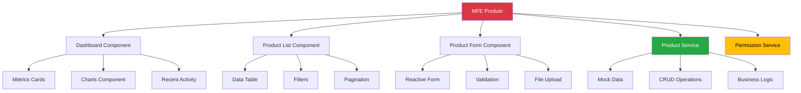

# 📦 Roteiro Documental - Parte 11: MFE Produto - Módulo de Negócio

## 🎯 Objetivo da Sessão

Analisar em detalhes a implementação do MFE Produto como um módulo de negócio completo, compreendendo seu dashboard com métricas, sistema CRUD simulado e controle granular de permissões.

## 🏗️ Arquitetura do MFE Produto

### Responsabilidades como Módulo de Negócio

O **MFE Produto** representa um **módulo de negócio completo** que demonstra como implementar funcionalidades complexas em um MicroFrontEnd:

#### Responsabilidades Principais
- ✅ **Dashboard Executivo**: Métricas e KPIs de produtos
- ✅ **Gestão de Produtos**: CRUD completo com validações
- ✅ **Controle de Acesso**: Permissões granulares por ação
- ✅ **Relatórios**: Visualizações e exportações
- ✅ **Integração**: Comunicação com outros sistemas

#### Características Técnicas
- **Domínio Específico**: Focado exclusivamente em produtos
- **Estado Complexo**: Gerencia múltiplas entidades e relacionamentos
- **Interface Rica**: Dashboard interativo com gráficos
- **Dados Simulados**: Mock services para demonstração realística

### Estrutura Modular



## 🔧 Implementação do Product Service

### Service Principal com Lógica de Negócio

```typescript
@Injectable({
  providedIn: 'root'
})
export class ProductService {
  private productsSubject = new BehaviorSubject<Product[]>([]);
  private metricsSubject = new BehaviorSubject<ProductMetrics | null>(null);
  private loadingSubject = new BehaviorSubject<boolean>(false);
  
  public products$ = this.productsSubject.asObservable();
  public metrics$ = this.metricsSubject.asObservable();
  public loading$ = this.loadingSubject.asObservable();
  
  private mockProducts: Product[] = [];
  private nextId = 1;

  constructor() {
    this.initializeMockData();
    this.calculateMetrics();
  }

  /**
   * Inicializa dados mock realísticos
   */
  private initializeMockData(): void {
    this.mockProducts = [
      {
        id: '1',
        name: 'Smartphone Galaxy Pro',
        description: 'Smartphone premium com câmera de 108MP',
        category: 'Eletrônicos',
        price: 2499.99,
        cost: 1800.00,
        stock: 45,
        minStock: 10,
        status: 'active',
        sku: 'SGP-001',
        barcode: '7891234567890',
        supplier: 'TechCorp',
        createdAt: new Date('2024-01-15'),
        updatedAt: new Date('2024-02-01'),
        tags: ['premium', 'smartphone', 'android'],
        images: ['smartphone1.jpg', 'smartphone2.jpg'],
        specifications: {
          weight: '180g',
          dimensions: '160x75x8mm',
          battery: '4500mAh',
          storage: '256GB'
        },
        salesData: {
          totalSold: 156,
          revenue: 389839.44,
          averageRating: 4.7,
          reviewCount: 89
        }
      },
      {
        id: '2',
        name: 'Notebook UltraBook Air',
        description: 'Notebook ultrafino para produtividade',
        category: 'Informática',
        price: 3299.99,
        cost: 2400.00,
        stock: 23,
        minStock: 5,
        status: 'active',
        sku: 'NBA-002',
        barcode: '7891234567891',
        supplier: 'CompuTech',
        createdAt: new Date('2024-01-10'),
        updatedAt: new Date('2024-01-28'),
        tags: ['notebook', 'ultrabook', 'produtividade'],
        images: ['notebook1.jpg'],
        specifications: {
          processor: 'Intel i7',
          ram: '16GB',
          storage: '512GB SSD',
          screen: '14" Full HD'
        },
        salesData: {
          totalSold: 78,
          revenue: 257399.22,
          averageRating: 4.5,
          reviewCount: 45
        }
      },
      {
        id: '3',
        name: 'Fone Bluetooth Premium',
        description: 'Fone com cancelamento de ruído ativo',
        category: 'Áudio',
        price: 899.99,
        cost: 650.00,
        stock: 8,
        minStock: 15,
        status: 'low_stock',
        sku: 'FBP-003',
        barcode: '7891234567892',
        supplier: 'AudioMax',
        createdAt: new Date('2024-02-01'),
        updatedAt: new Date('2024-02-10'),
        tags: ['fone', 'bluetooth', 'premium'],
        images: ['fone1.jpg', 'fone2.jpg'],
        specifications: {
          battery: '30h',
          connectivity: 'Bluetooth 5.0',
          weight: '250g',
          features: 'ANC, Quick Charge'
        },
        salesData: {
          totalSold: 234,
          revenue: 210597.66,
          averageRating: 4.8,
          reviewCount: 167
        }
      }
    ];
    
    this.nextId = this.mockProducts.length + 1;
    this.productsSubject.next([...this.mockProducts]);
  }

  /**
   * Calcula métricas do dashboard
   */
  private calculateMetrics(): void {
    const products = this.mockProducts;
    
    const metrics: ProductMetrics = {
      totalProducts: products.length,
      activeProducts: products.filter(p => p.status === 'active').length,
      lowStockProducts: products.filter(p => p.stock <= p.minStock).length,
      outOfStockProducts: products.filter(p => p.stock === 0).length,
      
      totalValue: products.reduce((sum, p) => sum + (p.price * p.stock), 0),
      totalCost: products.reduce((sum, p) => sum + (p.cost * p.stock), 0),
      averagePrice: products.reduce((sum, p) => sum + p.price, 0) / products.length,
      
      totalRevenue: products.reduce((sum, p) => sum + (p.salesData?.revenue || 0), 0),
      totalSold: products.reduce((sum, p) => sum + (p.salesData?.totalSold || 0), 0),
      averageRating: products.reduce((sum, p) => sum + (p.salesData?.averageRating || 0), 0) / products.length,
      
      topCategories: this.getTopCategories(products),
      recentActivity: this.getRecentActivity(products),
      salesTrend: this.generateSalesTrend(),
      stockAlerts: this.getStockAlerts(products)
    };
    
    this.metricsSubject.next(metrics);
  }

  /**
   * Obtém todas os produtos com filtros
   */
  getProducts(filters?: ProductFilters): Observable<Product[]> {
    return this.products$.pipe(
      map(products => {
        if (!filters) return products;
        
        return products.filter(product => {
          // Filtro por categoria
          if (filters.category && product.category !== filters.category) {
            return false;
          }
          
          // Filtro por status
          if (filters.status && product.status !== filters.status) {
            return false;
          }
          
          // Filtro por busca
          if (filters.search) {
            const searchLower = filters.search.toLowerCase();
            const matchesName = product.name.toLowerCase().includes(searchLower);
            const matchesDescription = product.description.toLowerCase().includes(searchLower);
            const matchesSku = product.sku.toLowerCase().includes(searchLower);
            
            if (!matchesName && !matchesDescription && !matchesSku) {
              return false;
            }
          }
          
          // Filtro por faixa de preço
          if (filters.priceRange) {
            if (product.price < filters.priceRange.min || product.price > filters.priceRange.max) {
              return false;
            }
          }
          
          return true;
        });
      })
    );
  }

  /**
   * Obtém produto por ID
   */
  getProductById(id: string): Observable<Product | null> {
    return this.products$.pipe(
      map(products => products.find(p => p.id === id) || null)
    );
  }

  /**
   * Cria novo produto
   */
  async createProduct(productData: Partial<Product>): Promise<Product> {
    this.loadingSubject.next(true);
    
    try {
      // Simular delay de API
      await this.delay(1000);
      
      const newProduct: Product = {
        id: this.nextId.toString(),
        name: productData.name || '',
        description: productData.description || '',
        category: productData.category || '',
        price: productData.price || 0,
        cost: productData.cost || 0,
        stock: productData.stock || 0,
        minStock: productData.minStock || 0,
        status: productData.status || 'active',
        sku: productData.sku || this.generateSku(),
        barcode: productData.barcode || this.generateBarcode(),
        supplier: productData.supplier || '',
        createdAt: new Date(),
        updatedAt: new Date(),
        tags: productData.tags || [],
        images: productData.images || [],
        specifications: productData.specifications || {},
        salesData: {
          totalSold: 0,
          revenue: 0,
          averageRating: 0,
          reviewCount: 0
        }
      };
      
      this.mockProducts.push(newProduct);
      this.nextId++;
      
      this.productsSubject.next([...this.mockProducts]);
      this.calculateMetrics();
      
      console.log('Produto criado:', newProduct);
      return newProduct;
      
    } finally {
      this.loadingSubject.next(false);
    }
  }

  /**
   * Atualiza produto existente
   */
  async updateProduct(id: string, productData: Partial<Product>): Promise<Product> {
    this.loadingSubject.next(true);
    
    try {
      await this.delay(800);
      
      const index = this.mockProducts.findIndex(p => p.id === id);
      if (index === -1) {
        throw new Error('Produto não encontrado');
      }
      
      const updatedProduct: Product = {
        ...this.mockProducts[index],
        ...productData,
        id, // Garantir que ID não mude
        updatedAt: new Date()
      };
      
      this.mockProducts[index] = updatedProduct;
      
      this.productsSubject.next([...this.mockProducts]);
      this.calculateMetrics();
      
      console.log('Produto atualizado:', updatedProduct);
      return updatedProduct;
      
    } finally {
      this.loadingSubject.next(false);
    }
  }

  /**
   * Remove produto
   */
  async deleteProduct(id: string): Promise<void> {
    this.loadingSubject.next(true);
    
    try {
      await this.delay(500);
      
      const index = this.mockProducts.findIndex(p => p.id === id);
      if (index === -1) {
        throw new Error('Produto não encontrado');
      }
      
      const deletedProduct = this.mockProducts.splice(index, 1)[0];
      
      this.productsSubject.next([...this.mockProducts]);
      this.calculateMetrics();
      
      console.log('Produto removido:', deletedProduct);
      
    } finally {
      this.loadingSubject.next(false);
    }
  }

  /**
   * Atualiza estoque do produto
   */
  async updateStock(id: string, quantity: number, operation: 'add' | 'subtract' | 'set'): Promise<Product> {
    const product = this.mockProducts.find(p => p.id === id);
    if (!product) {
      throw new Error('Produto não encontrado');
    }
    
    let newStock: number;
    
    switch (operation) {
      case 'add':
        newStock = product.stock + quantity;
        break;
      case 'subtract':
        newStock = Math.max(0, product.stock - quantity);
        break;
      case 'set':
        newStock = Math.max(0, quantity);
        break;
    }
    
    return await this.updateProduct(id, { 
      stock: newStock,
      status: newStock <= product.minStock ? 'low_stock' : 
              newStock === 0 ? 'out_of_stock' : 'active'
    });
  }

  /**
   * Obtém categorias disponíveis
   */
  getCategories(): Observable<string[]> {
    return this.products$.pipe(
      map(products => {
        const categories = new Set(products.map(p => p.category));
        return Array.from(categories).sort();
      })
    );
  }

  /**
   * Obtém fornecedores disponíveis
   */
  getSuppliers(): Observable<string[]> {
    return this.products$.pipe(
      map(products => {
        const suppliers = new Set(products.map(p => p.supplier));
        return Array.from(suppliers).sort();
      })
    );
  }

  /**
   * Gera relatório de produtos
   */
  generateReport(type: 'inventory' | 'sales' | 'lowstock'): Observable<ProductReport> {
    return this.products$.pipe(
      map(products => {
        switch (type) {
          case 'inventory':
            return this.generateInventoryReport(products);
          case 'sales':
            return this.generateSalesReport(products);
          case 'lowstock':
            return this.generateLowStockReport(products);
          default:
            throw new Error('Tipo de relatório inválido');
        }
      })
    );
  }

  // Métodos auxiliares privados
  private getTopCategories(products: Product[]): CategoryMetric[] {
    const categoryMap = new Map<string, CategoryMetric>();
    
    products.forEach(product => {
      const existing = categoryMap.get(product.category) || {
        name: product.category,
        count: 0,
        value: 0,
        revenue: 0
      };
      
      existing.count++;
      existing.value += product.price * product.stock;
      existing.revenue += product.salesData?.revenue || 0;
      
      categoryMap.set(product.category, existing);
    });
    
    return Array.from(categoryMap.values())
      .sort((a, b) => b.revenue - a.revenue)
      .slice(0, 5);
  }

  private getRecentActivity(products: Product[]): ActivityItem[] {
    return products
      .sort((a, b) => b.updatedAt.getTime() - a.updatedAt.getTime())
      .slice(0, 10)
      .map(product => ({
        id: product.id,
        type: 'product_updated',
        description: `Produto "${product.name}" foi atualizado`,
        timestamp: product.updatedAt,
        metadata: {
          productId: product.id,
          productName: product.name
        }
      }));
  }

  private generateSalesTrend(): SalesTrendData[] {
    // Simular dados de tendência dos últimos 12 meses
    const months = [];
    const now = new Date();
    
    for (let i = 11; i >= 0; i--) {
      const date = new Date(now.getFullYear(), now.getMonth() - i, 1);
      const sales = Math.floor(Math.random() * 50000) + 20000;
      const orders = Math.floor(Math.random() * 200) + 100;
      
      months.push({
        month: date.toLocaleDateString('pt-BR', { month: 'short', year: 'numeric' }),
        sales,
        orders,
        averageTicket: sales / orders
      });
    }
    
    return months;
  }

  private getStockAlerts(products: Product[]): StockAlert[] {
    return products
      .filter(p => p.stock <= p.minStock)
      .map(product => ({
        productId: product.id,
        productName: product.name,
        currentStock: product.stock,
        minStock: product.minStock,
        severity: product.stock === 0 ? 'critical' : 
                 product.stock <= product.minStock * 0.5 ? 'high' : 'medium',
        daysUntilOutOfStock: this.calculateDaysUntilOutOfStock(product)
      }))
      .sort((a, b) => {
        const severityOrder = { critical: 3, high: 2, medium: 1 };
        return severityOrder[b.severity] - severityOrder[a.severity];
      });
  }

  private calculateDaysUntilOutOfStock(product: Product): number {
    const dailySales = (product.salesData?.totalSold || 0) / 30; // Média diária
    return dailySales > 0 ? Math.floor(product.stock / dailySales) : 999;
  }

  private generateSku(): string {
    return 'PRD-' + Date.now().toString().slice(-6);
  }

  private generateBarcode(): string {
    return '789' + Math.random().toString().slice(2, 12);
  }

  private delay(ms: number): Promise<void> {
    return new Promise(resolve => setTimeout(resolve, ms));
  }

  private generateInventoryReport(products: Product[]): ProductReport {
    return {
      type: 'inventory',
      title: 'Relatório de Inventário',
      generatedAt: new Date(),
      data: {
        totalProducts: products.length,
        totalValue: products.reduce((sum, p) => sum + (p.price * p.stock), 0),
        byCategory: this.getTopCategories(products),
        lowStockItems: products.filter(p => p.stock <= p.minStock).length
      },
      items: products.map(p => ({
        id: p.id,
        name: p.name,
        category: p.category,
        stock: p.stock,
        value: p.price * p.stock,
        status: p.status
      }))
    };
  }

  private generateSalesReport(products: Product[]): ProductReport {
    return {
      type: 'sales',
      title: 'Relatório de Vendas',
      generatedAt: new Date(),
      data: {
        totalRevenue: products.reduce((sum, p) => sum + (p.salesData?.revenue || 0), 0),
        totalSold: products.reduce((sum, p) => sum + (p.salesData?.totalSold || 0), 0),
        topProducts: products
          .sort((a, b) => (b.salesData?.revenue || 0) - (a.salesData?.revenue || 0))
          .slice(0, 10)
      },
      items: products.map(p => ({
        id: p.id,
        name: p.name,
        totalSold: p.salesData?.totalSold || 0,
        revenue: p.salesData?.revenue || 0,
        averageRating: p.salesData?.averageRating || 0
      }))
    };
  }

  private generateLowStockReport(products: Product[]): ProductReport {
    const lowStockProducts = products.filter(p => p.stock <= p.minStock);
    
    return {
      type: 'lowstock',
      title: 'Relatório de Estoque Baixo',
      generatedAt: new Date(),
      data: {
        totalLowStock: lowStockProducts.length,
        criticalItems: lowStockProducts.filter(p => p.stock === 0).length,
        estimatedLoss: lowStockProducts.reduce((sum, p) => {
          const dailySales = (p.salesData?.totalSold || 0) / 30;
          const lostSales = dailySales * 7; // Perda estimada em 7 dias
          return sum + (lostSales * p.price);
        }, 0)
      },
      items: lowStockProducts.map(p => ({
        id: p.id,
        name: p.name,
        currentStock: p.stock,
        minStock: p.minStock,
        daysUntilOutOfStock: this.calculateDaysUntilOutOfStock(p)
      }))
    };
  }
}
```

### Interfaces e Tipos

```typescript
export interface Product {
  id: string;
  name: string;
  description: string;
  category: string;
  price: number;
  cost: number;
  stock: number;
  minStock: number;
  status: 'active' | 'inactive' | 'low_stock' | 'out_of_stock';
  sku: string;
  barcode: string;
  supplier: string;
  createdAt: Date;
  updatedAt: Date;
  tags: string[];
  images: string[];
  specifications: Record<string, any>;
  salesData?: {
    totalSold: number;
    revenue: number;
    averageRating: number;
    reviewCount: number;
  };
}

export interface ProductMetrics {
  totalProducts: number;
  activeProducts: number;
  lowStockProducts: number;
  outOfStockProducts: number;
  totalValue: number;
  totalCost: number;
  averagePrice: number;
  totalRevenue: number;
  totalSold: number;
  averageRating: number;
  topCategories: CategoryMetric[];
  recentActivity: ActivityItem[];
  salesTrend: SalesTrendData[];
  stockAlerts: StockAlert[];
}

export interface ProductFilters {
  category?: string;
  status?: string;
  search?: string;
  priceRange?: {
    min: number;
    max: number;
  };
}

export interface CategoryMetric {
  name: string;
  count: number;
  value: number;
  revenue: number;
}

export interface ActivityItem {
  id: string;
  type: string;
  description: string;
  timestamp: Date;
  metadata: Record<string, any>;
}

export interface SalesTrendData {
  month: string;
  sales: number;
  orders: number;
  averageTicket: number;
}

export interface StockAlert {
  productId: string;
  productName: string;
  currentStock: number;
  minStock: number;
  severity: 'low' | 'medium' | 'high' | 'critical';
  daysUntilOutOfStock: number;
}

export interface ProductReport {
  type: string;
  title: string;
  generatedAt: Date;
  data: Record<string, any>;
  items: any[];
}
```

## 🎯 Próximos Passos

Na **próxima sessão**, exploraremos o **Dashboard do MFE Produto**, analisando a implementação de métricas, gráficos e visualizações de dados.

### Tópicos da Próxima Sessão
- Componente de Dashboard
- Métricas e KPIs
- Gráficos e visualizações
- Cards informativos

---

**Duração Estimada**: 30-35 minutos  
**Nível**: Técnico Avançado  
**Próxima Parte**: [12 - Dashboard de Produtos](./12-dashboard-produtos.md)