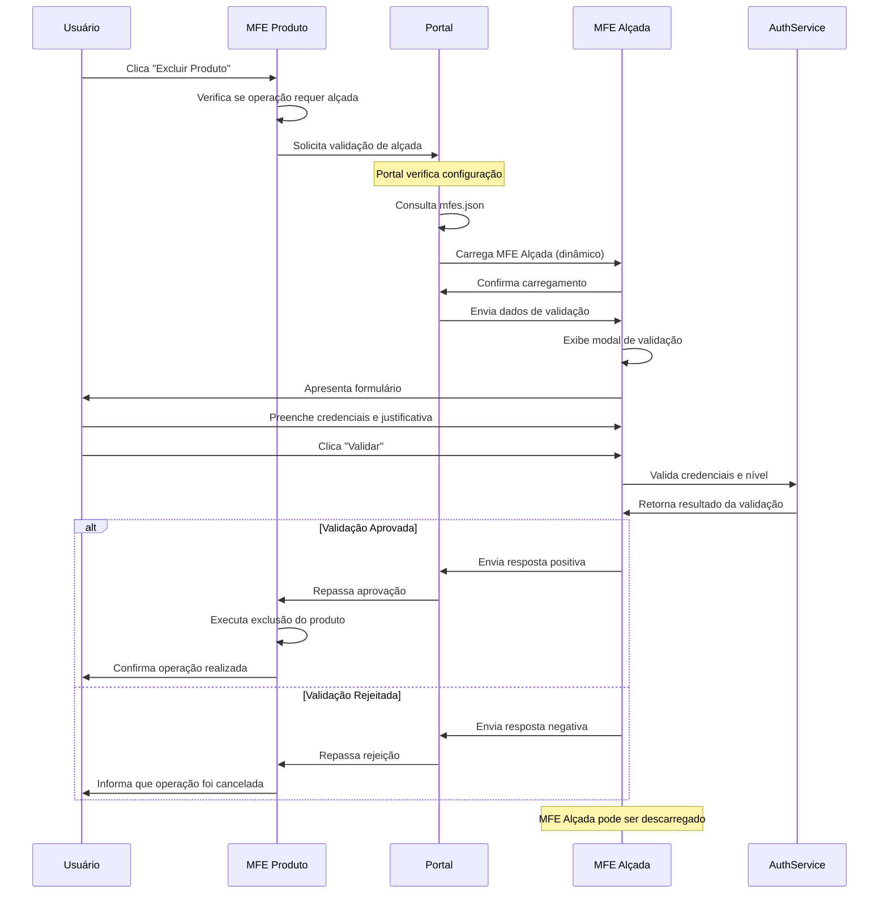

# 🛡️ Roteiro Documental - Parte 12: MFE Alçada - Validação de Operações

## 🎯 Objetivo da Sessão

Compreender a implementação do **MFE Alçada**, um microfrontend especializado em validação de operações críticas, explorando sua arquitetura, comunicação com outros MFEs e padrões de segurança implementados.

## 🏗️ Visão Geral do MFE Alçada

### Propósito e Responsabilidades

O **MFE Alçada** é um microfrontend especializado que implementa um **sistema de validação distribuída** para operações críticas que requerem aprovação hierárquica.

```
┌─────────────────────────────────────────────────────────────┐
│                    MFE ALÇADA                               │
│                                                             │
│  🛡️ Validação de Operações Críticas                        │
│  👤 Autenticação de Usuários com Alçada                    │
│  ⏱️ Controle Temporal de Validações                        │
│  📋 Interface Modal Interativa                             │
│  🔄 Comunicação Bidirecional                               │
│                                                             │
└─────────────────────────────────────────────────────────────┘
```

### Características Principais

#### 1. **Carregamento Dinâmico**
- **Sob Demanda**: Carregado apenas quando necessário
- **Sem Fallback**: Deve estar disponível quando solicitado
- **Configuração JSON**: Definido dinamicamente no `mfes.json`

#### 2. **Comunicação Bidirecional**
- **Recebe Solicitações**: De outros MFEs via Portal
- **Envia Respostas**: Resultado da validação de volta
- **Dados Estruturados**: Contratos bem definidos

#### 3. **Interface Especializada**
- **Modal de Validação**: Interface focada e não intrusiva
- **Formulário Reativo**: Validação em tempo real
- **Timer Visual**: Controle de expiração

## 🏢 Arquitetura do MFE Alçada

### Estrutura de Componentes

```
mfe-alcada/
├── src/
│   ├── app/
│   │   ├── components/
│   │   │   ├── validation-modal/           # 🎯 Componente principal
│   │   │   │   ├── validation-modal.component.ts
│   │   │   │   ├── validation-modal.component.html
│   │   │   │   └── validation-modal.component.scss
│   │   │   └── health/                     # Health check
│   │   │       └── health.component.ts
│   │   ├── services/
│   │   │   ├── auth.service.ts             # 🔐 Validação de alçada
│   │   │   ├── mfe-communication.service.ts # 📡 Comunicação
│   │   │   └── resource-label.service.ts   # 🏷️ Labels dinâmicos
│   │   ├── interfaces/
│   │   │   ├── validation.interface.ts     # 📋 Contratos
│   │   │   └── mfe-communication.interface.ts
│   │   ├── models/
│   │   │   └── auth.model.ts              # 👤 Modelos de auth
│   │   ├── app.component.ts               # 🚀 Componente raiz
│   │   └── app.config.ts                  # ⚙️ Configuração
│   ├── main.ts                            # 🎬 Bootstrap
│   └── index.html
├── federation.config.js                   # 🔗 Module Federation
└── package.json
```

### Configuração Module Federation

```javascript
// federation.config.js
const ModuleFederationPlugin = require("@module-federation/webpack");

module.exports = {
  plugins: [
    new ModuleFederationPlugin({
      name: "mfeAlcada",
      filename: "remoteEntry.js",
      exposes: {
        "./Component": "./src/app/app.component.ts",
      },
      shared: {
        "@angular/core": { 
          singleton: true, 
          strictVersion: true,
          requiredVersion: "^21.0.0"
        },
        "@angular/common": { 
          singleton: true, 
          strictVersion: true 
        },
        "rxjs": { 
          singleton: true, 
          strictVersion: true 
        }
      }
    })
  ]
};
```

## 🔐 Sistema de Validação de Alçada

### Níveis Hierárquicos

O sistema implementa uma **hierarquia de alçada** baseada em níveis:

```typescript
// auth.model.ts
export interface UserLevel {
  level: string;
  hierarchy: number;
  permissions: string[];
  description: string;
}

export const USER_LEVELS: Record<string, UserLevel> = {
  'user': {
    level: 'user',
    hierarchy: 1,
    permissions: ['read'],
    description: 'Usuário comum'
  },
  'supervisor': {
    level: 'supervisor', 
    hierarchy: 2,
    permissions: ['read', 'write'],
    description: 'Supervisor'
  },
  'manager': {
    level: 'manager',
    hierarchy: 3, 
    permissions: ['read', 'write', 'delete'],
    description: 'Gerente'
  },
  'director': {
    level: 'director',
    hierarchy: 4,
    permissions: ['read', 'write', 'delete', 'approve'],
    description: 'Diretor'
  }
};
```

### Validação de Credenciais

```typescript
// auth.service.ts
export class AuthService {
  async validateUserLevel(
    username: string, 
    password: string, 
    requiredLevel: string
  ): Promise<ValidationResult> {
    
    console.log(`[AuthService] 🔐 Validando usuário: ${username}`);
    console.log(`[AuthService] 📊 Nível requerido: ${requiredLevel}`);
    
    // Simular validação de credenciais
    const user = await this.authenticateUser(username, password);
    
    if (!user) {
      return {
        valid: false,
        reason: 'Credenciais inválidas'
      };
    }
    
    // Verificar nível de alçada
    const userLevel = USER_LEVELS[user.level];
    const requiredLevelData = USER_LEVELS[requiredLevel];
    
    if (!userLevel || !requiredLevelData) {
      return {
        valid: false,
        reason: 'Nível de alçada inválido'
      };
    }
    
    // Verificar hierarquia
    if (userLevel.hierarchy < requiredLevelData.hierarchy) {
      return {
        valid: false,
        reason: `Nível insuficiente. Requerido: ${requiredLevel}, Atual: ${user.level}`
      };
    }
    
    console.log(`[AuthService] ✅ Validação aprovada para ${username}`);
    
    return {
      valid: true,
      user: {
        name: user.name,
        level: user.level,
        permissions: userLevel.permissions
      }
    };
  }
}
```

## 📋 Contratos de Comunicação

### Interface de Validação

```typescript
// validation.interface.ts
export interface ValidationRequest {
  id: string;
  requestingMfe: string;
  operation: {
    type: 'delete' | 'update' | 'approve' | 'transfer' | 'create' | 'cancel';
    resource: string;
    resourceId: string;
    description: string;
  };
  requiredLevel: string;
  context: {
    resourceName: string;
    requestedBy: {
      name: string;
      id: string;
      role: string;
      department?: string;
    };
    resourceDetails: Record<string, any>;
    impact: 'low' | 'medium' | 'high' | 'critical';
    reversible: boolean;
  };
  metadata: {
    timestamp: string;
    urgency: 'low' | 'medium' | 'high';
    expiresAt: string;
  };
}

export interface ValidationResponse {
  validationId: string;
  validated: boolean;
  validatedBy?: {
    name: string;
    level: string;
    permissions: string[];
  };
  justification?: string;
  reason?: string;
  timestamp: string;
}
```

### Exemplo de Solicitação

```typescript
// Dados enviados pelo MFE Produto
const validationRequest: ValidationRequest = {
  id: 'val-' + Date.now(),
  requestingMfe: 'mfe-produto',
  operation: {
    type: 'delete',
    resource: 'product',
    resourceId: 'PROD-001',
    description: 'Exclusão de produto'
  },
  requiredLevel: 'manager',
  context: {
    resourceName: 'Smartphone XYZ',
    requestedBy: {
      name: 'João Silva',
      id: 'joao.silva',
      role: 'user',
      department: 'Vendas'
    },
    resourceDetails: {
      name: 'Smartphone XYZ',
      code: 'PROD-001',
      price: 1299.99,
      category: 'Eletrônicos',
      createdAt: '2024-01-15T10:30:00Z',
      status: 'Ativo'
    },
    impact: 'medium',
    reversible: false
  },
  metadata: {
    timestamp: new Date().toISOString(),
    urgency: 'medium',
    expiresAt: new Date(Date.now() + 30 * 60 * 1000).toISOString() // 30 min
  }
};
```

## 🎨 Componente de Validação

### ValidationModalComponent

O componente principal implementa uma **interface modal** para validação:

```typescript
// validation-modal.component.ts
@Component({
  selector: 'app-validation-modal',
  standalone: true,
  imports: [CommonModule, ReactiveFormsModule],
  templateUrl: './validation-modal.component.html',
  styleUrls: ['./validation-modal.component.scss']
})
export class ValidationModalComponent implements OnInit, OnDestroy {
  validationForm!: FormGroup;
  validation?: ValidationRequest;
  isValidating = false;
  timeRemaining = 0;
  
  constructor(
    private fb: FormBuilder,
    private authService: AuthService,
    private mfeCommunicationService: MfeCommunicationService,
    private resourceLabelService: ResourceLabelService,
    private cdr: ChangeDetectorRef
  ) {
    this.createForm();
  }
  
  ngOnInit(): void {
    // Escutar dados de entrada
    this.mfeCommunicationService.inputData$.subscribe(inputData => {
      if (inputData?.config?.validation) {
        this.validation = inputData.config.validation;
        this.startExpirationTimer();
        this.cdr.detectChanges();
      }
    });
  }
  
  private createForm(): void {
    this.validationForm = this.fb.group({
      username: ['', [Validators.required]],
      password: ['', [Validators.required]],
      justification: ['', [Validators.required, Validators.minLength(10)]]
    });
  }
  
  async onValidate(): Promise<void> {
    if (this.validationForm.invalid || !this.validation) return;
    
    this.isValidating = true;
    
    try {
      const credentials = this.validationForm.value;
      
      const validationResult = await this.authService.validateUserLevel(
        credentials.username,
        credentials.password,
        this.validation.requiredLevel
      );
      
      if (validationResult.valid) {
        this.sendValidationResponse(true, {
          validatedBy: validationResult.user,
          justification: credentials.justification
        });
      } else {
        this.sendValidationResponse(false, {
          reason: validationResult.reason
        });
      }
      
    } catch (error: any) {
      this.sendValidationResponse(false, {
        reason: 'Erro durante validação: ' + error.message
      });
    } finally {
      this.isValidating = false;
    }
  }
  
  private sendValidationResponse(validated: boolean, data: any): void {
    this.mfeCommunicationService.sendDataToPortal({
      type: 'VALIDATION_RESPONSE',
      payload: {
        action: 'validation_complete',
        data: {
          validationId: this.validation!.id,
          validated: validated,
          validatedBy: data.validatedBy,
          justification: data.justification,
          reason: data.reason,
          timestamp: new Date().toISOString()
        },
        status: validated ? 'success' : 'error'
      }
    });
  }
}
```

### Template do Modal

```html
<!-- validation-modal.component.html -->
<div class="validation-overlay" *ngIf="validation">
  <div class="validation-modal">
    
    <!-- Header -->
    <div class="modal-header" [ngClass]="getOperationClass()">
      <h2>{{ getValidationTitle() }}</h2>
      <div class="timer" *ngIf="timeRemaining > 0">
        ⏱️ {{ formatTimeRemaining() }}
      </div>
    </div>
    
    <!-- Informações da Operação -->
    <div class="operation-info">
      <div class="operation-summary">
        <h3>{{ getValidationDescription() }}</h3>
        <p><strong>Recurso:</strong> {{ validation.context.resourceName }}</p>
        <p><strong>Solicitado por:</strong> {{ validation.context.requestedBy.name }}</p>
        <p><strong>Impacto:</strong> 
          <span [ngClass]="'impact-' + validation.context.impact">
            {{ validation.context.impact | titlecase }}
          </span>
        </p>
      </div>
      
      <!-- Detalhes do Recurso -->
      <div class="resource-details">
        <h4>Detalhes do Recurso</h4>
        <div class="details-grid">
          <div 
            *ngFor="let detail of getResourceDetailsArray()" 
            class="detail-item"
          >
            <span class="label">{{ detail.label }}:</span>
            <span class="value">{{ detail.value }}</span>
          </div>
        </div>
      </div>
    </div>
    
    <!-- Formulário de Validação -->
    <form [formGroup]="validationForm" (ngSubmit)="onValidate()">
      
      <div class="form-group">
        <label for="username">Usuário com Alçada:</label>
        <input 
          type="text" 
          id="username"
          formControlName="username"
          [class.error]="hasFieldError('username')"
          placeholder="Digite seu usuário"
        >
        <div class="error-message" *ngIf="hasFieldError('username')">
          {{ getFieldError('username') }}
        </div>
      </div>
      
      <div class="form-group">
        <label for="password">Senha:</label>
        <input 
          type="password" 
          id="password"
          formControlName="password"
          [class.error]="hasFieldError('password')"
          placeholder="Digite sua senha"
        >
        <div class="error-message" *ngIf="hasFieldError('password')">
          {{ getFieldError('password') }}
        </div>
      </div>
      
      <div class="form-group">
        <label for="justification">Justificativa:</label>
        <textarea 
          id="justification"
          formControlName="justification"
          [class.error]="hasFieldError('justification')"
          [placeholder]="getJustificationPlaceholder()"
          rows="3"
        ></textarea>
        <div class="error-message" *ngIf="hasFieldError('justification')">
          {{ getFieldError('justification') }}
        </div>
      </div>
      
      <!-- Botões de Ação -->
      <div class="modal-actions">
        <button 
          type="button" 
          class="btn-cancel"
          (click)="onCancel()"
          [disabled]="isValidating"
        >
          Cancelar
        </button>
        
        <button 
          type="submit"
          [ngClass]="getSubmitButtonClass()"
          [ngStyle]="getSubmitButtonStyle()"
          [disabled]="!isFormValid()"
        >
          <span *ngIf="isValidating">🔄 Validando...</span>
          <span *ngIf="!isValidating">✅ Validar</span>
        </button>
      </div>
      
    </form>
    
  </div>
</div>
```

## 🎨 Estilização e UX

### CSS Responsivo

```scss
// validation-modal.component.scss
.validation-overlay {
  position: fixed;
  top: 0;
  left: 0;
  width: 100%;
  height: 100%;
  background: rgba(0, 0, 0, 0.7);
  display: flex;
  justify-content: center;
  align-items: center;
  z-index: 9999;
  
  .validation-modal {
    background: white;
    border-radius: 12px;
    box-shadow: 0 20px 40px rgba(0, 0, 0, 0.3);
    max-width: 600px;
    width: 90%;
    max-height: 90vh;
    overflow-y: auto;
    
    .modal-header {
      padding: 1.5rem;
      border-bottom: 1px solid #e5e7eb;
      display: flex;
      justify-content: space-between;
      align-items: center;
      
      &.operation-delete {
        background: linear-gradient(135deg, #fee2e2, #fecaca);
        border-bottom-color: #f87171;
      }
      
      .timer {
        background: #ef4444;
        color: white;
        padding: 0.5rem 1rem;
        border-radius: 6px;
        font-weight: 600;
        font-size: 0.875rem;
      }
    }
    
    .operation-info {
      padding: 1.5rem;
      
      .impact-high, .impact-critical {
        color: #dc2626;
        font-weight: 600;
      }
      
      .impact-medium {
        color: #d97706;
        font-weight: 600;
      }
      
      .impact-low {
        color: #059669;
        font-weight: 600;
      }
    }
    
    .form-group {
      margin-bottom: 1.5rem;
      
      label {
        display: block;
        margin-bottom: 0.5rem;
        font-weight: 600;
        color: #374151;
      }
      
      input, textarea {
        width: 100%;
        padding: 0.75rem;
        border: 2px solid #d1d5db;
        border-radius: 6px;
        font-size: 1rem;
        transition: border-color 0.2s ease;
        
        &:focus {
          outline: none;
          border-color: #3b82f6;
        }
        
        &.error {
          border-color: #ef4444;
        }
      }
      
      .error-message {
        color: #ef4444;
        font-size: 0.875rem;
        margin-top: 0.25rem;
      }
    }
    
    .modal-actions {
      display: flex;
      gap: 1rem;
      padding: 1.5rem;
      border-top: 1px solid #e5e7eb;
      
      button {
        flex: 1;
        padding: 0.75rem 1.5rem;
        border: none;
        border-radius: 6px;
        font-weight: 600;
        cursor: pointer;
        transition: all 0.2s ease;
        
        &.btn-cancel {
          background: #6b7280;
          color: white;
          
          &:hover:not(:disabled) {
            background: #4b5563;
          }
        }
        
        &.btn-validate-enabled {
          background: #10b981;
          color: white;
          
          &:hover {
            background: #059669;
          }
        }
        
        &.btn-validate-disabled {
          background: #9ca3af;
          color: white;
          cursor: not-allowed;
          opacity: 0.6;
        }
        
        &:disabled {
          cursor: not-allowed;
          opacity: 0.6;
        }
      }
    }
  }
}

// Responsividade
@media (max-width: 768px) {
  .validation-modal {
    width: 95% !important;
    margin: 1rem;
    
    .modal-header {
      flex-direction: column;
      gap: 1rem;
      text-align: center;
    }
    
    .modal-actions {
      flex-direction: column;
      
      button {
        width: 100%;
      }
    }
  }
}
```

## 🔄 Fluxo de Comunicação

### Sequência Completa de Validação



## 🛠️ Implementação Prática

### Integração com MFE Produto

```typescript
// No MFE Produto - product-dashboard.component.ts
async deleteProduct(product: Product): Promise<void> {
  // Verificar se operação requer validação
  if (this.requiresValidation('delete', product)) {
    console.log('[ProductDashboard] 🛡️ Operação requer validação de alçada');
    
    const validationRequest: ValidationRequest = {
      id: 'val-' + Date.now(),
      requestingMfe: 'mfe-produto',
      operation: {
        type: 'delete',
        resource: 'product',
        resourceId: product.id,
        description: `Exclusão do produto ${product.name}`
      },
      requiredLevel: 'manager',
      context: {
        resourceName: product.name,
        requestedBy: {
          name: this.currentUser.name,
          id: this.currentUser.id,
          role: this.currentUser.role
        },
        resourceDetails: {
          name: product.name,
          code: product.code,
          price: product.price,
          category: product.category,
          status: product.status
        },
        impact: this.calculateImpact(product),
        reversible: false
      },
      metadata: {
        timestamp: new Date().toISOString(),
        urgency: 'medium',
        expiresAt: new Date(Date.now() + 30 * 60 * 1000).toISOString()
      }
    };
    
    // Solicitar validação via Portal
    const validationResult = await this.requestValidation(validationRequest);
    
    if (validationResult.validated) {
      console.log('[ProductDashboard] ✅ Validação aprovada, executando exclusão');
      await this.executeDelete(product);
    } else {
      console.log('[ProductDashboard] ❌ Validação rejeitada:', validationResult.reason);
      this.showValidationRejected(validationResult.reason);
    }
  } else {
    // Operação não requer validação
    await this.executeDelete(product);
  }
}

private async requestValidation(request: ValidationRequest): Promise<ValidationResponse> {
  return new Promise((resolve) => {
    // Enviar solicitação para Portal
    this.mfeCommunicationService.sendDataToPortal({
      type: 'REQUEST_VALIDATION',
      payload: {
        action: 'request_validation',
        targetMfe: 'mfe-alcada',
        data: request
      }
    });
    
    // Escutar resposta
    const subscription = this.mfeCommunicationService.dataFromPortal$.subscribe(data => {
      if (data.type === 'VALIDATION_RESPONSE' && 
          data.payload.data.validationId === request.id) {
        subscription.unsubscribe();
        resolve(data.payload.data);
      }
    });
  });
}
```

## 📊 Benefícios do MFE Alçada

### 1. **Segurança Distribuída**
- ✅ **Validação Centralizada**: Lógica de alçada isolada
- ✅ **Controle Hierárquico**: Níveis bem definidos
- ✅ **Auditoria**: Registro de todas as validações
- ✅ **Timeout de Segurança**: Validações expiram automaticamente

### 2. **Flexibilidade Arquitetural**
- ✅ **Carregamento Sob Demanda**: Apenas quando necessário
- ✅ **Reutilização**: Pode ser usado por qualquer MFE
- ✅ **Configuração Externa**: Níveis definidos em configuração
- ✅ **Comunicação Padronizada**: Contratos bem definidos

### 3. **Experiência do Usuário**
- ✅ **Interface Especializada**: Modal focado na validação
- ✅ **Feedback Visual**: Timer e estados claros
- ✅ **Validação em Tempo Real**: Formulário reativo
- ✅ **Responsividade**: Funciona em dispositivos móveis

### 4. **Manutenibilidade**
- ✅ **Isolamento de Responsabilidade**: Lógica de alçada separada
- ✅ **Testabilidade**: Componente independente
- ✅ **Evolução Independente**: Deploy isolado
- ✅ **Documentação Clara**: Contratos bem definidos

## 🎯 Próximos Passos

Na **próxima sessão**, exploraremos a **Comunicação Inter-MFE** em detalhes, analisando como o Portal orquestra a comunicação entre MFE Produto e MFE Alçada, incluindo padrões de mensageria e tratamento de erros.

### Tópicos da Próxima Sessão
- Padrões de comunicação inter-MFE
- Orquestração via Portal
- Contratos de mensageria
- Tratamento de erros e timeouts
- Monitoramento de comunicação

---

**Duração Estimada**: 35-40 minutos  
**Nível**: Técnico Avançado  
**Próxima Parte**: [13 - Comunicação Inter-MFE](./13-comunicacao-inter-mfe.md)  
**🆕 Novidade v2.0**: MFE especializado em validação de operações críticas