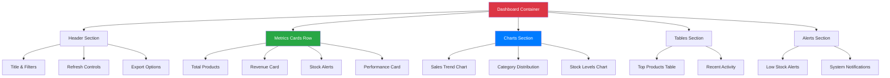

# 📊 Roteiro Documental - Parte 12: Dashboard de Produtos

## 🎯 Objetivo da Sessão

Analisar a implementação do Dashboard do MFE Produto, compreendendo como são construídas as métricas, gráficos, visualizações de dados e a interface executiva para gestão de produtos.

## 🏗️ Arquitetura do Dashboard

### Conceito de Dashboard Executivo

O **Dashboard de Produtos** é projetado como uma **interface executiva** que fornece uma visão consolidada e estratégica do negócio:

#### Características Principais
- ✅ **Visão 360°**: Métricas abrangentes do portfólio de produtos
- ✅ **Tempo Real**: Dados atualizados dinamicamente
- ✅ **Interatividade**: Drill-down e filtros dinâmicos
- ✅ **Responsividade**: Adaptável a diferentes dispositivos
- ✅ **Acessibilidade**: Suporte completo a leitores de tela

### Estrutura Visual



## 🔧 Implementação do Dashboard Component

### Componente Principal

```typescript
@Component({
  selector: 'app-product-dashboard',
  template: `
    <div class="dashboard-container" [class.loading]="isLoading">
      
      <!-- Header do Dashboard -->
      <div class="dashboard-header">
        <div class="header-content">
          <div class="title-section">
            <h1 class="dashboard-title">
              📊 Dashboard de Produtos
            </h1>
            <p class="dashboard-subtitle">
              Visão executiva do portfólio de produtos
            </p>
          </div>
          
          <div class="header-actions">
            <!-- Filtros rápidos -->
            <div class="quick-filters">
              <select 
                [(ngModel)]="selectedPeriod"
                (change)="onPeriodChange()"
                class="filter-select">
                <option value="7d">Últimos 7 dias</option>
                <option value="30d">Últimos 30 dias</option>
                <option value="90d">Últimos 90 dias</option>
                <option value="1y">Último ano</option>
              </select>
              
              <select 
                [(ngModel)]="selectedCategory"
                (change)="onCategoryChange()"
                class="filter-select">
                <option value="">Todas as categorias</option>
                <option *ngFor="let category of categories" [value]="category">
                  {{ category }}
                </option>
              </select>
            </div>
            
            <!-- Ações -->
            <div class="header-buttons">
              <button 
                class="action-button refresh"
                (click)="refreshData()"
                [disabled]="isLoading"
                title="Atualizar dados">
                <span class="button-icon">🔄</span>
                <span class="button-text">Atualizar</span>
              </button>
              
              <button 
                class="action-button export"
                (click)="exportDashboard()"
                title="Exportar relatório">
                <span class="button-icon">📊</span>
                <span class="button-text">Exportar</span>
              </button>
            </div>
          </div>
        </div>
        
        <!-- Indicador de última atualização -->
        <div class="last-update" *ngIf="lastUpdate">
          <span class="update-label">Última atualização:</span>
          <span class="update-time">{{ lastUpdate | date:'dd/MM/yyyy HH:mm' }}</span>
        </div>
      </div>

      <!-- Loading State -->
      <div class="loading-overlay" *ngIf="isLoading">
        <div class="loading-spinner"></div>
        <span class="loading-text">Carregando dashboard...</span>
      </div>

      <!-- Métricas Principais -->
      <div class="metrics-section" *ngIf="metrics && !isLoading">
        <div class="metrics-grid">
          
          <!-- Card: Total de Produtos -->
          <div class="metric-card primary">
            <div class="card-header">
              <span class="card-icon">📦</span>
              <span class="card-title">Total de Produtos</span>
            </div>
            <div class="card-content">
              <div class="metric-value">{{ metrics.totalProducts | number }}</div>
              <div class="metric-details">
                <span class="detail-item success">
                  {{ metrics.activeProducts }} ativos
                </span>
                <span class="detail-item" 
                      [class.warning]="metrics.lowStockProducts > 0">
                  {{ metrics.lowStockProducts }} estoque baixo
                </span>
              </div>
            </div>
          </div>

          <!-- Card: Receita Total -->
          <div class="metric-card success">
            <div class="card-header">
              <span class="card-icon">💰</span>
              <span class="card-title">Receita Total</span>
            </div>
            <div class="card-content">
              <div class="metric-value">{{ metrics.totalRevenue | currency:'BRL' }}</div>
              <div class="metric-details">
                <span class="detail-item">
                  {{ metrics.totalSold | number }} vendidos
                </span>
                <span class="detail-item">
                  Ticket médio: {{ getAverageTicket() | currency:'BRL' }}
                </span>
              </div>
            </div>
          </div>

          <!-- Card: Valor do Estoque -->
          <div class="metric-card info">
            <div class="card-header">
              <span class="card-icon">🏪</span>
              <span class="card-title">Valor do Estoque</span>
            </div>
            <div class="card-content">
              <div class="metric-value">{{ metrics.totalValue | currency:'BRL' }}</div>
              <div class="metric-details">
                <span class="detail-item">
                  Custo: {{ metrics.totalCost | currency:'BRL' }}
                </span>
                <span class="detail-item success">
                  Margem: {{ getMarginPercentage() }}%
                </span>
              </div>
            </div>
          </div>

          <!-- Card: Avaliação Média -->
          <div class="metric-card warning">
            <div class="card-header">
              <span class="card-icon">⭐</span>
              <span class="card-title">Avaliação Média</span>
            </div>
            <div class="card-content">
              <div class="metric-value">{{ metrics.averageRating | number:'1.1-1' }}</div>
              <div class="metric-details">
                <div class="rating-stars">
                  <span *ngFor="let star of getStarsArray(metrics.averageRating)"
                        class="star" 
                        [class.filled]="star">⭐</span>
                </div>
                <span class="detail-item">
                  Baseado em {{ getTotalReviews() }} avaliações
                </span>
              </div>
            </div>
          </div>
        </div>
      </div>

      <!-- Seção de Gráficos -->
      <div class="charts-section" *ngIf="metrics && !isLoading">
        <div class="charts-grid">
          
          <!-- Gráfico: Tendência de Vendas -->
          <div class="chart-container">
            <div class="chart-header">
              <h3 class="chart-title">📈 Tendência de Vendas</h3>
              <div class="chart-controls">
                <button 
                  *ngFor="let type of chartTypes"
                  class="chart-type-button"
                  [class.active]="selectedChartType === type.value"
                  (click)="setChartType(type.value)">
                  {{ type.label }}
                </button>
              </div>
            </div>
            <div class="chart-content">
              <app-sales-trend-chart
                [data]="metrics.salesTrend"
                [type]="selectedChartType"
                [height]="300">
              </app-sales-trend-chart>
            </div>
          </div>

          <!-- Gráfico: Distribuição por Categoria -->
          <div class="chart-container">
            <div class="chart-header">
              <h3 class="chart-title">🎯 Distribuição por Categoria</h3>
            </div>
            <div class="chart-content">
              <app-category-distribution-chart
                [data]="metrics.topCategories"
                [height]="300">
              </app-category-distribution-chart>
            </div>
          </div>
        </div>
      </div>

      <!-- Seção de Tabelas e Listas -->
      <div class="tables-section" *ngIf="metrics && !isLoading">
        <div class="tables-grid">
          
          <!-- Top Produtos -->
          <div class="table-container">
            <div class="table-header">
              <h3 class="table-title">🏆 Top Produtos por Receita</h3>
              <button class="view-all-button" (click)="viewAllProducts()">
                Ver todos
              </button>
            </div>
            <div class="table-content">
              <app-top-products-table
                [products]="topProducts"
                [showActions]="hasWritePermission"
                (productClick)="onProductClick($event)"
                (editProduct)="onEditProduct($event)">
              </app-top-products-table>
            </div>
          </div>

          <!-- Atividade Recente -->
          <div class="table-container">
            <div class="table-header">
              <h3 class="table-title">🕒 Atividade Recente</h3>
            </div>
            <div class="table-content">
              <app-recent-activity-list
                [activities]="metrics.recentActivity"
                [maxItems]="10">
              </app-recent-activity-list>
            </div>
          </div>
        </div>
      </div>

      <!-- Alertas de Estoque -->
      <div class="alerts-section" *ngIf="metrics?.stockAlerts?.length > 0 && !isLoading">
        <div class="alerts-container">
          <div class="alerts-header">
            <h3 class="alerts-title">⚠️ Alertas de Estoque</h3>
            <span class="alerts-count">{{ metrics.stockAlerts.length }} alertas</span>
          </div>
          <div class="alerts-content">
            <app-stock-alerts-list
              [alerts]="metrics.stockAlerts"
              [showActions]="hasWritePermission"
              (alertClick)="onAlertClick($event)"
              (resolveAlert)="onResolveAlert($event)">
            </app-stock-alerts-list>
          </div>
        </div>
      </div>

      <!-- Ações Rápidas -->
      <div class="quick-actions" *ngIf="hasWritePermission && !isLoading">
        <div class="actions-container">
          <h3 class="actions-title">⚡ Ações Rápidas</h3>
          <div class="actions-grid">
            <button class="quick-action-button" (click)="addNewProduct()">
              <span class="action-icon">➕</span>
              <span class="action-label">Novo Produto</span>
            </button>
            
            <button class="quick-action-button" (click)="bulkUpdateStock()">
              <span class="action-icon">📦</span>
              <span class="action-label">Atualizar Estoque</span>
            </button>
            
            <button class="quick-action-button" (click)="generateReport()">
              <span class="action-icon">📊</span>
              <span class="action-label">Gerar Relatório</span>
            </button>
            
            <button class="quick-action-button" (click)="importProducts()">
              <span class="action-icon">📥</span>
              <span class="action-label">Importar Produtos</span>
            </button>
          </div>
        </div>
      </div>
    </div>
  `,
  styleUrls: ['./product-dashboard.component.scss']
})
export class ProductDashboardComponent implements OnInit, OnDestroy {
  // Estado do componente
  metrics: ProductMetrics | null = null;
  topProducts: Product[] = [];
  categories: string[] = [];
  isLoading = false;
  lastUpdate: Date | null = null;
  
  // Filtros
  selectedPeriod = '30d';
  selectedCategory = '';
  selectedChartType = 'revenue';
  
  // Configurações
  chartTypes = [
    { value: 'revenue', label: 'Receita' },
    { value: 'orders', label: 'Pedidos' },
    { value: 'ticket', label: 'Ticket Médio' }
  ];
  
  // Permissões
  hasWritePermission = false;
  hasDeletePermission = false;
  
  private subscription = new Subscription();
  private refreshInterval?: number;

  constructor(
    private productService: ProductService,
    private mfeCommunicationService: MfeCommunicationService,
    private permissionService: PermissionService,
    private router: Router,
    private cdr: ChangeDetectorRef
  ) {}

  ngOnInit(): void {
    this.setupSubscriptions();
    this.checkPermissions();
    this.loadDashboardData();
    this.setupAutoRefresh();
  }

  ngOnDestroy(): void {
    this.subscription.unsubscribe();
    if (this.refreshInterval) {
      clearInterval(this.refreshInterval);
    }
  }

  /**
   * Configura subscriptions reativas
   */
  private setupSubscriptions(): void {
    // Métricas do produto
    this.subscription.add(
      this.productService.metrics$.subscribe(metrics => {
        this.metrics = metrics;
        this.lastUpdate = new Date();
        this.cdr.detectChanges();
      })
    );
    
    // Loading state
    this.subscription.add(
      this.productService.loading$.subscribe(loading => {
        this.isLoading = loading;
      })
    );
    
    // Top produtos
    this.subscription.add(
      this.productService.getProducts().subscribe(products => {
        this.topProducts = products
          .sort((a, b) => (b.salesData?.revenue || 0) - (a.salesData?.revenue || 0))
          .slice(0, 10);
      })
    );
    
    // Categorias
    this.subscription.add(
      this.productService.getCategories().subscribe(categories => {
        this.categories = categories;
      })
    );
    
    // Contexto do usuário
    this.subscription.add(
      this.mfeCommunicationService.inputData$.subscribe(inputData => {
        if (inputData.user) {
          this.checkPermissions(inputData.user);
        }
      })
    );
  }

  /**
   * Verifica permissões do usuário
   */
  private checkPermissions(user?: any): void {
    const currentUser = user || this.getCurrentUser();
    
    if (currentUser) {
      this.hasWritePermission = this.permissionService.hasPermission(currentUser, 'write');
      this.hasDeletePermission = this.permissionService.hasPermission(currentUser, 'delete');
    }
  }

  /**
   * Carrega dados do dashboard
   */
  private async loadDashboardData(): Promise<void> {
    try {
      this.isLoading = true;
      
      // Simular carregamento de dados
      await new Promise(resolve => setTimeout(resolve, 1000));
      
      // Os dados são carregados automaticamente via subscriptions
      
    } catch (error) {
      console.error('Erro ao carregar dashboard:', error);
    } finally {
      this.isLoading = false;
    }
  }

  /**
   * Configura refresh automático
   */
  private setupAutoRefresh(): void {
    // Refresh a cada 5 minutos
    this.refreshInterval = window.setInterval(() => {
      this.refreshData();
    }, 5 * 60 * 1000);
  }

  /**
   * Atualiza dados do dashboard
   */
  async refreshData(): Promise<void> {
    console.log('Atualizando dados do dashboard...');
    
    try {
      // Recarregar métricas
      await this.loadDashboardData();
      
      // Notificar sucesso
      this.showNotification('Dados atualizados com sucesso', 'success');
      
    } catch (error) {
      console.error('Erro ao atualizar dados:', error);
      this.showNotification('Erro ao atualizar dados', 'error');
    }
  }

  /**
   * Mudança de período
   */
  onPeriodChange(): void {
    console.log('Período alterado para:', this.selectedPeriod);
    this.loadDashboardData();
  }

  /**
   * Mudança de categoria
   */
  onCategoryChange(): void {
    console.log('Categoria alterada para:', this.selectedCategory);
    this.loadDashboardData();
  }

  /**
   * Define tipo de gráfico
   */
  setChartType(type: string): void {
    this.selectedChartType = type;
  }

  /**
   * Calcula ticket médio
   */
  getAverageTicket(): number {
    if (!this.metrics || this.metrics.totalSold === 0) {
      return 0;
    }
    return this.metrics.totalRevenue / this.metrics.totalSold;
  }

  /**
   * Calcula percentual de margem
   */
  getMarginPercentage(): number {
    if (!this.metrics || this.metrics.totalValue === 0) {
      return 0;
    }
    const margin = ((this.metrics.totalValue - this.metrics.totalCost) / this.metrics.totalValue) * 100;
    return Math.round(margin * 10) / 10;
  }

  /**
   * Obtém array de estrelas para rating
   */
  getStarsArray(rating: number): boolean[] {
    const stars = [];
    for (let i = 1; i <= 5; i++) {
      stars.push(i <= Math.round(rating));
    }
    return stars;
  }

  /**
   * Obtém total de reviews
   */
  getTotalReviews(): number {
    return this.topProducts.reduce((sum, product) => 
      sum + (product.salesData?.reviewCount || 0), 0
    );
  }

  /**
   * Ações de produtos
   */
  onProductClick(product: Product): void {
    console.log('Produto clicado:', product);
    // Navegar para detalhes do produto
  }

  onEditProduct(product: Product): void {
    console.log('Editar produto:', product);
    // Abrir modal de edição
  }

  /**
   * Ações de alertas
   */
  onAlertClick(alert: any): void {
    console.log('Alerta clicado:', alert);
    // Navegar para produto com estoque baixo
  }

  onResolveAlert(alert: any): void {
    console.log('Resolver alerta:', alert);
    // Abrir modal de atualização de estoque
  }

  /**
   * Ações rápidas
   */
  addNewProduct(): void {
    console.log('Adicionar novo produto');
    // Navegar para formulário de produto
  }

  bulkUpdateStock(): void {
    console.log('Atualização em lote de estoque');
    // Abrir modal de atualização em lote
  }

  generateReport(): void {
    console.log('Gerar relatório');
    // Abrir modal de geração de relatório
  }

  importProducts(): void {
    console.log('Importar produtos');
    // Abrir modal de importação
  }

  /**
   * Outras ações
   */
  viewAllProducts(): void {
    console.log('Ver todos os produtos');
    // Navegar para lista completa
  }

  exportDashboard(): void {
    console.log('Exportar dashboard');
    // Gerar e baixar relatório do dashboard
  }

  /**
   * Métodos auxiliares
   */
  private getCurrentUser(): any {
    return this.mfeCommunicationService.getCurrentInputData()?.user;
  }

  private showNotification(message: string, type: 'success' | 'error' | 'info'): void {
    // Implementar sistema de notificações
    console.log(`[${type.toUpperCase()}] ${message}`);
  }
}
```

## 📊 Componentes de Visualização

### Sales Trend Chart Component

```typescript
@Component({
  selector: 'app-sales-trend-chart',
  template: `
    <div class="chart-container" [style.height.px]="height">
      <canvas #chartCanvas></canvas>
    </div>
  `
})
export class SalesTrendChartComponent implements OnInit, OnDestroy, OnChanges {
  @Input() data: SalesTrendData[] = [];
  @Input() type: 'revenue' | 'orders' | 'ticket' = 'revenue';
  @Input() height = 300;
  
  @ViewChild('chartCanvas', { static: true }) canvasRef!: ElementRef<HTMLCanvasElement>;
  
  private chart?: Chart;

  ngOnInit(): void {
    this.createChart();
  }

  ngOnDestroy(): void {
    if (this.chart) {
      this.chart.destroy();
    }
  }

  ngOnChanges(changes: SimpleChanges): void {
    if (changes['data'] || changes['type']) {
      this.updateChart();
    }
  }

  private createChart(): void {
    const ctx = this.canvasRef.nativeElement.getContext('2d');
    if (!ctx) return;

    this.chart = new Chart(ctx, {
      type: 'line',
      data: {
        labels: this.data.map(d => d.month),
        datasets: [{
          label: this.getDatasetLabel(),
          data: this.getDatasetData(),
          borderColor: this.getLineColor(),
          backgroundColor: this.getFillColor(),
          borderWidth: 3,
          fill: true,
          tension: 0.4,
          pointBackgroundColor: '#ffffff',
          pointBorderColor: this.getLineColor(),
          pointBorderWidth: 2,
          pointRadius: 6,
          pointHoverRadius: 8
        }]
      },
      options: {
        responsive: true,
        maintainAspectRatio: false,
        plugins: {
          legend: {
            display: false
          },
          tooltip: {
            backgroundColor: 'rgba(0, 0, 0, 0.8)',
            titleColor: '#ffffff',
            bodyColor: '#ffffff',
            borderColor: this.getLineColor(),
            borderWidth: 1,
            callbacks: {
              label: (context) => {
                const value = context.parsed.y;
                return this.formatTooltipValue(value);
              }
            }
          }
        },
        scales: {
          x: {
            grid: {
              display: false
            },
            ticks: {
              color: '#6b7280'
            }
          },
          y: {
            grid: {
              color: 'rgba(107, 114, 128, 0.1)'
            },
            ticks: {
              color: '#6b7280',
              callback: (value) => this.formatAxisValue(value as number)
            }
          }
        },
        interaction: {
          intersect: false,
          mode: 'index'
        }
      }
    });
  }

  private updateChart(): void {
    if (!this.chart) return;

    this.chart.data.labels = this.data.map(d => d.month);
    this.chart.data.datasets[0].data = this.getDatasetData();
    this.chart.data.datasets[0].label = this.getDatasetLabel();
    this.chart.data.datasets[0].borderColor = this.getLineColor();
    this.chart.data.datasets[0].backgroundColor = this.getFillColor();
    
    this.chart.update();
  }

  private getDatasetData(): number[] {
    switch (this.type) {
      case 'revenue':
        return this.data.map(d => d.sales);
      case 'orders':
        return this.data.map(d => d.orders);
      case 'ticket':
        return this.data.map(d => d.averageTicket);
      default:
        return [];
    }
  }

  private getDatasetLabel(): string {
    switch (this.type) {
      case 'revenue':
        return 'Receita';
      case 'orders':
        return 'Pedidos';
      case 'ticket':
        return 'Ticket Médio';
      default:
        return '';
    }
  }

  private getLineColor(): string {
    switch (this.type) {
      case 'revenue':
        return '#10b981';
      case 'orders':
        return '#3b82f6';
      case 'ticket':
        return '#f59e0b';
      default:
        return '#6b7280';
    }
  }

  private getFillColor(): string {
    switch (this.type) {
      case 'revenue':
        return 'rgba(16, 185, 129, 0.1)';
      case 'orders':
        return 'rgba(59, 130, 246, 0.1)';
      case 'ticket':
        return 'rgba(245, 158, 11, 0.1)';
      default:
        return 'rgba(107, 114, 128, 0.1)';
    }
  }

  private formatTooltipValue(value: number): string {
    switch (this.type) {
      case 'revenue':
      case 'ticket':
        return new Intl.NumberFormat('pt-BR', {
          style: 'currency',
          currency: 'BRL'
        }).format(value);
      case 'orders':
        return new Intl.NumberFormat('pt-BR').format(value) + ' pedidos';
      default:
        return value.toString();
    }
  }

  private formatAxisValue(value: number): string {
    switch (this.type) {
      case 'revenue':
      case 'ticket':
        return new Intl.NumberFormat('pt-BR', {
          style: 'currency',
          currency: 'BRL',
          notation: 'compact'
        }).format(value);
      case 'orders':
        return new Intl.NumberFormat('pt-BR', {
          notation: 'compact'
        }).format(value);
      default:
        return value.toString();
    }
  }
}
```

## 🎯 Próximos Passos

Na **próxima sessão**, exploraremos as **vantagens da abordagem MFE** implementada, analisando os benefícios técnicos, organizacionais e de negócio obtidos.

### Tópicos da Próxima Sessão
- Benefícios técnicos alcançados
- Vantagens organizacionais
- Impactos no desenvolvimento
- Escalabilidade e manutenibilidade

---

**Duração Estimada**: 25-30 minutos  
**Nível**: Técnico Intermediário  
**Próxima Parte**: [13 - Vantagens da Abordagem](./13-vantagens-abordagem.md)