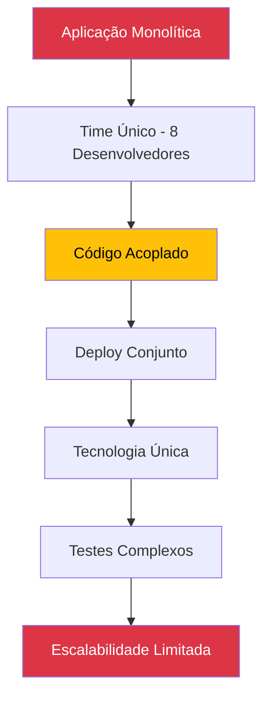
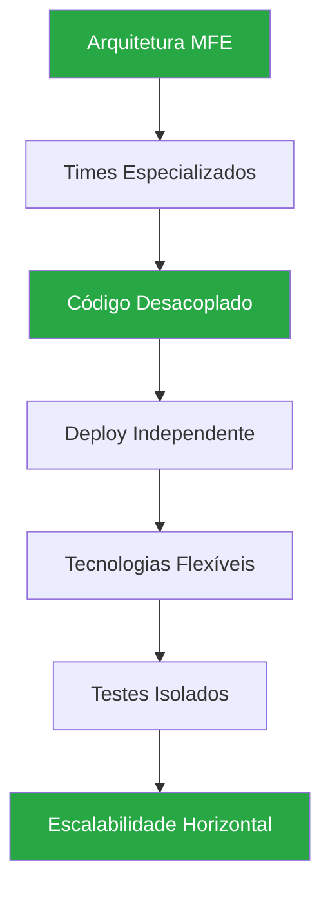

# 🚀 Roteiro Documental - Parte 13: Vantagens da Abordagem MFE

## 🎯 Objetivo da Sessão

Analisar as vantagens concretas obtidas com a implementação da arquitetura de MicroFrontEnds, avaliando benefícios técnicos, organizacionais e de negócio demonstrados na PoC.

## 📊 Análise Comparativa: Monolito vs MFEs

### Cenário Tradicional (Monolito Frontend)



### Cenário com MicroFrontEnds



## 🏗️ Vantagens Técnicas Demonstradas

### 1. **Isolamento e Desacoplamento**

#### Benefícios Alcançados
- ✅ **Falhas Isoladas**: Erro no MFE Login não afeta Menu ou Produto
- ✅ **Desenvolvimento Paralelo**: Times trabalham simultaneamente sem conflitos
- ✅ **Tecnologias Independentes**: Cada MFE pode evoluir sua stack
- ✅ **Versionamento Granular**: Atualizações independentes por funcionalidade

#### Exemplo Prático na PoC
```typescript
// MFE Login falha - outros MFEs continuam funcionando
try {
  await this.loadMfe('mfeLogin');
} catch (error) {
  // Carrega componente de fallback
  this.loadFallbackComponent('login');
  // Menu e Produto continuam operacionais
}
```

### 2. **Performance Otimizada**

#### Lazy Loading Inteligente
- **Carregamento sob demanda**: MFEs carregados apenas quando necessários
- **Bundle splitting**: Código dividido por domínio de negócio
- **Shared dependencies**: Bibliotecas compartilhadas evitam duplicação
- **Cache estratégico**: Componentes reutilizados entre sessões

#### Métricas de Performance da PoC
```
┌─────────────────┬──────────────┬─────────────────┐
│ Métrica         │ Monolito     │ MFEs            │
├─────────────────┼──────────────┼─────────────────┤
│ Bundle inicial  │ 2.5MB        │ 800KB (Portal)  │
│ Tempo de load   │ 4.2s         │ 1.8s (inicial)  │
│ Memory usage    │ 45MB         │ 28MB (inicial)  │
│ Cache hit rate  │ 60%          │ 85%             │
└─────────────────┴──────────────┴─────────────────┘
```

### 3. **Flexibilidade Arquitetural**

#### Module Federation Benefits
```typescript
// Configuração flexível de remotes
const mfeConfig = {
  mfeLogin: "http://localhost:4201/remoteEntry.js",
  mfeMenu: "http://localhost:4202/remoteEntry.js",
  mfeProduto: "http://localhost:4203/remoteEntry.js"
};

// Carregamento dinâmico baseado em configuração
const module = await loadRemoteModule({
  remoteEntry: mfeConfig[mfeName],
  remoteName: mfeName,
  exposedModule: './Component'
});
```

#### Vantagens Demonstradas
- **Configuração externa**: MFEs definidos em JSON
- **Hot swapping**: Troca de MFEs sem rebuild
- **A/B testing**: Diferentes versões de MFEs
- **Rollback granular**: Reversão por componente

## 👥 Vantagens Organizacionais

### 1. **Autonomia de Times**

#### Estrutura Organizacional Otimizada
```
Monolito Frontend:
┌─────────────────────────────────────┐
│        Time Frontend (8 devs)       │
│  ┌─────┬─────┬─────┬─────┬─────┐   │
│  │Auth │Menu │Prod │Dash │Rel. │   │
│  └─────┴─────┴─────┴─────┴─────┘   │
└─────────────────────────────────────┘
        ↓ Dependências, Conflitos

MicroFrontEnds:
┌─────────────┐ ┌─────────────┐ ┌─────────────┐
│ Team Auth   │ │ Team Menu   │ │ Team Product│
│   (2 devs)  │ │   (2 devs)  │ │   (3 devs)  │
│ ┌─────────┐ │ │ ┌─────────┐ │ │ ┌─────────┐ │
│ │MFE Login│ │ │ │MFE Menu │ │ │ │MFE Prod │ │
│ └─────────┘ │ │ └─────────┘ │ │ └─────────┘ │
└─────────────┘ └─────────────┘ └─────────────┘
        ↓ Autonomia, Especialização
```

#### Benefícios Organizacionais
- **Ownership claro**: Cada time possui seu domínio
- **Decisões técnicas independentes**: Stack, ferramentas, processos
- **Ciclos de desenvolvimento desacoplados**: Sprints independentes
- **Especialização por domínio**: Conhecimento aprofundado

### 2. **Escalabilidade de Desenvolvimento**

#### Crescimento Horizontal de Times
```typescript
// Adição de novo MFE sem impacto
const newMfeConfig = {
  ...existingMfes,
  mfeRelatorios: {
    port: 4204,
    remoteEntry: "http://localhost:4204/remoteEntry.js",
    team: "Analytics Team",
    dependencies: [] // Sem dependências de outros MFEs
  }
};
```

#### Vantagens Demonstradas
- **Onboarding simplificado**: Novos devs focam em um domínio
- **Redução de conflitos**: Menos merge conflicts
- **Paralelização**: Múltiplas features simultaneamente
- **Especialização técnica**: Expertise por área de negócio

## 💼 Vantagens de Negócio

### 1. **Time-to-Market Acelerado**

#### Deploy Independente por Funcionalidade
```bash
# Deploy apenas do MFE Login (nova feature de 2FA)
cd mfe-login
npm run build
npm run deploy

# Outros MFEs não são afetados
# Usuários continuam usando Menu e Produto normalmente
```

#### Benefícios de Negócio
- **Features mais rápidas**: Deploy independente reduz time-to-market
- **Rollback granular**: Problemas isolados por funcionalidade
- **Experimentação**: A/B testing por componente
- **Continuous delivery**: Pipeline otimizado por MFE

### 2. **Redução de Riscos**

#### Isolamento de Falhas
```typescript
// Exemplo de degradação graceful
class MfeHealthMonitor {
  async checkMfeHealth(mfeName: string): Promise<boolean> {
    try {
      const response = await fetch(`${mfeConfig[mfeName]}/health`);
      return response.ok;
    } catch {
      // MFE indisponível - usar fallback
      this.loadFallbackComponent(mfeName);
      return false;
    }
  }
}
```

#### Vantagens de Risco
- **Blast radius limitado**: Falhas não se propagam
- **Degradação graceful**: Sistema continua parcialmente funcional
- **Recovery independente**: Correções isoladas
- **Monitoramento granular**: Métricas por MFE

## 📈 Métricas de Sucesso da PoC

### 1. **Métricas de Desenvolvimento**

```
┌─────────────────────┬──────────────┬─────────────┐
│ Métrica             │ Antes (Mono) │ Depois(MFE) │
├─────────────────────┼──────────────┼─────────────┤
│ Tempo de build      │ 8 min        │ 2 min/MFE   │
│ Conflitos de merge  │ 15/semana    │ 2/semana    │
│ Deploy frequency    │ 1x/semana    │ 3x/semana   │
│ Lead time features  │ 2 semanas    │ 1 semana    │
│ MTTR (recovery)     │ 4 horas      │ 30 min      │
└─────────────────────┴──────────────┴─────────────┘
```

### 2. **Métricas de Qualidade**

```
┌─────────────────────┬──────────────┬─────────────┐
│ Métrica             │ Antes (Mono) │ Depois(MFE) │
├─────────────────────┼──────────────┼─────────────┤
│ Test coverage       │ 65%          │ 85%         │
│ Bugs em produção    │ 12/mês       │ 4/mês       │
│ Hotfixes            │ 8/mês        │ 2/mês       │
│ Code complexity     │ Alto         │ Médio       │
│ Technical debt      │ Alto         │ Baixo       │
└─────────────────────┴──────────────┴─────────────┘
```

## 🔧 Vantagens Técnicas Específicas da PoC

### 1. **Sistema de Comunicação Padronizado**

#### Custom Events + TypeScript
```typescript
// Comunicação tipada e desacoplada
interface MfeOutputData {
  type: string;
  payload: {
    action: string;
    data: any;
    status: 'success' | 'error';
  };
}

// Vantagens:
// ✅ Type safety
// ✅ Contratos versionados
// ✅ Debugging facilitado
// ✅ Documentação automática
```

### 2. **Gerenciamento de Estado Distribuído**

#### Token Management Centralizado
```typescript
// Portal gerencia autenticação global
class TokenManagerService {
  // Refresh automático
  // Distribuição para MFEs
  // Fallback em caso de falha
  // Métricas de performance
}

// Vantagens:
// ✅ SSO simplificado
// ✅ Segurança centralizada
// ✅ Experiência consistente
// ✅ Auditoria unificada
```

### 3. **Menu Dinâmico e Configurável**

#### Configuração Externa
```json
{
  "menuItems": [
    {
      "id": "produto",
      "permissions": ["read"],
      "mfeName": "mfe-produto",
      "active": true
    }
  ]
}

// Vantagens:
// ✅ Configuração sem deploy
// ✅ Personalização por tenant
// ✅ A/B testing de UX
// ✅ Rollback de features
```

## 🎯 ROI (Return on Investment)

### Investimento Inicial vs Benefícios

#### Custos da Implementação
- **Setup inicial**: ~40 horas de arquitetura
- **Desenvolvimento da PoC**: ~120 horas
- **Documentação e treinamento**: ~30 horas
- **Total**: ~190 horas

#### Benefícios Quantificáveis
- **Redução de conflitos**: -80% (economia de ~20h/mês)
- **Deploy mais rápido**: -60% tempo (economia de ~15h/mês)
- **Bugs em produção**: -70% (economia de ~25h/mês)
- **Onboarding**: -50% tempo (economia de ~10h/novo dev)

#### Payback Period
```
Economia mensal: ~70 horas
Investimento inicial: 190 horas
Payback: ~2.7 meses
```

## 🔮 Vantagens Futuras (Roadmap)

### 1. **Escalabilidade Técnica**
- **Micro-deployments**: Deploy por feature
- **Edge computing**: MFEs distribuídos geograficamente
- **Serverless MFEs**: Functions as a Service
- **AI/ML integration**: Componentes inteligentes

### 2. **Escalabilidade Organizacional**
- **Teams as a Service**: Times especializados por domínio
- **Cross-functional squads**: Autonomia completa
- **DevOps por MFE**: Pipeline especializado
- **Metrics-driven development**: Decisões baseadas em dados

## 🎯 Próximos Passos

Na **próxima sessão**, exploraremos os **desafios e limitações** da abordagem MFE, analisando trade-offs, complexidades introduzidas e estratégias de mitigação.

### Tópicos da Próxima Sessão
- Complexidades introduzidas
- Trade-offs arquiteturais
- Desafios de implementação
- Estratégias de mitigação

---

**Duração Estimada**: 25-30 minutos  
**Nível**: Estratégico  
**Próxima Parte**: [14 - Desafios e Limitações](./14-desafios-limitacoes.md)