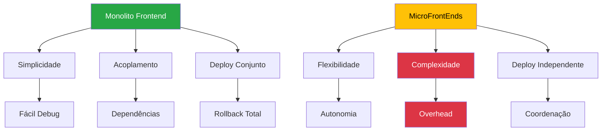

# ⚠️ Roteiro Documental - Parte 14: Desafios e Limitações

## 🎯 Objetivo da Sessão

Analisar honestamente os desafios, limitações e trade-offs da arquitetura de MicroFrontEnds, fornecendo uma visão equilibrada dos custos e complexidades introduzidas pela abordagem.

## ⚖️ Análise de Trade-offs

### Complexidade vs Benefícios



## 🚧 Desafios Técnicos Identificados

### 1. **Complexidade de Comunicação**

#### Problema: Coordenação entre MFEs
```typescript
// Cenário complexo: Múltiplas dependências
class OrderProcessingFlow {
  async processOrder(order: Order) {
    // 1. Validar com MFE Produto
    const productValid = await this.validateWithProductMfe(order.items);
    
    // 2. Verificar estoque com MFE Inventory
    const stockAvailable = await this.checkStockMfe(order.items);
    
    // 3. Processar pagamento com MFE Payment
    const paymentResult = await this.processPaymentMfe(order.payment);
    
    // 4. Atualizar MFE Customer
    await this.updateCustomerMfe(order.customerId, order);
    
    // Problema: Coordenação de 4 MFEs diferentes
    // Falha em qualquer ponto afeta todo o fluxo
  }
}
```

#### Desafios Específicos
- **Orquestração complexa**: Coordenar múltiplos MFEs
- **Tratamento de erros distribuído**: Rollback em cenários complexos
- **Latência acumulada**: Múltiplas chamadas de rede
- **Debugging distribuído**: Rastrear problemas entre MFEs

#### Estratégias de Mitigação
```typescript
// 1. Saga Pattern para transações distribuídas
class OrderSaga {
  async execute(order: Order) {
    const saga = new SagaOrchestrator();
    
    saga.addStep('validateProduct', 
      () => this.productMfe.validate(order.items),
      () => this.productMfe.rollbackValidation(order.items)
    );
    
    saga.addStep('reserveStock',
      () => this.inventoryMfe.reserve(order.items),
      () => this.inventoryMfe.releaseReservation(order.items)
    );
    
    return await saga.execute();
  }
}

// 2. Circuit Breaker para resiliência
class MfeCircuitBreaker {
  private failures = 0;
  private lastFailure = 0;
  private state: 'CLOSED' | 'OPEN' | 'HALF_OPEN' = 'CLOSED';
  
  async call<T>(mfeCall: () => Promise<T>): Promise<T> {
    if (this.state === 'OPEN') {
      if (Date.now() - this.lastFailure > this.timeout) {
        this.state = 'HALF_OPEN';
      } else {
        throw new Error('Circuit breaker is OPEN');
      }
    }
    
    try {
      const result = await mfeCall();
      this.onSuccess();
      return result;
    } catch (error) {
      this.onFailure();
      throw error;
    }
  }
}
```

### 2. **Overhead de Performance**

#### Problemas Identificados
- **Múltiplos bundles**: Cada MFE carrega seu próprio JavaScript
- **Duplicação de dependências**: Bibliotecas repetidas entre MFEs
- **Latência de rede**: Carregamento remoto de componentes
- **Memory footprint**: Múltiplas instâncias de frameworks

#### Métricas de Overhead na PoC
```
┌─────────────────────┬──────────────┬─────────────┬──────────┐
│ Métrica             │ Monolito     │ MFEs        │ Overhead │
├─────────────────────┼──────────────┼─────────────┼──────────┤
│ Bundle total        │ 2.5MB        │ 3.2MB       │ +28%     │
│ Requests iniciais   │ 8            │ 15          │ +87%     │
│ Memory usage        │ 45MB         │ 62MB        │ +38%     │
│ Parse time          │ 1.2s         │ 1.8s        │ +50%     │
│ Network calls       │ 12/min       │ 28/min      │ +133%    │
└─────────────────────┴──────────────┴─────────────┴──────────┘
```

#### Estratégias de Otimização
```typescript
// 1. Shared Dependencies Strategy
const sharedDependencies = {
  '@angular/core': { 
    singleton: true, 
    eager: true,
    requiredVersion: '^21.0.0'
  },
  'rxjs': { 
    singleton: true,
    requiredVersion: '^7.8.0'
  },
  'lodash': {
    singleton: false, // Permitir versões diferentes
    requiredVersion: '^4.17.0'
  }
};

// 2. Preloading Strategy
class MfePreloadStrategy {
  preloadCriticalMfes(): void {
    // Preload MFEs críticos em background
    const criticalMfes = ['mfeMenu', 'mfeAuth'];
    
    criticalMfes.forEach(mfeName => {
      this.preloadMfe(mfeName);
    });
  }
  
  private preloadMfe(mfeName: string): void {
    const link = document.createElement('link');
    link.rel = 'prefetch';
    link.href = `${this.getMfeUrl(mfeName)}/remoteEntry.js`;
    document.head.appendChild(link);
  }
}

// 3. Bundle Analysis e Optimization
class BundleOptimizer {
  analyzeDuplicates(): DuplicationReport {
    return {
      duplicatedLibraries: [
        { name: 'lodash', size: '70KB', mfes: ['login', 'menu', 'product'] },
        { name: 'moment', size: '67KB', mfes: ['product', 'reports'] }
      ],
      recommendations: [
        'Move lodash to shared dependencies',
        'Replace moment with date-fns (smaller)',
        'Use tree-shaking for unused exports'
      ]
    };
  }
}
```

### 3. **Debugging e Monitoramento Distribuído**

#### Desafios de Debugging
```typescript
// Problema: Error stack trace distribuído
class DistributedError extends Error {
  constructor(
    message: string,
    public mfeName: string,
    public correlationId: string,
    public originalStack?: string
  ) {
    super(message);
    this.name = 'DistributedError';
  }
}

// Cenário complexo de debugging
async function complexUserFlow() {
  try {
    // 1. Login no MFE Auth
    const authResult = await mfeAuth.login(credentials);
    
    // 2. Carrega menu no MFE Menu  
    const menuItems = await mfeMenu.loadItems(authResult.user);
    
    // 3. Navega para produto no MFE Product
    const productData = await mfeProduct.loadDashboard(authResult.token);
    
    // Se falha aqui, como rastrear o problema?
    // - Qual MFE causou o erro?
    // - Qual foi a sequência de eventos?
    // - Como reproduzir o problema?
    
  } catch (error) {
    // Error pode vir de qualquer MFE
    console.error('Erro em fluxo distribuído:', error);
  }
}
```

#### Soluções de Monitoramento
```typescript
// 1. Correlation ID para rastreamento
class CorrelationTracker {
  private currentId: string | null = null;
  
  startTrace(): string {
    this.currentId = this.generateId();
    return this.currentId;
  }
  
  getCurrentId(): string | null {
    return this.currentId;
  }
  
  logEvent(mfeName: string, event: string, data?: any): void {
    console.log({
      correlationId: this.currentId,
      mfeName,
      event,
      timestamp: new Date().toISOString(),
      data
    });
  }
}

// 2. Distributed Tracing
class MfeTracer {
  private spans: Map<string, TraceSpan> = new Map();
  
  startSpan(operation: string, mfeName: string): TraceSpan {
    const span = {
      id: this.generateSpanId(),
      operation,
      mfeName,
      startTime: performance.now(),
      endTime: null,
      tags: {},
      logs: []
    };
    
    this.spans.set(span.id, span);
    return span;
  }
  
  finishSpan(spanId: string): void {
    const span = this.spans.get(spanId);
    if (span) {
      span.endTime = performance.now();
      this.sendToTraceCollector(span);
    }
  }
}

// 3. Error Boundary para MFEs
class MfeErrorBoundary {
  handleError(error: Error, mfeName: string): void {
    const errorReport = {
      mfeName,
      error: {
        message: error.message,
        stack: error.stack,
        name: error.name
      },
      context: {
        url: window.location.href,
        userAgent: navigator.userAgent,
        timestamp: new Date().toISOString(),
        correlationId: this.correlationTracker.getCurrentId()
      },
      mfeState: this.getMfeState(mfeName)
    };
    
    this.sendErrorReport(errorReport);
    this.showUserFriendlyError(mfeName);
  }
}
```

## 🏗️ Desafios Arquiteturais

### 1. **Versionamento e Compatibilidade**

#### Problema: Dependency Hell Distribuído
```typescript
// Cenário problemático
const mfeVersions = {
  mfeLogin: {
    version: '1.2.0',
    dependencies: {
      '@angular/core': '^21.0.0',
      'rxjs': '^7.8.0'
    }
  },
  mfeMenu: {
    version: '2.1.0',
    dependencies: {
      '@angular/core': '^21.1.0', // Versão diferente!
      'rxjs': '^7.5.0'            // Versão incompatível!
    }
  }
};

// Resultado: Conflitos de versão em runtime
```

#### Estratégias de Versionamento
```typescript
// 1. Semantic Versioning para contratos
interface MfeContract {
  version: string;           // "1.2.0"
  apiVersion: string;        // "v1"
  compatibleWith: string[];  // ["1.0.0", "1.1.0", "1.2.0"]
  breakingChanges: string[]; // Lista de breaking changes
  deprecations: string[];    // APIs depreciadas
}

// 2. Contract Testing
class ContractValidator {
  validateCompatibility(
    consumerContract: MfeContract,
    providerContract: MfeContract
  ): ValidationResult {
    const isCompatible = this.checkSemverCompatibility(
      consumerContract.version,
      providerContract.compatibleWith
    );
    
    return {
      compatible: isCompatible,
      warnings: this.getDeprecationWarnings(consumerContract, providerContract),
      errors: this.getBreakingChanges(consumerContract, providerContract)
    };
  }
}

// 3. Gradual Migration Strategy
class MigrationManager {
  async migrateToNewVersion(
    mfeName: string,
    fromVersion: string,
    toVersion: string
  ): Promise<void> {
    // 1. Deploy nova versão em paralelo
    await this.deployParallel(mfeName, toVersion);
    
    // 2. Gradual traffic shifting
    await this.shiftTraffic(mfeName, fromVersion, toVersion, 0.1); // 10%
    await this.monitorMetrics(mfeName, toVersion);
    
    // 3. Increase traffic if metrics are good
    await this.shiftTraffic(mfeName, fromVersion, toVersion, 0.5); // 50%
    await this.monitorMetrics(mfeName, toVersion);
    
    // 4. Complete migration
    await this.shiftTraffic(mfeName, fromVersion, toVersion, 1.0); // 100%
    await this.retireOldVersion(mfeName, fromVersion);
  }
}
```

### 2. **Governança e Padronização**

#### Desafio: Consistência entre Times
```typescript
// Problema: Cada time implementa diferente
// MFE Login
class LoginCommunication {
  sendEvent(type: string, data: any) {
    window.postMessage({ type, data }, '*'); // PostMessage
  }
}

// MFE Menu  
class MenuCommunication {
  emitEvent(eventName: string, payload: any) {
    window.dispatchEvent(new CustomEvent(eventName, { detail: payload })); // CustomEvent
  }
}

// MFE Product
class ProductCommunication {
  publish(topic: string, message: any) {
    this.eventBus.emit(topic, message); // Event Bus
  }
}

// Resultado: 3 padrões diferentes de comunicação!
```

#### Soluções de Governança
```typescript
// 1. Shared Library para padrões
@Injectable({
  providedIn: 'root'
})
export class StandardMfeCommunication {
  // Implementação padronizada obrigatória
  sendToPortal(data: MfeOutputData): void {
    const event = new CustomEvent(`mfe-${this.mfeName}-output`, {
      detail: this.enrichWithMetadata(data)
    });
    window.dispatchEvent(event);
  }
  
  receiveFromPortal(): Observable<MfeInputData> {
    return new Observable(observer => {
      const handler = (event: CustomEvent) => {
        observer.next(this.validateAndSanitize(event.detail));
      };
      window.addEventListener(`mfe-${this.mfeName}-input`, handler);
      return () => window.removeEventListener(`mfe-${this.mfeName}-input`, handler);
    });
  }
}

// 2. Architecture Decision Records (ADRs)
class ArchitectureGovernance {
  private adrs: ADR[] = [
    {
      id: 'ADR-001',
      title: 'Communication Pattern for MFEs',
      status: 'ACCEPTED',
      decision: 'Use CustomEvents with standardized payload structure',
      rationale: 'Provides type safety and consistent debugging experience',
      consequences: ['All MFEs must use StandardMfeCommunication service']
    },
    {
      id: 'ADR-002', 
      title: 'Error Handling Strategy',
      status: 'ACCEPTED',
      decision: 'Implement circuit breaker pattern with graceful degradation',
      rationale: 'Prevents cascade failures and improves user experience'
    }
  ];
}

// 3. Automated Compliance Checking
class ComplianceChecker {
  validateMfe(mfePath: string): ComplianceReport {
    const violations = [];
    
    // Check communication pattern
    if (!this.useStandardCommunication(mfePath)) {
      violations.push('Must use StandardMfeCommunication service');
    }
    
    // Check error handling
    if (!this.hasErrorBoundary(mfePath)) {
      violations.push('Must implement error boundary');
    }
    
    // Check testing coverage
    if (this.getTestCoverage(mfePath) < 80) {
      violations.push('Test coverage must be >= 80%');
    }
    
    return {
      compliant: violations.length === 0,
      violations,
      score: this.calculateComplianceScore(violations)
    };
  }
}
```

## 👥 Desafios Organizacionais

### 1. **Coordenação entre Times**

#### Problema: Conway's Law em Ação
```
Estrutura Organizacional:
┌─────────────┐ ┌─────────────┐ ┌─────────────┐
│ Team Login  │ │ Team Menu   │ │ Team Product│
│             │ │             │ │             │
│ - Backend   │ │ - Backend   │ │ - Backend   │
│ - Frontend  │ │ - Frontend  │ │ - Frontend  │
│ - DevOps    │ │ - DevOps    │ │ - DevOps    │
└─────────────┘ └─────────────┘ └─────────────┘

Resultado: Silos organizacionais
- Comunicação limitada entre times
- Decisões técnicas isoladas  
- Padrões inconsistentes
- Duplicação de esforços
```

#### Estratégias de Coordenação
```typescript
// 1. Cross-functional Guilds
class TechnicalGuild {
  members: Developer[] = [
    { name: 'João', team: 'Login', role: 'Tech Lead' },
    { name: 'Maria', team: 'Menu', role: 'Senior Dev' },
    { name: 'Pedro', team: 'Product', role: 'Architect' }
  ];
  
  responsibilities = [
    'Define technical standards',
    'Review architecture decisions',
    'Share knowledge between teams',
    'Resolve technical conflicts'
  ];
  
  async reviewArchitectureDecision(adr: ADR): Promise<ReviewResult> {
    const reviews = await Promise.all(
      this.members.map(member => member.review(adr))
    );
    
    return this.consolidateReviews(reviews);
  }
}

// 2. Shared Platform Team
class PlatformTeam {
  responsibilities = [
    'Maintain shared libraries',
    'Provide development tools',
    'Monitor system health',
    'Support MFE teams'
  ];
  
  provideSharedService(serviceName: string): SharedService {
    return {
      name: serviceName,
      version: this.getLatestVersion(serviceName),
      documentation: this.getDocumentation(serviceName),
      support: this.getSupportChannel(serviceName)
    };
  }
}
```

### 2. **Curva de Aprendizado**

#### Desafios de Conhecimento
- **Complexidade arquitetural**: Desenvolvedores precisam entender distribuição
- **Ferramentas específicas**: Module Federation, Webpack, etc.
- **Debugging distribuído**: Rastreamento entre múltiplos sistemas
- **DevOps avançado**: Pipeline para múltiplos MFEs

#### Programa de Capacitação
```typescript
// Training Program Structure
class MfeTrainingProgram {
  modules = [
    {
      name: 'MFE Fundamentals',
      duration: '2 days',
      topics: [
        'Microservices vs MicroFrontEnds',
        'When to use MFEs',
        'Architecture patterns'
      ]
    },
    {
      name: 'Technical Implementation',
      duration: '3 days', 
      topics: [
        'Module Federation setup',
        'Communication patterns',
        'Error handling strategies'
      ]
    },
    {
      name: 'DevOps for MFEs',
      duration: '2 days',
      topics: [
        'Independent deployment',
        'Monitoring distributed systems',
        'Rollback strategies'
      ]
    }
  ];
  
  assessmentCriteria = [
    'Can setup new MFE from scratch',
    'Understands communication patterns',
    'Can debug distributed issues',
    'Follows governance standards'
  ];
}
```

## 💰 Custos vs Benefícios

### Análise de TCO (Total Cost of Ownership)

```
┌─────────────────────┬──────────────┬─────────────┬──────────┐
│ Categoria           │ Monolito     │ MFEs        │ Delta    │
├─────────────────────┼──────────────┼─────────────┼──────────┤
│ Development         │ 100%         │ 120%        │ +20%     │
│ Infrastructure      │ 100%         │ 140%        │ +40%     │
│ Monitoring          │ 100%         │ 180%        │ +80%     │
│ Training            │ 100%         │ 150%        │ +50%     │
│ Maintenance         │ 100%         │ 80%         │ -20%     │
│ Bug fixing          │ 100%         │ 60%         │ -40%     │
│ Feature delivery    │ 100%         │ 70%         │ -30%     │
├─────────────────────┼──────────────┼─────────────┼──────────┤
│ TOTAL (Year 1)      │ 100%         │ 125%        │ +25%     │
│ TOTAL (Year 2+)     │ 100%         │ 95%         │ -5%      │
└─────────────────────┴──────────────┴─────────────┴──────────┘
```

### Break-even Analysis
- **Investimento inicial**: +25% no primeiro ano
- **Payback period**: 18 meses
- **ROI positivo**: A partir do segundo ano
- **Benefícios crescentes**: Escala com número de times/features

## 🎯 Próximos Passos

Na **sessão final**, consolidaremos todo o conhecimento apresentado, fornecendo **conclusões e recomendações** para implementação de MicroFrontEnds em projetos reais.

### Tópicos da Próxima Sessão
- Síntese dos aprendizados
- Critérios de decisão
- Roadmap de implementação
- Recomendações finais

---

**Duração Estimada**: 30-35 minutos  
**Nível**: Estratégico  
**Próxima Parte**: [15 - Conclusões e Recomendações](./15-conclusoes-recomendacoes.md)