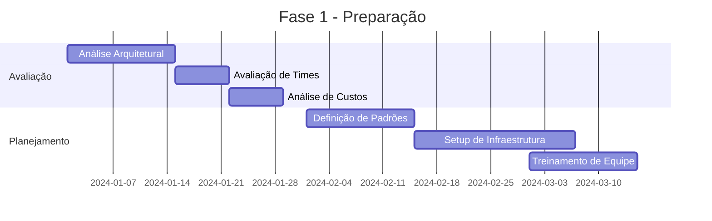
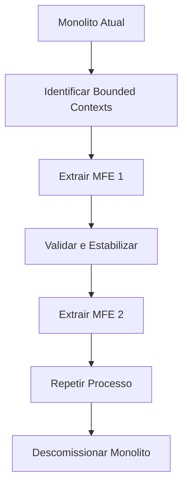

# 🎯 Roteiro Documental - Parte 17: Conclusões e Recomendações (v2.0)

## 🎯 Objetivo da Sessão

Consolidar os aprendizados obtidos ao longo do roteiro, apresentar conclusões baseadas na implementação prática da PoC e fornecer recomendações estratégicas para adoção de MicroFrontEnds em projetos reais, incluindo as evoluções da versão 2.0.

## 📊 Síntese da Jornada de Aprendizado

### O que Construímos

Ao longo deste roteiro, implementamos uma **PoC completa** de MicroFrontEnds que demonstra:

```
🏗️ ARQUITETURA HÍBRIDA IMPLEMENTADA

┌─────────────────────────────────────────────────────────────┐
│                    MFE PORTAL (Hub)                         │
│  🔄 Orquestração • 📡 Mediação • 🛡️ Segurança              │
└─────────────────┬───────────────────────────────────────────┘
                  │
    ┌─────────────┼─────────────┬─────────────┬─────────────┐
    │             │             │             │             │
┌───▼───┐    ┌────▼────┐   ┌────▼────┐   ┌────▼────┐   ┌────▼────┐
│Login  │    │ Menu    │   │Produto  │   │ Alçada  │   │Futuro   │
│🏗️Static│    │🏗️Static │   │🔄Dynamic│   │🔄Dynamic│   │🔄Dynamic│
│Always │    │Always   │   │OnDemand │   │OnDemand │   │OnDemand │
└───────┘    └─────────┘   └─────────┘   └─────────┘   └─────────┘
                                │             ▲
                                │ 📞 Inter-MFE │
                                │Communication │
                                └─────────────┘
```

### 🆕 Evoluções da Versão 2.0

#### **Carregamento Híbrido**
- **MFEs Estáticos**: Login e Menu sempre disponíveis
- **MFEs Dinâmicos**: Produto e Alçada carregados sob demanda
- **Sem Fallbacks**: MFEs dinâmicos devem estar disponíveis
- **Configuração JSON**: Estratégias definidas externamente

#### **Comunicação Inter-MFE**
- **Portal como Mediador**: Todas as comunicações passam pelo hub
- **Contratos Tipados**: Interfaces bem definidas para mensagens
- **Correlação de Mensagens**: Rastreamento de solicitações/respostas
- **Timeout e Retry**: Mecanismos de recuperação

#### **Validação Distribuída**
- **MFE Alçada**: Especializado em validação de operações críticas
- **Níveis Hierárquicos**: Sistema de alçada baseado em permissões
- **Auditoria**: Registro completo de validações
- **Interface Especializada**: Modal focado na experiência de validação

## 🎓 Principais Aprendizados

### 1. **Arquiteturais**

#### ✅ **O que Funciona Bem**
- **Hub-and-Spoke**: Padrão eficaz para orquestração
- **Carregamento Híbrido**: Otimização baseada no contexto de uso
- **Module Federation**: Tecnologia madura para runtime integration
- **Standalone Components**: Simplificam desenvolvimento e deployment

#### ⚠️ **Desafios Identificados**
- **Complexidade de Comunicação**: Requer padronização rigorosa
- **Debugging Distribuído**: Ferramentas específicas necessárias
- **Gerenciamento de Estado**: Coordenação entre MFEs é complexa
- **Dependências Compartilhadas**: Versionamento requer atenção

### 2. **Técnicos**

#### ✅ **Soluções Eficazes**
- **Custom Events**: Comunicação desacoplada e flexível
- **JSON Configuration**: Configuração externa sem rebuild
- **TypeScript Interfaces**: Contratos tipados reduzem erros
- **RxJS Observables**: Programação reativa facilita comunicação

#### ⚠️ **Pontos de Atenção**
- **Performance**: Múltiplos bundles podem impactar carregamento
- **SEO**: SPAs com MFEs requerem estratégias específicas
- **Testing**: Testes end-to-end mais complexos
- **Monitoramento**: Observabilidade distribuída é essencial

### 3. **Organizacionais**

#### ✅ **Benefícios Realizados**
- **Desenvolvimento Paralelo**: Times independentes por MFE
- **Deploy Independente**: Ciclos de release desacoplados
- **Tecnologias Flexíveis**: Cada MFE pode evoluir independentemente
- **Escalabilidade de Times**: Crescimento horizontal facilitado

#### ⚠️ **Desafios Organizacionais**
- **Governança**: Padrões e contratos devem ser bem definidos
- **Coordenação**: Comunicação entre times é crítica
- **Conhecimento**: Curva de aprendizado para toda a equipe
- **Infraestrutura**: DevOps mais complexo

## 📈 Critérios de Decisão para Adoção

### Quando Adotar MicroFrontEnds

#### 🟢 **Cenários Ideais**

```typescript
interface IdealScenario {
  teamSize: 'large' | 'multiple'; // +15 desenvolvedores ou múltiplos times
  applicationComplexity: 'high' | 'enterprise'; // Aplicações complexas
  deploymentFrequency: 'high'; // Deploys frequentes
  technologyDiversity: boolean; // Necessidade de tecnologias diferentes
  organizationalMaturity: 'high'; // DevOps e processos maduros
  longTermProject: boolean; // Projetos de longo prazo
}

const shouldAdoptMFE = (scenario: IdealScenario): boolean => {
  return (
    scenario.teamSize === 'multiple' &&
    scenario.applicationComplexity === 'enterprise' &&
    scenario.deploymentFrequency === 'high' &&
    scenario.organizationalMaturity === 'high' &&
    scenario.longTermProject === true
  );
};
```

#### 🔴 **Cenários Não Recomendados**

```typescript
interface NotIdealScenario {
  teamSize: 'small'; // <10 desenvolvedores
  applicationComplexity: 'simple' | 'medium'; // Aplicações simples
  timeToMarket: 'urgent'; // Pressão por entrega rápida
  organizationalMaturity: 'low'; // Processos imaturos
  shortTermProject: boolean; // Projetos de curto prazo
  limitedResources: boolean; // Recursos limitados
}
```

### Matriz de Decisão

| Fator | Peso | Monolito | MicroFrontEnds | Recomendação |
|-------|------|----------|----------------|--------------|
| **Tamanho da Equipe** | 🔥🔥🔥 | <10 devs | >15 devs | MFE para times grandes |
| **Complexidade** | 🔥🔥🔥 | Simples/Média | Alta/Enterprise | MFE para alta complexidade |
| **Frequência de Deploy** | 🔥🔥 | Semanal/Mensal | Diária/Contínua | MFE para deploy frequente |
| **Diversidade Tecnológica** | 🔥🔥 | Homogênea | Heterogênea | MFE para diversidade |
| **Maturidade DevOps** | 🔥🔥🔥 | Básica | Avançada | MFE requer maturidade |
| **Prazo do Projeto** | 🔥 | <1 ano | >2 anos | MFE para longo prazo |
| **Orçamento** | 🔥 | Limitado | Adequado | MFE requer investimento |

## 🛣️ Roadmap de Implementação

### Fase 1: Preparação (2-3 meses)

#### **Avaliação e Planejamento**


#### **Atividades Chave**
- ✅ **Análise de Viabilidade**: Usar matriz de decisão
- ✅ **Definição de Padrões**: Contratos, comunicação, deployment
- ✅ **Setup de Infraestrutura**: CI/CD, monitoramento, registry
- ✅ **Capacitação**: Treinamento em Module Federation e padrões

### Fase 2: PoC e Validação (1-2 meses)

#### **Implementação Piloto**
```typescript
interface PoCScope {
  mfes: ['shell', 'auth', 'feature1']; // Máximo 3 MFEs
  features: ['login', 'navigation', 'core-feature'];
  technologies: ['Angular', 'Module Federation'];
  duration: '4-8 weeks';
  team: 'small-dedicated'; // 3-5 desenvolvedores
}
```

#### **Critérios de Sucesso**
- 🎯 **Performance**: Tempo de carregamento < 3s
- 🎯 **Comunicação**: Latência entre MFEs < 100ms
- 🎯 **Deployment**: Deploy independente funcionando
- 🎯 **Monitoramento**: Observabilidade implementada
- 🎯 **Developer Experience**: Produtividade mantida

### Fase 3: Migração Gradual (6-12 meses)

#### **Estratégia Strangler Fig**


#### **Ordem de Migração Recomendada**
1. **MFEs de Infraestrutura**: Login, Menu, Layout
2. **MFEs de Funcionalidade**: Features menos críticas primeiro
3. **MFEs Críticos**: Core business por último
4. **MFEs Especializados**: Relatórios, Admin, etc.

### Fase 4: Otimização e Evolução (Contínua)

#### **Melhorias Contínuas**
- 🔄 **Performance**: Otimização de bundles e carregamento
- 🔄 **Monitoramento**: Métricas e alertas avançados
- 🔄 **Governança**: Refinamento de padrões e processos
- 🔄 **Automação**: CI/CD e testes automatizados

## 🏗️ Padrões Arquiteturais Recomendados

### 1. **Padrão Hub-and-Spoke Evoluído**

```typescript
// Implementação recomendada
interface MfeArchitecture {
  shell: {
    responsibilities: ['orchestration', 'authentication', 'routing', 'communication'];
    loadType: 'always';
    fallback: false;
  };
  
  structural: {
    mfes: ['login', 'menu', 'layout'];
    loadType: 'static';
    fallback: true;
    characteristics: ['essential', 'small', 'stable'];
  };
  
  functional: {
    mfes: ['products', 'orders', 'reports'];
    loadType: 'dynamic';
    fallback: false;
    characteristics: ['contextual', 'large', 'evolving'];
  };
  
  platform: {
    mfes: ['validation', 'audit', 'notifications'];
    loadType: 'on-demand';
    fallback: false;
    characteristics: ['specialized', 'reusable', 'critical'];
  };
}
```

### 2. **Comunicação Padronizada**

```typescript
// Padrão de mensageria recomendado
interface StandardMessage {
  type: string; // Tipo da mensagem
  source: string; // MFE origem
  target?: string; // MFE destino (opcional para broadcast)
  correlationId?: string; // Para rastreamento
  timestamp: string; // ISO timestamp
  payload: {
    action: string; // Ação específica
    data: any; // Dados da mensagem
    metadata?: any; // Metadados opcionais
  };
}

// Exemplo de implementação
class MfeCommunicationService {
  sendMessage(message: StandardMessage): void {
    const event = new CustomEvent('mfe-message', {
      detail: {
        ...message,
        timestamp: new Date().toISOString(),
        correlationId: message.correlationId || this.generateId()
      }
    });
    window.dispatchEvent(event);
  }
}
```

### 3. **Carregamento Inteligente**

```typescript
// Estratégia de carregamento recomendada
interface LoadingStrategy {
  static: {
    when: 'application-start';
    mfes: ['essential', 'small', 'stable'];
    fallback: true;
    cache: 'permanent';
  };
  
  dynamic: {
    when: 'user-navigation';
    mfes: ['feature-specific', 'large', 'contextual'];
    fallback: false;
    cache: 'session';
  };
  
  onDemand: {
    when: 'specific-action';
    mfes: ['specialized', 'rare-use', 'heavy'];
    fallback: false;
    cache: 'temporary';
  };
}
```

## 🔧 Ferramentas e Tecnologias Recomendadas

### Stack Tecnológico

#### **Core Technologies**
```json
{
  "frontend": {
    "framework": "Angular 21+",
    "bundler": "Webpack 5 + Module Federation",
    "language": "TypeScript 5.9+",
    "styling": "SCSS + CSS Custom Properties"
  },
  "communication": {
    "events": "Custom Events",
    "state": "RxJS Observables",
    "contracts": "TypeScript Interfaces",
    "validation": "JSON Schema"
  },
  "infrastructure": {
    "registry": "NPM Private Registry",
    "cdn": "CloudFront / CloudFlare",
    "monitoring": "DataDog / New Relic",
    "deployment": "Docker + Kubernetes"
  }
}
```

#### **Ferramentas de Desenvolvimento**
```json
{
  "development": {
    "cli": "@angular-architects/native-federation",
    "testing": "Jest + Cypress",
    "linting": "ESLint + Prettier",
    "documentation": "Compodoc + Storybook"
  },
  "devops": {
    "ci_cd": "GitHub Actions / GitLab CI",
    "containerization": "Docker",
    "orchestration": "Kubernetes",
    "monitoring": "Prometheus + Grafana"
  }
}
```

### Ferramentas de Governança

#### **Contratos e Documentação**
```typescript
// Ferramenta de validação de contratos
interface ContractValidation {
  schemas: {
    messages: 'JSON Schema';
    apis: 'OpenAPI 3.0';
    events: 'AsyncAPI';
  };
  
  validation: {
    runtime: 'Ajv JSON Schema Validator';
    buildTime: 'TypeScript Compiler';
    testing: 'Contract Testing (Pact)';
  };
  
  documentation: {
    generation: 'Automated from schemas';
    hosting: 'Internal Developer Portal';
    versioning: 'Semantic Versioning';
  };
}
```

## 📊 Métricas de Sucesso

### KPIs Técnicos

#### **Performance**
```typescript
interface PerformanceKPIs {
  loadTime: {
    initial: '<3s'; // Carregamento inicial
    mfe: '<1s'; // Carregamento de MFE individual
    navigation: '<500ms'; // Navegação entre MFEs
  };
  
  bundle: {
    shell: '<500KB'; // Bundle do shell
    mfe: '<1MB'; // Bundle individual de MFE
    shared: '<2MB'; // Dependências compartilhadas
  };
  
  runtime: {
    memory: '<100MB per MFE'; // Uso de memória
    cpu: '<5% idle'; // Uso de CPU em idle
    network: '<10 requests per navigation'; // Requests por navegação
  };
}
```

#### **Qualidade**
```typescript
interface QualityKPIs {
  reliability: {
    uptime: '>99.9%'; // Disponibilidade
    errorRate: '<0.1%'; // Taxa de erro
    mttr: '<30min'; // Tempo médio de recuperação
  };
  
  maintainability: {
    testCoverage: '>80%'; // Cobertura de testes
    codeQuality: 'A rating (SonarQube)'; // Qualidade do código
    documentation: '>90% APIs documented'; // Documentação
  };
}
```

### KPIs Organizacionais

#### **Produtividade**
```typescript
interface ProductivityKPIs {
  development: {
    leadTime: '<2 weeks'; // Tempo de desenvolvimento
    deploymentFrequency: '>1 per day'; // Frequência de deploy
    changeFailureRate: '<5%'; // Taxa de falha em mudanças
  };
  
  collaboration: {
    crossTeamDependencies: '<20%'; // Dependências entre times
    autonomy: '>80%'; // Autonomia dos times
    knowledgeSharing: 'Regular sessions'; // Compartilhamento de conhecimento
  };
}
```

## 🚨 Riscos e Mitigações

### Riscos Técnicos

#### **Alto Risco**
```typescript
interface HighRisks {
  complexity: {
    risk: 'Arquitetura muito complexa para o time';
    mitigation: 'Treinamento intensivo + mentoria + PoC gradual';
    probability: 'Medium';
    impact: 'High';
  };
  
  performance: {
    risk: 'Degradação de performance por múltiplos bundles';
    mitigation: 'Monitoramento contínuo + otimização + CDN';
    probability: 'Medium';
    impact: 'High';
  };
  
  integration: {
    risk: 'Falhas na comunicação entre MFEs';
    mitigation: 'Contratos rígidos + testes de integração + circuit breakers';
    probability: 'Low';
    impact: 'High';
  };
}
```

#### **Médio Risco**
```typescript
interface MediumRisks {
  governance: {
    risk: 'Falta de padronização entre MFEs';
    mitigation: 'Governança clara + code reviews + linting automatizado';
    probability: 'Medium';
    impact: 'Medium';
  };
  
  debugging: {
    risk: 'Dificuldade para debugar problemas distribuídos';
    mitigation: 'Ferramentas de observabilidade + logging estruturado';
    probability: 'High';
    impact: 'Medium';
  };
}
```

### Estratégias de Mitigação

#### **Plano de Contingência**
```typescript
interface ContingencyPlan {
  rollback: {
    strategy: 'Blue-Green Deployment';
    automation: 'Automated rollback triggers';
    timeframe: '<5 minutes';
  };
  
  fallback: {
    strategy: 'Graceful degradation';
    implementation: 'Fallback components for critical MFEs';
    monitoring: 'Health checks + circuit breakers';
  };
  
  recovery: {
    strategy: 'Disaster recovery procedures';
    backup: 'Multi-region deployment';
    rto: '<1 hour'; // Recovery Time Objective
    rpo: '<15 minutes'; // Recovery Point Objective
  };
}
```

## 🎯 Recomendações Finais

### Para Organizações Iniciantes

#### **Comece Pequeno**
```typescript
const beginnerRecommendations = {
  start: {
    scope: 'Single team, 2-3 MFEs maximum';
    duration: '3-6 months PoC';
    investment: 'Limited, focused on learning';
  },
  
  focus: [
    'Master the basics of Module Federation',
    'Establish communication patterns',
    'Build deployment pipeline',
    'Create monitoring foundation'
  ],
  
  avoid: [
    'Complex inter-MFE communication',
    'Multiple technology stacks',
    'Large-scale migration',
    'Advanced optimization patterns'
  ]
};
```

#### **Evolua Gradualmente**
```typescript
const evolutionPath = {
  phase1: 'PoC with 2-3 MFEs',
  phase2: 'Add 1-2 more MFEs, refine patterns',
  phase3: 'Scale to multiple teams',
  phase4: 'Advanced patterns and optimization',
  phase5: 'Full organizational adoption'
};
```

### Para Organizações Avançadas

#### **Maximize os Benefícios**
```typescript
const advancedRecommendations = {
  architecture: {
    patterns: ['Event-driven architecture', 'CQRS for complex state', 'Micro-services alignment'];
    technologies: ['Advanced Module Federation', 'Micro-frontend frameworks', 'Edge computing'];
  },
  
  organization: {
    structure: 'Autonomous teams per domain';
    processes: 'DevOps maturity level 4-5';
    culture: 'Experimentation and continuous learning';
  },
  
  innovation: [
    'Server-side rendering for MFEs',
    'Edge-side includes (ESI)',
    'Progressive Web App features',
    'AI-driven optimization'
  ]
};
```

### Checklist de Prontidão

#### **Antes de Começar**
- [ ] **Equipe**: >10 desenvolvedores ou múltiplos times
- [ ] **Complexidade**: Aplicação enterprise com múltiplos domínios
- [ ] **Maturidade**: DevOps e CI/CD estabelecidos
- [ ] **Comprometimento**: Liderança alinhada com investimento
- [ ] **Tempo**: Projeto de longo prazo (>1 ano)
- [ ] **Recursos**: Orçamento para ferramentas e treinamento

#### **Durante a Implementação**
- [ ] **Padrões**: Contratos e comunicação bem definidos
- [ ] **Monitoramento**: Observabilidade desde o início
- [ ] **Testes**: Estratégia de testes distribuídos
- [ ] **Documentação**: Arquitetura e APIs documentadas
- [ ] **Governança**: Processos de review e aprovação

#### **Após o Go-Live**
- [ ] **Performance**: Métricas dentro dos targets
- [ ] **Confiabilidade**: SLA sendo atendido
- [ ] **Produtividade**: Times mantendo velocidade
- [ ] **Qualidade**: Bugs e incidentes controlados
- [ ] **Evolução**: Roadmap de melhorias contínuas

## 🌟 Reflexões Finais

### O Futuro dos MicroFrontEnds

A arquitetura de MicroFrontEnds representa uma **evolução natural** do desenvolvimento frontend, especialmente para organizações que enfrentam os desafios de:

- **Escala de desenvolvimento** com múltiplos times
- **Complexidade crescente** de aplicações enterprise
- **Necessidade de agilidade** em ciclos de release
- **Diversidade tecnológica** e evolução independente

### Lições Aprendidas

#### **Sucessos da PoC**
1. **Carregamento Híbrido** provou ser uma estratégia eficaz
2. **Comunicação Inter-MFE** via Portal funciona bem para casos complexos
3. **Module Federation** é uma tecnologia madura e confiável
4. **Angular Standalone Components** simplificam significativamente o desenvolvimento

#### **Desafios Superados**
1. **Complexidade de Debug** mitigada com ferramentas adequadas
2. **Performance** mantida com estratégias de otimização
3. **Governança** estabelecida com padrões claros
4. **Curva de Aprendizado** reduzida com treinamento estruturado

### Mensagem Final

MicroFrontEnds **não são uma bala de prata**, mas sim uma **ferramenta poderosa** quando aplicada nos contextos corretos. O sucesso depende de:

- **Avaliação cuidadosa** da adequação ao contexto
- **Implementação gradual** com aprendizado contínuo
- **Investimento em pessoas** e processos
- **Compromisso organizacional** de longo prazo

A jornada vale a pena para organizações que enfrentam os desafios de escala, complexidade e agilidade no desenvolvimento frontend moderno.

---

**Duração Estimada**: 35-40 minutos  
**Nível**: Estratégico  
**Status**: ✅ Roteiro Completo  
**🆕 Novidades v2.0**: Recomendações atualizadas com carregamento híbrido e comunicação inter-MFE

**Parabéns por completar esta jornada de aprendizado! 🎉**